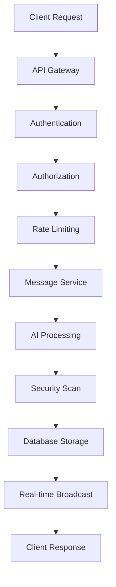
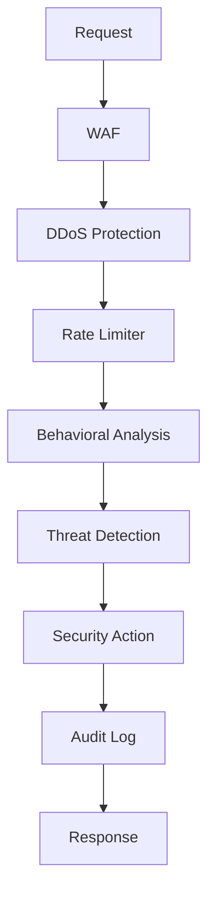

# PlexiChat Architecture Overview

PlexiChat is built with a modern, modular enterprise architecture designed for scalability, security, and maintainability. This document provides a comprehensive overview of the system architecture, design patterns, and component interactions.

## Table of Contents

1. [High-Level Architecture](#high-level-architecture)
2. [Core System Components](#core-system-components)
3. [Feature Modules](#feature-modules)
4. [Interface Layers](#interface-layers)
5. [Infrastructure Services](#infrastructure-services)
6. [Data Flow](#data-flow)
7. [Security Architecture](#security-architecture)
8. [Deployment Architecture](#deployment-architecture)

## High-Level Architecture

PlexiChat follows a layered, microservices-inspired architecture with clear separation of concerns:

```
┌─────────────────────────────────────────────────────────────┐
│                    Interface Layer                          │
├─────────────────┬─────────────────┬─────────────────────────┤
│   Web UI        │   REST API      │   CLI Interface         │
│   (React/Vue)   │   (FastAPI)     │   (Click/Typer)        │
└─────────────────┴─────────────────┴─────────────────────────┘
┌─────────────────────────────────────────────────────────────┐
│                    Feature Layer                            │
├─────────────────┬─────────────────┬─────────────────────────┤
│   AI Integration│   Backup System │   Clustering            │
│   Security      │   Messaging     │   File Management       │
└─────────────────┴─────────────────┴─────────────────────────┘
┌─────────────────────────────────────────────────────────────┐
│                    Core System Layer                        │
├─────────────────┬─────────────────┬─────────────────────────┤
│   Authentication│   Database      │   Configuration         │
│   Security      │   Logging       │   Event System          │
└─────────────────┴─────────────────┴─────────────────────────┘
┌─────────────────────────────────────────────────────────────┐
│                    Infrastructure Layer                     │
├─────────────────┬─────────────────┬─────────────────────────┤
│   Services      │   Modules       │   Performance           │
│   Monitoring    │   Caching       │   Load Balancing        │
└─────────────────┴─────────────────┴─────────────────────────┘
```

## Core System Components

### 1. Authentication System (`core_system/auth/`)

**Unified Authentication Manager**
- Multi-factor authentication (TOTP, hardware keys, biometrics)
- OAuth 2.0 / OpenID Connect integration
- Session management with secure tokens
- Role-based access control (RBAC)
- Device management and trust

```python
# Authentication flow
UnifiedAuthManager
├── AuthenticationProvider (base)
├── PasswordAuthProvider
├── MFAAuthProvider
├── OAuthProvider
├── BiometricProvider
└── DeviceAuthProvider
```

### 2. Security System (`core_system/security/`)

**Quantum-Resistant Security**
- End-to-end encryption with quantum-resistant algorithms
- Distributed key management across multiple vaults
- Real-time threat detection and behavioral analysis
- Certificate management and SSL/TLS automation
- Security monitoring and audit logging

```python
# Security architecture
SecurityManager
├── QuantumEncryptionSystem
├── DistributedKeyManager
├── ThreatDetectionEngine
├── CertificateManager
└── SecurityMonitor
```

### 3. Database System (`core_system/database/`)

**Multi-Database Support**
- Database abstraction layer with SQLAlchemy
- Support for PostgreSQL, MySQL, SQLite
- Automatic migrations and schema management
- Connection pooling and optimization
- Database encryption and backup integration

```python
# Database architecture
DatabaseManager
├── ConnectionManager
├── MigrationManager
├── EncryptionLayer
├── BackupIntegration
└── PerformanceOptimizer
```

### 4. Configuration System (`core_system/config/`)

**Dynamic Configuration Management**
- Environment-based configuration
- Hot-reload capabilities
- Validation and type checking
- Secrets management integration
- Configuration versioning

### 5. Logging System (`core_system/logging/`)

**Structured Logging and Monitoring**
- Centralized logging with structured formats
- Log aggregation and analysis
- Performance metrics collection
- Error tracking and alerting
- Audit trail maintenance

## Feature Modules

### 1. AI Integration (`features/ai/`)

**Multi-Provider AI System**
- Provider abstraction layer (OpenAI, Anthropic, Google, local models)
- Intelligent content processing and analysis
- Semantic search capabilities
- Content moderation and safety
- AI-powered insights and recommendations

```python
# AI architecture
AICoordinator
├── ProviderManager
│   ├── OpenAIProvider
│   ├── AnthropicProvider
│   ├── GoogleAIProvider
│   └── LocalModelProvider
├── ContentProcessor
├── SemanticSearch
├── ContentModerator
└── InsightsEngine
```

### 2. Backup System (`features/backup/`)

**Distributed Quantum Backup**
- Intelligent data sharding across multiple locations
- Quantum-encrypted backup storage
- Incremental and differential backups
- Automated backup scheduling
- Disaster recovery capabilities

```python
# Backup architecture
QuantumBackupSystem
├── ShardingManager
├── EncryptionLayer
├── StorageManager
├── SchedulingEngine
└── RecoveryManager
```

### 3. Clustering System (`features/clustering/`)

**Multi-Node Clustering**
- Automatic node discovery and registration
- Load balancing and traffic distribution
- Health monitoring and failover
- Data synchronization across nodes
- Horizontal scaling capabilities

```python
# Clustering architecture
ClusterManager
├── NodeManager
├── LoadBalancer
├── HealthMonitor
├── SyncManager
└── ScalingController
```

### 4. Security Features (`features/security/`)

**Advanced Security Features**
- Web Application Firewall (WAF)
- DDoS protection and rate limiting
- Vulnerability scanning and penetration testing
- Security Information and Event Management (SIEM)
- Bug bounty program management

## Interface Layers

### 1. REST API (`interfaces/api/`)

**Versioned RESTful API**
- API versioning with backward compatibility
- OpenAPI/Swagger documentation
- Rate limiting and throttling
- Authentication and authorization
- Real-time WebSocket support

```python
# API structure
/api/v1/
├── auth/          # Authentication endpoints
├── users/         # User management
├── messages/      # Messaging functionality
├── files/         # File operations
├── admin/         # Administrative functions
├── ai/            # AI integration endpoints
└── system/        # System management
```

### 2. Web Interface (`interfaces/web/`)

**Modern Web Application**
- Responsive design with mobile support
- Real-time updates with WebSockets
- Progressive Web App (PWA) capabilities
- Accessibility compliance (WCAG 2.1)
- Multi-language support

### 3. CLI Interface (`cli/`)

**Command-Line Administration**
- Comprehensive system management
- Batch operations and automation
- Configuration management
- Monitoring and diagnostics
- Backup and recovery operations

## Infrastructure Services

### 1. Service Management (`infrastructure/services/`)

**Microservices Architecture**
- Service discovery and registration
- Inter-service communication
- Circuit breaker patterns
- Service mesh integration
- Health checks and monitoring

### 2. Module System (`infrastructure/modules/`)

**Plugin Architecture**
- Dynamic module loading
- Secure plugin sandboxing
- Plugin marketplace integration
- Version management
- Dependency resolution

### 3. Performance Optimization (`infrastructure/performance/`)

**Edge Computing and Optimization**
- Intelligent caching strategies
- Content delivery optimization
- Database query optimization
- Resource pooling
- Performance monitoring

## Data Flow

### Message Processing Flow



### Security Processing Flow



## Security Architecture

### Defense in Depth

1. **Network Security**
   - WAF and DDoS protection
   - Network segmentation
   - VPN and secure tunnels

2. **Application Security**
   - Input validation and sanitization
   - SQL injection prevention
   - XSS and CSRF protection

3. **Data Security**
   - End-to-end encryption
   - Database encryption
   - Secure key management

4. **Identity Security**
   - Multi-factor authentication
   - Zero-trust architecture
   - Behavioral analysis

### Encryption Layers

```
┌─────────────────────────────────────┐
│        Transport Layer (TLS)        │
├─────────────────────────────────────┤
│      Application Layer (E2E)        │
├─────────────────────────────────────┤
│       Database Layer (AES)          │
├─────────────────────────────────────┤
│        Storage Layer (Quantum)      │
└─────────────────────────────────────┘
```

## Deployment Architecture

### Single Node Deployment

```
┌─────────────────────────────────────┐
│            Load Balancer            │
├─────────────────────────────────────┤
│          PlexiChat App              │
├─────────────────────────────────────┤
│          Database                   │
├─────────────────────────────────────┤
│          Redis Cache                │
└─────────────────────────────────────┘
```

### Multi-Node Cluster

```
┌─────────────────────────────────────┐
│         External Load Balancer      │
└─────────────┬───────────────────────┘
              │
    ┌─────────┼─────────┐
    │         │         │
┌───▼───┐ ┌───▼───┐ ┌───▼───┐
│Node 1 │ │Node 2 │ │Node 3 │
│       │ │       │ │       │
│App    │ │App    │ │App    │
│Cache  │ │Cache  │ │Cache  │
└───┬───┘ └───┬───┘ └───┬───┘
    │         │         │
    └─────────┼─────────┘
              │
    ┌─────────▼─────────┐
    │  Shared Database  │
    │   (PostgreSQL)    │
    └───────────────────┘
```

### Cloud Deployment

```
┌─────────────────────────────────────┐
│              CDN                    │
├─────────────────────────────────────┤
│         Load Balancer               │
├─────────────────────────────────────┤
│      Container Orchestration        │
│         (Kubernetes)                │
├─────────────────────────────────────┤
│        Managed Database             │
│      (RDS/Cloud SQL)                │
├─────────────────────────────────────┤
│         Object Storage              │
│        (S3/GCS/Azure)               │
└─────────────────────────────────────┘
```

## Design Patterns

### 1. Dependency Injection
- Service container for dependency management
- Interface-based programming
- Testability and modularity

### 2. Event-Driven Architecture
- Asynchronous event processing
- Loose coupling between components
- Scalable message handling

### 3. Repository Pattern
- Data access abstraction
- Database independence
- Testable data layer

### 4. Factory Pattern
- Dynamic object creation
- Provider abstraction
- Plugin system support

### 5. Observer Pattern
- Real-time notifications
- Event broadcasting
- State change monitoring

## Performance Considerations

### 1. Caching Strategy
- Multi-level caching (Redis, in-memory, CDN)
- Cache invalidation strategies
- Performance optimization

### 2. Database Optimization
- Connection pooling
- Query optimization
- Indexing strategies

### 3. Asynchronous Processing
- Background task processing
- Non-blocking I/O operations
- Concurrent request handling

### 4. Resource Management
- Memory optimization
- CPU utilization
- Network bandwidth management

---

This architecture provides a solid foundation for a secure, scalable, and maintainable communication platform that can grow with your organization's needs.
