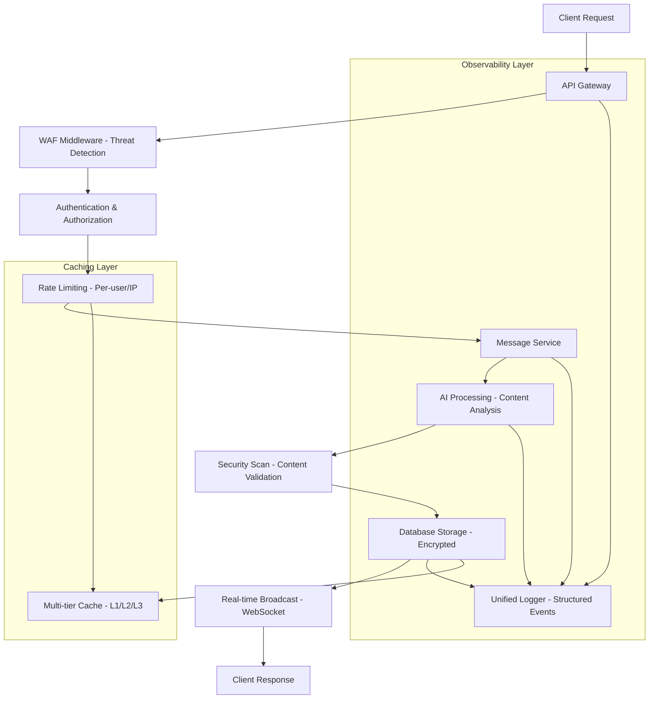
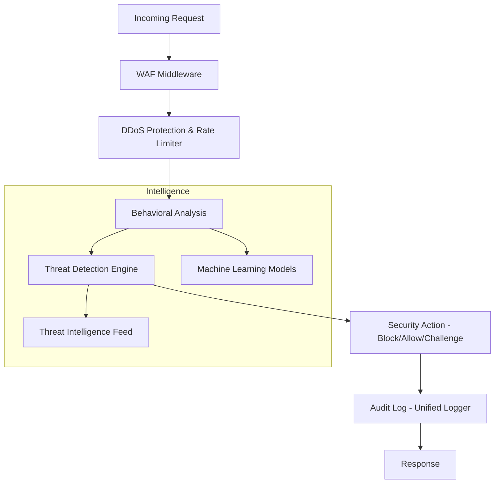
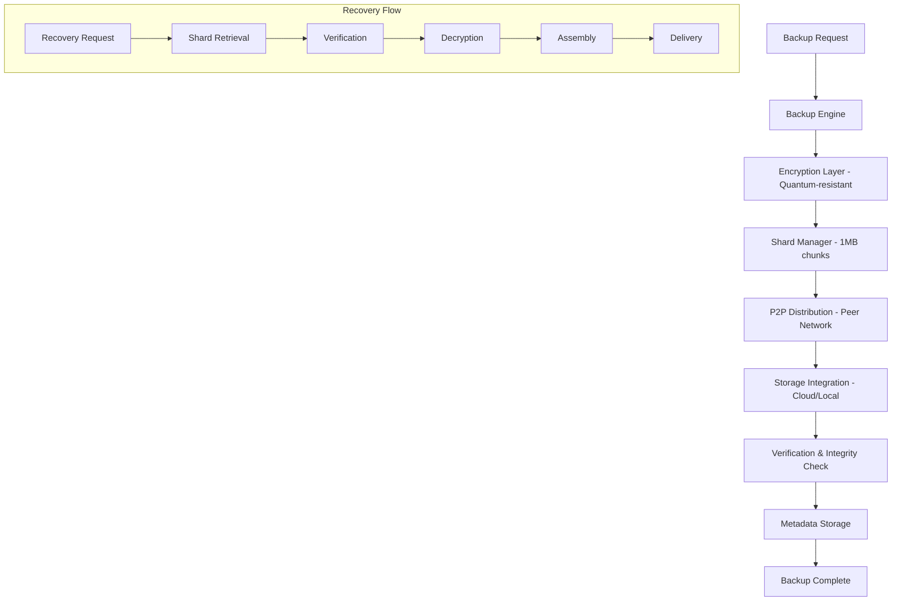

# Architecture Overview - PlexiChat Backend

**Document Date:** 2025-08-31
**Architect:** Kilo Code
**Based on:** FEATURES_DISCOVERY.md and Codebase Analysis
**Focus:** Existing Architecture Documentation

## Executive Summary

PlexiChat implements a sophisticated layered architecture for enterprise-grade communication platforms. This overview documents the current module layout and responsibilities based on comprehensive feature discovery analysis, revealing a system with advanced security features, plugin extensibility, and robust backup capabilities.

**Key Architectural Characteristics:**
- **Modular Design:** Clear separation of concerns across core, features, interfaces, and infrastructure layers
- **Security-First:** Multi-layered security with unified security module and quantum-resistant encryption
- **Plugin System:** Extensible architecture supporting 20+ plugins with marketplace integration
- **Scalability:** Horizontal scaling with clustering and sharding capabilities
- **Feature Completeness:** Varies by module (33% fully implemented, 45% partially implemented, 22% planning/stub)

## Core Modules

### Authentication & Authorization (`core/auth/`)
**Responsibilities:**
- Multi-factor authentication (MFA) with TOTP, hardware keys, and backup codes
- OAuth2 integration framework (currently mocked)
- Session management with secure tokens and device tracking
- Role-based access control (RBAC) and permission management

**Current State:** 70% implemented (MFA functional, OAuth2 framework exists but providers mocked)

### Database System (`core/database/`)
**Responsibilities:**
- Multi-database support (PostgreSQL, MySQL, SQLite)
- Automatic migrations and schema management
- Connection pooling and performance optimization
- Database encryption and backup integration

**Current State:** Fully implemented with migration system

### Security Module (`core/security/`)
**Responsibilities:**
- Unified security policy management
- Threat detection and response
- Rate limiting integration
- Security event logging and audit trails

**Current State:** 85% implemented with comprehensive security framework

### Caching System (`core/caching/`)
**Responsibilities:**
- Multi-tier caching (in-memory, Redis, CDN)
- Cache invalidation strategies
- Performance optimization for high-throughput operations

**Current State:** Framework exists, implementation details vary

### Logging System (`core/logging/`)
**Responsibilities:**
- Unified structured logging across all components
- Performance metrics collection (microsecond timing)
- Log aggregation and analysis
- Directory management for artifacts

**Current State:** Fully implemented with advanced features

### Event System (`core/events/`)
**Responsibilities:**
- Internal event-driven architecture
- Asynchronous processing and background tasks
- Inter-component communication

**Current State:** Framework implemented

### Messaging System (`core/messaging/`)
**Responsibilities:**
- Real-time message processing and routing
- WebSocket integration for live communication
- Message queuing and delivery guarantees

**Current State:** Core messaging implemented

### Monitoring System (`core/monitoring/`)
**Responsibilities:**
- System health monitoring
- Performance metrics collection
- Alerting and notification system

**Current State:** Framework exists with monitoring capabilities

### Notification System (`core/notifications/`)
**Responsibilities:**
- User notifications and alerts
- Multi-channel delivery (email, push, in-app)
- Notification preferences and management

**Current State:** Basic implementation

### Performance Optimization (`core/performance/`)
**Responsibilities:**
- Microsecond-level performance monitoring
- Request preprocessing and optimization
- Resource utilization tracking

**Current State:** Advanced performance framework

### Plugin Core (`core/plugins/`)
**Responsibilities:**
- Plugin loading and lifecycle management
- Security sandboxing for plugins
- Plugin dependency resolution

**Current State:** 65% implemented with core architecture

### Threading & Concurrency (`core/threading/`)
**Responsibilities:**
- Asynchronous task processing
- Thread pool management
- Concurrent operation handling

**Current State:** Framework implemented

### Updates & Versioning (`core/updates/`, `core/versioning/`)
**Responsibilities:**
- System update management
- Version control and rollback capabilities
- Feature flag management

**Current State:** Basic versioning system

### WebSocket Integration (`core/websocket/`)
**Responsibilities:**
- Real-time bidirectional communication
- Connection management and scaling
- Message broadcasting

**Current State:** Implemented for real-time features

## Features

### AI Integration (`features/ai/`)
**Responsibilities:**
- Multi-provider AI support (OpenAI, Anthropic, Google, Local)
- Content processing and semantic search
- AI-powered moderation and insights
- Response caching and optimization

**Current State:** 55% implemented (framework exists, providers partially implemented)

### Backup System (`features/backup/`)
**Responsibilities:**
- Quantum-ready backup with AES-256-GCM and ML-KEM-768 encryption
- P2P sharded distribution (1MB shards)
- Incremental and differential backups
- Point-in-time recovery

**Current State:** 40% implemented (API framework complete, storage logic mocked)

### Clustering (`core/clustering/`)
**Responsibilities:**
- Node discovery and registration
- Load balancing and traffic distribution
- Health monitoring and failover
- Data synchronization

**Current State:** 30% implemented (basic framework, core logic missing)

## Interfaces

### REST API (`interfaces/api/`)
**Responsibilities:**
- RESTful API endpoints with FastAPI
- Versioned API structure (/api/v1/)
- Authentication and authorization middleware
- Rate limiting and security controls

**Current State:** Fully implemented with comprehensive endpoints

### Web Interface (`interfaces/web/`)
**Responsibilities:**
- Modern SPA with React/Vue components
- Real-time updates via WebSocket
- Responsive design with accessibility compliance
- Plugin management UI

**Current State:** Implemented with advanced features

### CLI Tools (`interfaces/cli/`)
**Responsibilities:**
- Command-line operations and system management
- Batch processing and automation
- Administrative functions

**Current State:** Implemented with CLI tools

## Infrastructure

### Services (`infrastructure/services/`)
**Responsibilities:**
- Microservices architecture
- Service discovery and registration
- Inter-service communication
- Health checks and monitoring

**Current State:** Framework implemented

### Modules (`infrastructure/modules/`)
**Responsibilities:**
- Plugin system infrastructure
- Module loading and management
- Security sandboxing

**Current State:** Core infrastructure exists

### Scalability (`infrastructure/scalability/`)
**Responsibilities:**
- Horizontal scaling capabilities
- Load balancing
- Resource optimization

**Current State:** Framework for scaling

### Deployment (`infrastructure/deployment/`)
**Responsibilities:**
- Deployment automation
- Configuration management
- Environment-specific setups

**Current State:** Deployment infrastructure

### Containerization (`infrastructure/containerization/`)
**Responsibilities:**
- Docker containerization
- Orchestration support
- Container security

**Current State:** Containerization setup

### Debugging (`infrastructure/debugging/`)
**Responsibilities:**
- Debugging tools and utilities
- Log analysis and troubleshooting

**Current State:** Debugging infrastructure

### Analytics (`infrastructure/analytics/`)
**Responsibilities:**
- Usage analytics and reporting
- Performance analytics
- Business intelligence

**Current State:** Analytics framework

### Installer (`infrastructure/installer/`)
**Responsibilities:**
- Automated installation and setup
- Dependency management
- Configuration initialization

**Current State:** Installer system

### Messaging (`infrastructure/messaging/`)
**Responsibilities:**
- Inter-component messaging
- Message queuing
- Event-driven communication

**Current State:** Messaging infrastructure

### Middleware (`infrastructure/middleware/`)
**Responsibilities:**
- Application middleware stack
- Request processing pipeline
- Cross-cutting concerns

**Current State:** Middleware framework

### Utils (`infrastructure/utils/`)
**Responsibilities:**
- Utility functions and helpers
- Common infrastructure components
- Shared utilities

**Current State:** Utility modules

## Plugins System

**Responsibilities:**
- Dynamic plugin loading and management
- Plugin marketplace integration
- Security sandboxing and isolation
- Version management and updates
- Dependency resolution

**Available Plugins (20+):**
- AI Providers (Multi-provider AI integration)
- Advanced Analytics (Usage statistics)
- Advanced Antivirus (File scanning)
- API Integration Layer (Third-party services)
- Code Analyzer (Code review tools)
- Data Visualizer (Charts and graphs)
- Dev Tools (Development utilities)
- File Manager (Advanced file operations)
- Network Scanner (Network analysis)
- Performance Monitor (System monitoring)
- Security Toolkit (Security assessment)
- System Manager (Administration)
- User Manager (User administration)
- Webhook Manager (Event integrations)

**Current State:** 65% implemented with marketplace framework

## Data Flow Diagrams

### Message Processing Flow

### Security Processing Flow

### Backup and Recovery Flow

## Key Architectural Patterns

### 1. Layered Architecture
- **Interface Layer:** API, Web, CLI interfaces
- **Feature Layer:** AI, Backup, Clustering features
- **Core Layer:** Authentication, Database, Security, Logging
- **Infrastructure Layer:** Services, Modules, Scalability

### 2. Plugin Architecture
- Dynamic loading with security sandboxing
- Marketplace integration for plugin distribution
- Version management and dependency resolution

### 3. Security-First Design
- Multi-layered security (WAF, authentication, encryption)
- Unified security module with threat detection
- Audit logging and compliance support

### 4. Scalability Patterns
- Horizontal scaling with clustering
- Multi-tier caching (L1/L2/L3)
- Load balancing and traffic distribution

### 5. Event-Driven Architecture
- Internal event system for loose coupling
- Asynchronous processing for performance
- Real-time communication via WebSocket

### 6. Microservices Approach
- Modular design with clear boundaries
- Service discovery and communication
- Independent deployment and scaling

## Summary

The PlexiChat backend architecture demonstrates enterprise-grade design with strong foundations in security, scalability, and extensibility. The system features a comprehensive plugin ecosystem, advanced security measures, and robust backup capabilities. While some components remain partially implemented (particularly P2P distribution and clustering), the overall architecture provides a solid foundation for production deployment.

**Key Strengths:**
- Modular and extensible design
- Comprehensive security architecture
- Advanced plugin system
- Multi-tier caching and performance optimization
- Unified logging and monitoring

**Critical Implementation Gaps (from FEATURES_DISCOVERY.md):**
- P2P shard distribution logic (40% complete)
- Clustering implementation (30% complete)
- Distributed storage integration (mocked)
- Peer discovery and coordination (missing)

This documentation preserves the existing architecture without proposing changes, focusing solely on documenting the current state and responsibilities of each module.