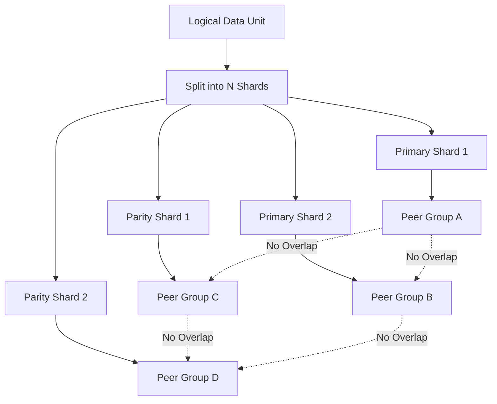
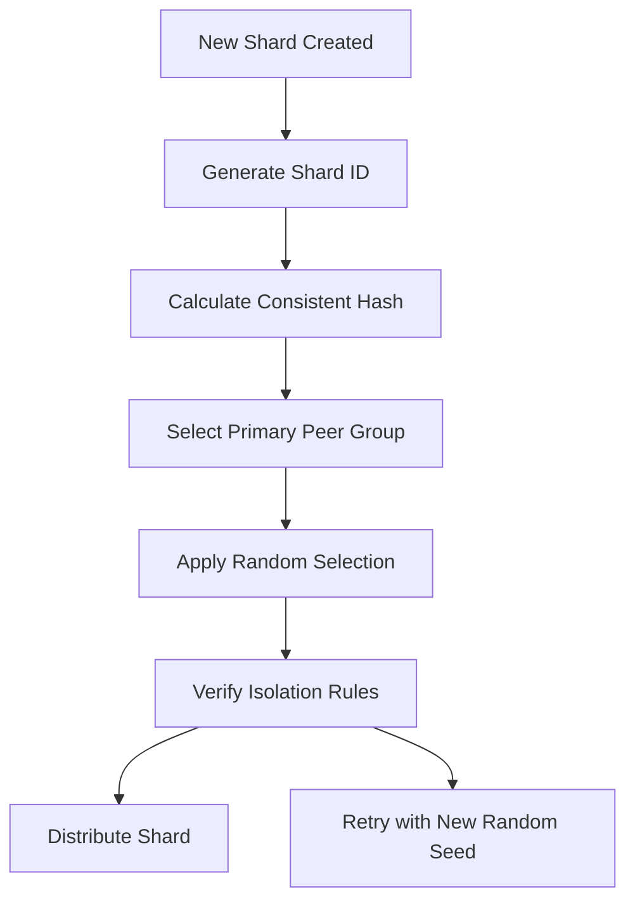
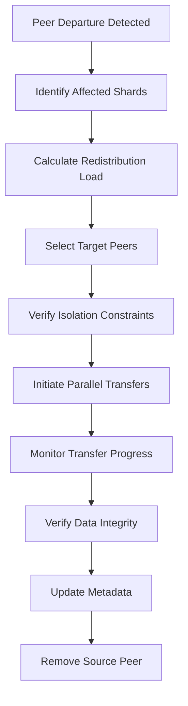
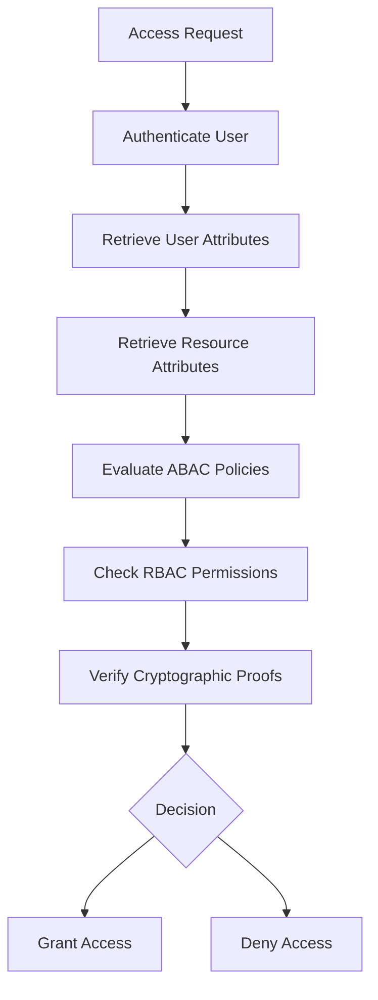
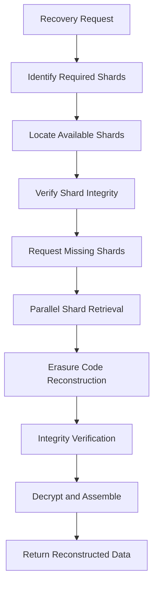

# Design: P2P Sharded Backup/Distribution System Constraints and Rules

**Document Version:** 1.0
**Date:** 2025-08-31
**Author:** Kilo Code
**Phase:** X (P2P Sharded Backup & Distribution)
**Scope:** Security and privacy constraints for shard distribution and recovery

## Executive Summary

This document defines the comprehensive constraints and rules for the P2P Sharded Backup & Distribution system in PlexiChat. The design ensures security, privacy, and availability while mitigating identified threats from the threat model. All designs align with the existing architecture using encrypted 1MB shards, server-side hashes, immutable shards, per-shard unique keys, intentional partial shards for privacy, and partial recovery/versioning capabilities.

## 1. Complementary Shard Isolation Rules

### Core Principle
No single peer shall receive both complementary shards that could reconstruct the same logical data unit, preventing single-point data reconstruction attacks.

### Shard Classification Rules

#### Logical Data Unit Definition
- **Primary Shards**: Contain encrypted data segments (≈1MB each)
- **Parity Shards**: Contain erasure-coded redundancy for recovery
- **Metadata Shards**: Contain integrity hashes and distribution metadata
- **Complementary Pairs**: Shards that together enable data reconstruction

#### Distribution Constraints

#### Isolation Enforcement
1. **Peer Group Assignment**: Each shard type assigned to mutually exclusive peer groups
2. **Geographic Separation**: Complementary shards distributed across different geographic regions
3. **Network Segmentation**: Shards isolated at network level using different communication channels
4. **Temporal Separation**: Complementary shards distributed at different times with random delays

### Security Implications
- **Prevents Reconstruction Attacks**: Single compromised peer cannot reconstruct data
- **Mitigates Collusion**: Multiple peers required for reconstruction
- **Reduces Attack Surface**: Isolated shard access patterns

## 2. Shard Distribution Strategies

### Randomness Requirements

#### Cryptographic Randomness
- **Seed Generation**: Use HKDF-SHA256 with system entropy for distribution seeds
- **Peer Selection**: Cryptographically secure random selection from eligible peer pool
- **Timing Randomization**: Random delays (1-60 seconds) between shard distributions

#### Deterministic Components
- **Consistent Hashing**: Deterministic peer selection based on shard ID
- **Load Balancing**: Weighted random selection based on peer capacity and reliability
- **Geographic Optimization**: Deterministic geographic distribution with random peer selection within regions

### Assignment Algorithm

#### Primary Distribution Strategy

#### Algorithm Parameters
- **Replication Factor**: Minimum 3 copies per shard
- **Peer Group Size**: Maximum 10% of total peers per group
- **Geographic Diversity**: Minimum 3 regions for critical shards
- **Load Threshold**: Maximum 80% utilization before redistribution

### Security Controls
- **Entropy Verification**: Continuous monitoring of randomness quality
- **Distribution Auditing**: Complete audit trail of all shard assignments
- **Anomaly Detection**: Statistical analysis of distribution patterns

## 3. Redistribution Mechanisms

### Peer Departure Handling

#### Graceful Departure Protocol
1. **Departure Announcement**: Peer signals planned departure with 24-hour notice
2. **Redundancy Verification**: Confirm minimum replication factors maintained
3. **Gradual Redistribution**: Move shards to new peers over departure window
4. **Final Verification**: Confirm all shards redistributed before peer removal

#### Emergency Redistribution Protocol
1. **Failure Detection**: Automated detection of unresponsive peers
2. **Immediate Isolation**: Remove failed peer from distribution pool
3. **Priority Redistribution**: Redistribute critical shards first (RTO < 1 hour)
4. **Quorum Verification**: Ensure data availability during redistribution

### Redistribution Workflow

#### Standard Redistribution Process

#### Load Balancing Integration
- **Progressive Redistribution**: Distribute load over time to prevent network congestion
- **Capacity-Aware Selection**: Prefer peers with available capacity
- **Performance Monitoring**: Track redistribution impact on system performance

### Security Considerations
- **Integrity Preservation**: Cryptographic verification of redistributed shards
- **Access Control**: Maintain shard ownership during redistribution
- **Audit Logging**: Complete audit trail of all redistribution operations

## 4. Replication Factors and Availability

### Minimum Replication Requirements

#### Criticality-Based Replication
- **Critical Data**: 5x replication (RTO < 1 hour, RPO < 5 minutes)
- **Important Data**: 3x replication (RTO < 4 hours, RPO < 1 hour)
- **Standard Data**: 2x replication (RTO < 24 hours, RPO < 24 hours)
- **Archival Data**: 1x replication (RTO < 72 hours, RPO < 72 hours)

#### Dynamic Replication Adjustment
- **Usage-Based Scaling**: Increase replication for frequently accessed data
- **Threat-Based Scaling**: Temporary replication increase during security incidents
- **Capacity-Based Adjustment**: Reduce replication during storage constraints

### Availability Guarantees

#### Service Level Objectives
- **Uptime SLA**: 99.9% availability for critical systems
- **Recovery Time**: Maximum 1 hour for critical data recovery
- **Data Durability**: 99.999999999% (11 9's) annual durability

#### Geographic Distribution Requirements
- **Regional Redundancy**: Minimum 3 geographic regions for critical data
- **Cross-Continent Distribution**: Critical shards distributed across continents
- **Disaster Recovery**: Isolated recovery sites for regional disasters

### Monitoring and Alerting
- **Replication Health Checks**: Continuous verification of replication status
- **Capacity Monitoring**: Track storage utilization across peer network
- **Performance Metrics**: Monitor distribution and retrieval performance

## 5. Shard Ownership and Access Control

### Ownership Model

#### Cryptographic Ownership
- **Public-Key Ownership**: Shards owned by public key of creating user
- **Signature Verification**: All shard operations require valid ownership signature
- **Delegation Support**: Temporary delegation with time-limited certificates

#### Access Control Policies

##### Role-Based Access Control (RBAC)
- **Owner**: Full read/write/delete access to owned shards
- **Delegate**: Limited access for specific operations and time periods
- **Administrator**: System-level access for maintenance operations
- **Auditor**: Read-only access for compliance verification

##### Attribute-Based Access Control (ABAC)
- **Context Attributes**: Time, location, device, network security level
- **Data Attributes**: Data classification, sensitivity level, retention period
- **User Attributes**: Clearance level, department, project membership

### Access Control Enforcement

#### Policy Decision Point (PDP)

#### Policy Enforcement Point (PEP)
- **API Gateway**: Enforce access control at API boundaries
- **Peer Nodes**: Local enforcement of shard access policies
- **Metadata Server**: Centralized policy evaluation for complex decisions

### Security Features
- **Zero-Trust Architecture**: Continuous verification of access rights
- **Audit Logging**: Complete audit trail of all access decisions
- **Anomaly Detection**: Behavioral analysis of access patterns
- **Incident Response**: Automated response to policy violations

## 6. Recovery Protocols

### Partial Data Reconstruction

#### Erasure Coding Recovery
- **Reed-Solomon Codes**: Support reconstruction from any k out of n shards
- **Progressive Recovery**: Reconstruct data as shards become available
- **Integrity Verification**: Cryptographic verification during reconstruction

#### Recovery Workflow

### Complete Data Reconstruction

#### Quorum-Based Recovery
- **Minimum Quorum**: Require majority of shards for reconstruction
- **Byzantine Fault Tolerance**: Withstand malicious or corrupted shards
- **Consensus Verification**: Distributed verification of reconstruction validity

#### Disaster Recovery Protocols
- **Cold Recovery**: Complete system rebuild from backup metadata
- **Warm Recovery**: Partial reconstruction with available shards
- **Hot Recovery**: Real-time reconstruction during system operation

### Recovery Security

#### Authentication and Authorization
- **Recovery Authentication**: Multi-factor authentication for recovery operations
- **Authorization Verification**: Confirm user has recovery rights for specific data
- **Audit Logging**: Complete audit trail of all recovery operations

#### Data Protection During Recovery
- **End-to-End Encryption**: Maintain encryption throughout recovery process
- **Secure Channels**: Encrypted communication for shard retrieval
- **Integrity Protection**: Cryptographic verification of all recovered data

## Security and Privacy Mitigations

### Threat-Specific Mitigations

#### Reconstruction Attack Prevention
- **Shard Isolation**: Ensure complementary shards never co-locate
- **Entropy Maximization**: Maximize randomness in shard distribution
- **Collusion Detection**: Monitor for coordinated shard access patterns

#### Sybil Attack Mitigation
- **Proof-of-Work**: Require computational proof for peer registration
- **Reputation Scoring**: Track peer reliability and behavior
- **Network Analysis**: Detect artificial peer proliferation

#### Metadata Leakage Protection
- **Differential Privacy**: Add noise to metadata queries
- **Oblivious RAM**: Hide access patterns in metadata operations
- **Aggregation Limits**: Prevent detailed metadata correlation

### Privacy-Preserving Techniques

#### Data Anonymization
- **Shard Content Anonymization**: Remove identifiable information from shards
- **Distribution Pattern Obfuscation**: Hide data relationships through randomization
- **Access Pattern Protection**: Prevent inference of data usage patterns

#### Communication Security
- **Tor Integration**: Route sensitive operations through anonymity network
- **Traffic Obfuscation**: Hide shard distribution patterns
- **Peer Reputation**: Trust-based peer selection and validation

## Implementation Considerations

### System Integration
- **Existing Architecture Alignment**: Design compatible with current backup engine and encryption services
- **API Integration**: Leverage existing RESTful shard management APIs
- **Monitoring Integration**: Integrate with existing security monitoring and alerting

### Performance Optimization
- **Distribution Efficiency**: Minimize network overhead through intelligent batching
- **Storage Optimization**: Optimize shard placement for retrieval performance
- **Caching Strategies**: Implement intelligent caching for frequently accessed shards

### Scalability Requirements
- **Peer Network Scaling**: Support thousands of peers with efficient distribution
- **Data Volume Scaling**: Handle petabyte-scale data with consistent performance
- **Geographic Scaling**: Optimize for global distribution and local access

## Compliance and Regulatory Alignment

### GDPR Compliance
- **Data Minimization**: Only distribute necessary shard information
- **Purpose Limitation**: Clear purpose for each shard distribution
- **Storage Limitation**: Automatic cleanup of expired shards
- **Integrity and Confidentiality**: Cryptographic protection of personal data

### SOC 2 Controls
- **Security**: Technical safeguards for data protection
- **Availability**: High availability through replication and recovery
- **Confidentiality**: Access controls and encryption
- **Privacy**: Privacy-preserving techniques and data handling

## Monitoring and Metrics

### Key Performance Indicators
- **Distribution Success Rate**: Percentage of successful shard distributions
- **Recovery Time**: Average time for data reconstruction
- **Security Incident Rate**: Frequency of security-related events
- **Availability Uptime**: System availability percentage

### Alert Thresholds
- **Distribution Failure**: >5% distribution failures trigger alert
- **Recovery Delay**: >1 hour recovery time triggers alert
- **Security Events**: Any high-severity security events trigger alert
- **Availability Drop**: <99.9% availability triggers alert

## Conclusion

This design establishes comprehensive constraints and rules for the P2P Sharded Backup & Distribution system, ensuring security, privacy, and availability while mitigating identified threats. The design aligns with existing architecture and provides a foundation for secure implementation.

### Key Design Decisions

1. **Complementary Shard Isolation**: Prevents single-peer reconstruction through strict distribution rules
2. **Hybrid Distribution Strategy**: Combines cryptographic randomness with deterministic load balancing
3. **Graceful Redistribution**: Ensures availability during peer lifecycle events
4. **Criticality-Based Replication**: Optimizes resource usage while meeting availability requirements
5. **Cryptographic Ownership**: Provides strong, verifiable shard ownership and access control
6. **Erasure Coding Recovery**: Enables efficient partial and complete data reconstruction

### Security/Privacy Benefits

- **Reconstruction Attack Resistance**: Multiple peers required for data access
- **Privacy Preservation**: Distribution patterns hide data relationships
- **Collusion Prevention**: Isolation rules prevent coordinated attacks
- **Auditability**: Complete audit trail for compliance and forensics
- **Availability Assurance**: Redundant distribution ensures data durability

This design serves as the architectural foundation for secure P2P shard distribution and should be reviewed quarterly or when significant architectural changes occur.

---

**Revision History:**
- v1.0 (2025-08-31): Initial design document for Phase X P2P Sharded Backup & Distribution