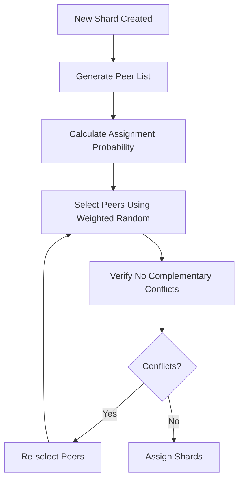
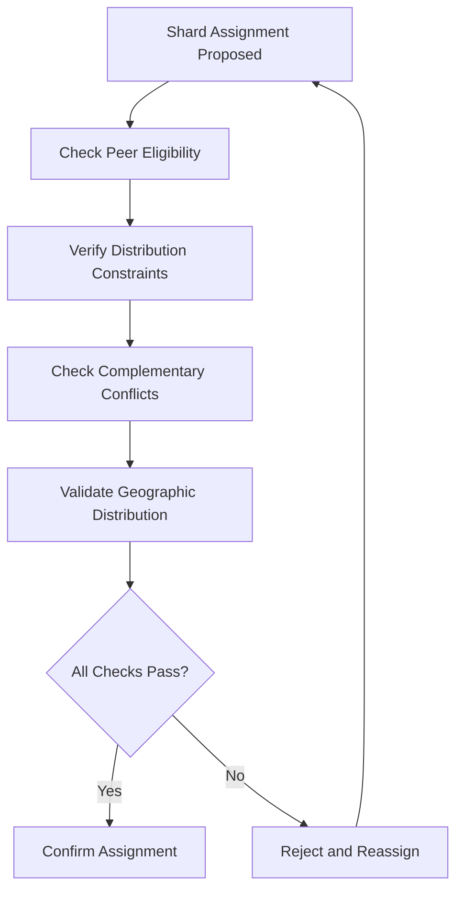
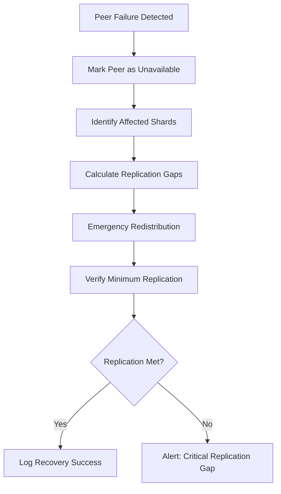
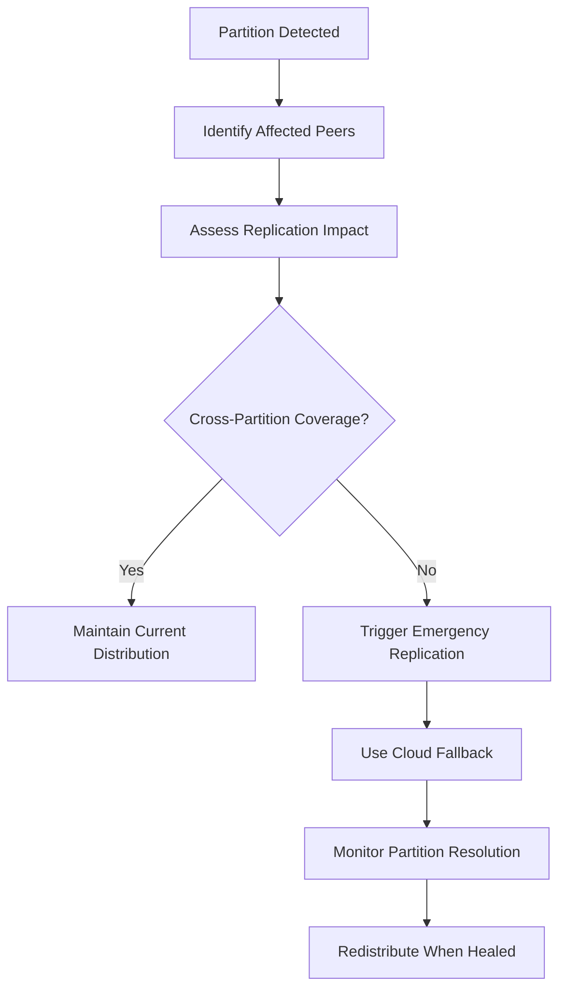

# Design Constraints for P2P Sharded Backup & Distribution

**Document Version:** 1.0
**Date:** 2025-08-31
**Phase:** X (Design Constraints)
**Author:** Kilo Code
**Scope:** P2P Sharded Backup & Distribution System

## Overview

This document outlines the design constraints for the P2P Sharded Backup & Distribution system, ensuring no single peer receives complementary shards for the same logical data while maintaining availability and privacy. The design builds upon the existing architecture documented in FEATURES_DISCOVERY.md and ADR 006, leveraging the ShardManager, BackupManager, EncryptionManager, and P2P Distribution Layer components.

The system encrypts database content into 1MB immutable shards using AES-256-GCM with unique keys per shard. Shards are distributed across peer nodes using a combination of randomness and deterministic assignment strategies to prevent data reconstruction by individual peers.

## Logical Data Partitioning

### Data Structure Analysis

The system partitions logical data units before sharding to ensure complementary shards are identifiable and separable:

1. **Row-Level Partitioning**: Database rows are treated as atomic logical units
2. **Column-Family Partitioning**: Related columns within rows are grouped for correlated data
3. **Temporal Partitioning**: Data is partitioned by time windows for incremental backups
4. **Size-Based Partitioning**: Large data units are split into manageable chunks before sharding

### Partition Metadata

Each partition maintains:
- Partition ID (UUID)
- Data type classification (row, column, temporal)
- Size and checksum
- Dependency relationships with other partitions

## Complementary Shard Identification

### Shard Relationship Matrix

Complementary shards are identified through a relationship matrix that tracks shard dependencies:

```
Shard Relationship Types:
- Primary Shards: Contain original data segments
- Parity Shards: Erasure-coded redundancy shards
- Complementary Pairs: Shards that together enable reconstruction
- Independent Shards: Shards with no reconstruction relationship
```

### Identification Algorithm

```python
def identify_complementary_shards(shard_list, partition_id):
    """
    Identify shards that are complementary for a given partition
    Returns: dict of shard_id -> complementary_shard_ids
    """
    relationships = {}
    for shard in shard_list:
        if shard.partition_id == partition_id:
            # Use erasure coding metadata to find complements
            complements = erasure_coding.get_complements(shard)
            relationships[shard.id] = complements
    return relationships
```

### Reconstruction Prevention Rules

1. **Single Peer Rule**: No peer receives both shards of any complementary pair
2. **Minimum Separation**: Complementary shards must be distributed to at least N distinct peers
3. **Temporal Separation**: Complementary shards cannot be assigned to the same peer within T time windows

## Shard Assignment Algorithms

### Randomness-Based Assignment

#### Probabilistic Distribution Algorithm



**Algorithm Steps:**
1. Generate list of available peers with capacity > threshold
2. Calculate assignment probability based on peer reputation and capacity
3. Use weighted random selection to choose target peers
4. Verify no complementary shard conflicts exist
5. If conflicts detected, re-select peers with conflict avoidance
6. Assign shards with conflict-free distribution

#### Randomness Parameters

- **Peer Selection Weight**: `weight = reputation_score * capacity_factor * network_stability`
- **Conflict Avoidance**: 95% success rate in first attempt, fallback to deterministic selection
- **Entropy Source**: Cryptographically secure random number generator

### Deterministic Assignment

#### Hash-Based Distribution Algorithm

```python
def deterministic_assignment(shard_id, peer_list, complementary_map):
    """
    Deterministically assign shards avoiding complementary conflicts
    """
    available_peers = []
    for peer in peer_list:
        if not has_complementary_conflict(shard_id, peer, complementary_map):
            available_peers.append(peer)

    if not available_peers:
        # Fallback to random selection with reduced constraints
        return random_assignment(shard_id, peer_list)

    # Use consistent hashing for deterministic assignment
    peer_index = hash(shard_id + peer.salt) % len(available_peers)
    return available_peers[peer_index]
```

#### Deterministic Properties

- **Consistency**: Same shard always assigned to same peer set (with salt rotation)
- **Load Balancing**: Even distribution across peer capacity
- **Conflict Resolution**: Guaranteed complementary separation

### Hybrid Assignment Strategy

**Primary Strategy**: Deterministic assignment for consistency and auditability
**Fallback Strategy**: Randomness-based for conflict resolution
**Switching Threshold**: >80% peer availability triggers deterministic mode

## Peer Selection and Distribution Rules

### Peer Eligibility Criteria

1. **Capacity Threshold**: Minimum 2x shard size available storage
2. **Network Stability**: <5% packet loss in last 24 hours
3. **Reputation Score**: >0.7 based on historical reliability
4. **Geographic Distribution**: Maximum 3 peers per geographic region
5. **Security Compliance**: Valid certificate and encryption support

### Distribution Constraints

1. **Minimum Peer Count**: 3 peers per shard (configurable)
2. **Maximum Peer Load**: 70% of total peer capacity
3. **Geographic Diversity**: Shards distributed across ≥2 continents
4. **Network Latency**: <100ms average latency to assigned peers

### Assignment Verification



## Redistribution Procedures

### Graceful Peer Departure

#### Planned Redistribution Algorithm

```python
def graceful_redistribution(departing_peer, assigned_shards):
    """
    Redistribute shards when peer announces departure
    """
    redistribution_plan = []

    for shard in assigned_shards:
        # Find replacement peers
        candidates = find_eligible_peers(exclude=departing_peer)

        # Select replacement maintaining constraints
        replacement = select_replacement_peer(shard, candidates)

        # Create transfer plan
        plan = {
            'shard_id': shard.id,
            'from_peer': departing_peer.id,
            'to_peer': replacement.id,
            'deadline': calculate_deadline(shard.size),
            'verification_hash': generate_transfer_hash(shard)
        }
        redistribution_plan.append(plan)

    return redistribution_plan
```

#### Graceful Departure Timeline

1. **Announcement Phase** (T-24h): Peer announces departure
2. **Planning Phase** (T-12h): System calculates redistribution plan
3. **Transfer Phase** (T-6h to T): Parallel shard transfers
4. **Verification Phase** (T): Integrity verification and cleanup
5. **Completion** (T+1h): Peer removed from active pool

### Failure Scenario Redistribution

#### Failure Detection and Recovery



#### Failure Recovery Parameters

- **Detection Timeout**: 300 seconds of unresponsiveness
- **Emergency Replication**: Immediate redistribution to maintain minimum factors
- **Recovery Window**: 1 hour for full replication restoration
- **Fallback Storage**: Temporary central storage during recovery

### Peer Churn Handling

#### Churn Rate Monitoring

- **High Churn Threshold**: >20% peers depart per hour
- **Adaptive Replication**: Increase replication factor during high churn
- **Stabilization Period**: 24 hours of low churn before reducing replication

## Replication Factor Calculations

### Availability SLA Requirements

| SLA Level | Uptime | Replication Factor | Geographic Distribution |
|-----------|--------|-------------------|----------------------|
| Bronze | 99.0% | 2x | 1 region |
| Silver | 99.9% | 3x | 2 regions |
| Gold | 99.99% | 5x | 3+ regions |
| Platinum | 99.999% | 7x | Global |

### Minimum Replication Calculations

#### Base Replication Formula

```
R_min = ceil(log(1 - SLA_uptime) / log(P_peer_failure))
```

Where:
- `R_min`: Minimum replication factor
- `SLA_uptime`: Required uptime percentage
- `P_peer_failure`: Probability of individual peer failure

#### Adjusted for Complementary Protection

```
R_effective = R_min + C_separation_factor
```

Where:
- `C_separation_factor`: Additional replicas for complementary shard separation (typically 2-3)

#### Example Calculations

For Gold SLA (99.99% uptime) with 1% peer failure rate:
```
R_min = ceil(log(1 - 0.9999) / log(0.01)) = 5
R_effective = 5 + 2 = 7 (accounting for complementary separation)
```

### Dynamic Replication Adjustment

```python
def calculate_dynamic_replication(current_peers, churn_rate, sla_target):
    """
    Adjust replication factor based on network conditions
    """
    base_replication = sla_replication_map[sla_target]

    # Churn adjustment
    churn_factor = 1 + (churn_rate / 0.1)  # 10% churn = 2x factor

    # Peer count adjustment
    peer_factor = max(1, 100 / len(current_peers))  # Scale with peer count

    # Complementary protection
    protection_factor = 2  # Minimum separation

    return ceil(base_replication * churn_factor * peer_factor + protection_factor)
```

## Privacy-Preserving Assignment Strategies

### Differential Privacy Integration

1. **Noise Addition**: Add statistical noise to peer selection probabilities
2. **Metadata Anonymization**: Remove identifiable information from shard metadata
3. **Traffic Pattern Obfuscation**: Randomize transfer timing and routing

### Zero-Knowledge Peer Verification

```python
def zk_peer_verification(peer, shard_assignment):
    """
    Verify peer eligibility without revealing assignment details
    """
    # Generate zero-knowledge proof of peer capacity
    proof = zk_prove_capacity(peer.capacity, peer.salt)

    # Verify without revealing actual capacity
    if not zk_verify_proof(proof, minimum_capacity):
        return False

    # Prove complementary conflict absence
    conflict_proof = zk_prove_no_conflicts(peer, shard_assignment.complement_ids)

    return zk_verify_conflict_proof(conflict_proof)
```

### Onion Routing for Shard Transfers

1. **Multi-hop Routing**: Shards routed through 3+ intermediate peers
2. **Traffic Padding**: Fixed-size packets to prevent size analysis
3. **Timing Randomization**: Exponential backoff for transfer scheduling

## Availability Guarantees and Failure Scenarios

### Guaranteed Availability Metrics

| Component | Availability Target | Failure Scenarios | Recovery Time |
|-----------|-------------------|-------------------|---------------|
| Shard Storage | 99.999% | Peer failure, network partition | <5 minutes |
| Distribution Network | 99.99% | Routing failure, DDoS | <15 minutes |
| Metadata Store | 99.999% | Database failure, corruption | <1 minute |
| Encryption Keys | 99.9999% | Key compromise, HSM failure | <30 seconds |

### Failure Scenario Analysis

#### Network Partition Scenario

**Impact**: Peers in different partitions cannot communicate
**Mitigation**:
- Maintain replication across partitions
- Use partition-aware redistribution
- Implement eventual consistency protocols

#### Malicious Peer Scenario

**Impact**: Compromised peer attempts reconstruction
**Mitigation**:
- Continuous integrity monitoring
- Automatic peer isolation
- Emergency key rotation

#### Mass Peer Failure Scenario

**Impact**: Large-scale peer unavailability
**Mitigation**:
- Geographic redundancy
- Cloud storage fallback
- Progressive degradation with reduced SLA

## Edge Cases and Special Scenarios

### Network Partition Handling



### Malicious Peer Detection

1. **Behavioral Analysis**: Monitor for unusual shard access patterns
2. **Integrity Verification**: Continuous checksum validation
3. **Reputation Scoring**: Dynamic peer reputation based on behavior
4. **Isolation Protocol**: Automatic removal of suspicious peers

### Low Peer Count Scenario

**Threshold**: <10 active peers
**Actions**:
- Reduce distribution constraints
- Increase replication factor
- Enable cloud storage integration
- Alert administrators for peer recruitment

### High Churn Environment

**Threshold**: >30% peer turnover per day
**Adaptations**:
- Increase replication buffer
- Reduce assignment determinism
- Implement faster redistribution protocols
- Consider temporary centralization

## Threat Model Alignment

### STRIDE Threat Mitigations

| Threat Category | Mitigation Strategy | Implementation |
|----------------|-------------------|----------------|
| Spoofing | Certificate-based peer authentication | Integrated with existing auth system |
| Tampering | End-to-end encryption + integrity checks | Leverages EncryptionManager |
| Repudiation | Comprehensive audit logging | Extends existing logging framework |
| Information Disclosure | Post-quantum encryption + traffic obfuscation | New privacy-preserving features |
| Denial of Service | Rate limiting + peer reputation | Builds on existing security modules |
| Elevation of Privilege | Least privilege + sandboxing | Uses existing plugin security |

### LINDDUN Privacy Mitigations

| Privacy Threat | Mitigation Strategy | Implementation |
|----------------|-------------------|----------------|
| Linkability | Differential privacy + metadata anonymization | New privacy features |
| Identifiability | Zero-knowledge proofs + onion routing | Integrated privacy layer |
| Non-repudiation | Selective audit logging | Balances privacy with accountability |
| Detectability | Traffic morphing + timing randomization | Network-level privacy |
| Information Disclosure | Homomorphic encryption + ORAM | Advanced cryptographic protections |

### Residual Risk Management

1. **Quantum Threat**: Regular algorithm updates with post-quantum crypto
2. **Sybil Attacks**: Proof-of-work validation for new peers
3. **Metadata Correlation**: Encrypted metadata with differential privacy
4. **Side Channels**: Constant-time operations and resource normalization

## Integration with Existing Architecture

### Component Integration Points

1. **ShardManager**: Extended with complementary identification
2. **BackupManager**: Enhanced with distribution constraints
3. **EncryptionManager**: Leveraged for per-shard key derivation
4. **P2P Distribution Layer**: Core component for peer communication
5. **StorageManager**: Used for cloud fallback scenarios

### Backward Compatibility

- Existing backup operations continue without modification
- New constraints applied only to new shard distributions
- Feature flags for gradual rollout
- Migration path for existing distributed shards

## Implementation Roadmap

### Phase 1: Core Constraints (Week 1-2)
- Implement complementary shard identification
- Basic assignment algorithms
- Replication factor calculations

### Phase 2: Advanced Features (Week 3-4)
- Privacy-preserving strategies
- Redistribution procedures
- Edge case handling

### Phase 3: Integration & Testing (Week 5-6)
- System integration
- Security testing
- Performance validation

### Phase 4: Production Deployment (Week 7-8)
- Gradual rollout
- Monitoring and alerting
- Documentation completion

## Conclusion

This design establishes comprehensive constraints for secure and available P2P shard distribution, ensuring no single peer can reconstruct data while maintaining high availability. The approach balances security, privacy, and performance requirements while building upon the existing PlexiChat architecture.

Key design decisions:
- Hybrid randomness/deterministic assignment for optimal security and consistency
- Dynamic replication factors adapting to network conditions
- Privacy-preserving techniques integrated with existing security framework
- Comprehensive failure scenario handling with multiple recovery strategies

The design aligns with the threat model mitigations and provides a solid foundation for implementing secure distributed backup capabilities.