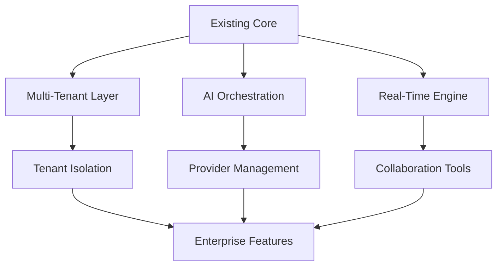

# PlexiChat Feature Roadmap

## Overview

This comprehensive feature roadmap outlines the strategic development direction for PlexiChat, building upon the existing robust architecture that includes:

- **FastAPI Backend**: High-performance async API framework
- **WebSocket Support**: Real-time communication capabilities
- **P2P Backup System**: Decentralized data redundancy
- **Security Features**: Comprehensive authentication and encryption
- **AI Integration**: Multi-provider AI services
- **Plugin Architecture**: Extensible modular system

The roadmap categorizes features into three tiers based on scope and impact:

- **Massive Features**: Large-scale architectural enhancements requiring significant development effort
- **Medium Features**: Substantial improvements to existing functionality
- **Small Features**: Targeted enhancements and user experience improvements

## Massive Features

### 1. Multi-Tenant Enterprise Architecture
**Description**: Transform PlexiChat into a multi-tenant platform supporting isolated organizations with dedicated resources, configurations, and administrative controls.

**Technical Requirements**:
- Database schema redesign with tenant isolation
- Tenant-aware middleware in `plexichat/src/plexichat/core/middleware/`
- Enhanced authentication system in `plexichat/src/plexichat/core/auth/`
- API versioning for backward compatibility
- Resource quota management
- Cross-tenant communication controls

**User Stories**:
- As an enterprise admin, I want to create isolated workspaces for different departments
- As a system admin, I want to enforce resource limits per tenant
- As a user, I want seamless switching between personal and work contexts

**Priority**: High
**Estimated Effort**: 3-4 months
**Dependencies**: Database migration, authentication refactor

### 2. Advanced AI Integration Hub
**Description**: Create a unified AI orchestration platform supporting multiple providers, custom model training, and intelligent routing based on task complexity.

**Technical Requirements**:
- Extend `plexichat/src/plexichat/features/ai/` with provider abstraction layer
- Implement model training pipelines using existing clustering infrastructure
- Add AI performance monitoring in `plexichat/src/plexichat/core/monitoring/`
- Develop intelligent provider selection algorithms
- Integrate with existing plugin system for custom AI modules

**User Stories**:
- As a power user, I want the system to automatically select the best AI provider for my query
- As a developer, I want to train custom models on my chat data
- As an admin, I want to monitor AI usage and performance across providers

**Priority**: High
**Estimated Effort**: 2-3 months
**Dependencies**: AI provider plugins, monitoring system

### 3. Real-Time Collaboration Suite
**Description**: Implement comprehensive real-time collaboration tools including document editing, whiteboarding, and screen sharing capabilities.

**Technical Requirements**:
- WebRTC integration for peer-to-peer media streaming
- Operational Transformation for conflict-free collaborative editing
- Extend WebSocket infrastructure in `plexichat/src/plexichat/core/websocket/`
- File versioning system integration with backup
- Real-time presence indicators

**User Stories**:
- As a team member, I want to collaboratively edit documents in real-time
- As a remote worker, I want to share my screen during meetings
- As a project manager, I want to create and share interactive whiteboards

**Priority**: Medium
**Estimated Effort**: 3-4 months
**Dependencies**: WebRTC libraries, WebSocket enhancements

### 4. Federated Chat Network
**Description**: Enable cross-platform communication through federation protocols, allowing PlexiChat users to connect with users on other chat platforms.

**Technical Requirements**:
- Implement federation protocols (Matrix, ActivityPub)
- Identity federation and verification system
- Bridge development for popular platforms (Slack, Discord, Teams)
- Enhanced security for external communications
- Message routing and delivery guarantees

**User Stories**:
- As a user, I want to chat with friends on other platforms without leaving PlexiChat
- As an organization, I want to integrate with existing corporate chat systems
- As a developer, I want to build bridges to custom platforms

**Priority**: Medium
**Estimated Effort**: 4-5 months
**Dependencies**: Protocol libraries, security enhancements

### 5. Enterprise Analytics & Intelligence Platform
**Description**: Build a comprehensive analytics platform providing deep insights into usage patterns, performance metrics, and user behavior.

**Technical Requirements**:
- Data aggregation pipeline using existing clustering
- Real-time analytics dashboard in `plexichat/src/plexichat/interfaces/web/`
- Machine learning models for predictive analytics
- Integration with existing monitoring in `plexichat/src/plexichat/core/monitoring/`
- Export capabilities for external BI tools

**User Stories**:
- As an admin, I want to see real-time usage statistics and trends
- As a manager, I want predictive insights on user engagement
- As a developer, I want detailed performance metrics for optimization

**Priority**: Medium
**Estimated Effort**: 2-3 months
**Dependencies**: Monitoring system, database analytics

## Medium Features

### 1. Enhanced File Sharing & Collaboration
**Description**: Upgrade file sharing with preview capabilities, version control, and collaborative editing for supported formats.

**Technical Requirements**:
- File preview generation service
- Integration with existing file management in `plexichat/src/plexichat/core/files/`
- Version control system
- Collaborative editing for documents

**Priority**: High
**Estimated Effort**: 1-2 months

### 2. Voice & Video Calling Integration
**Description**: Add native voice and video calling capabilities with recording and transcription features.

**Technical Requirements**:
- WebRTC implementation for calls
- Audio/video processing pipeline
- Integration with AI transcription services
- Call recording and storage

**Priority**: High
**Estimated Effort**: 2 months

### 3. Advanced Moderation Tools
**Description**: Implement sophisticated content moderation with AI-powered detection and automated responses.

**Technical Requirements**:
- AI content analysis integration
- Automated moderation rules engine
- Human-in-the-loop review system
- Reporting and analytics

**Priority**: Medium
**Estimated Effort**: 1-2 months

### 4. Custom Themes & UI Personalization
**Description**: Allow users to create and apply custom themes with advanced personalization options.

**Technical Requirements**:
- Theme engine in web interface
- CSS variable system
- User preference storage
- Theme marketplace

**Priority**: Low
**Estimated Effort**: 1 month

### 5. External Service Integrations
**Description**: Build connectors for popular services like calendar, project management, and productivity tools.

**Technical Requirements**:
- OAuth integration framework
- API client libraries
- Webhook handling
- Data synchronization

**Priority**: Medium
**Estimated Effort**: 1-2 months

### 6. Mobile Application Development
**Description**: Create native mobile apps for iOS and Android with full feature parity.

**Technical Requirements**:
- React Native or Flutter framework
- API client for mobile
- Offline synchronization
- Push notifications

**Priority**: High
**Estimated Effort**: 3-4 months

### 7. Advanced Search & Discovery
**Description**: Implement semantic search, filters, and intelligent content discovery.

**Technical Requirements**:
- Full-text search with AI ranking
- Faceted search interface
- Content indexing pipeline
- Search analytics

**Priority**: Medium
**Estimated Effort**: 1-2 months

### 8. Notification System Overhaul
**Description**: Redesign notification system with smart filtering, scheduling, and multi-channel delivery.

**Technical Requirements**:
- Notification routing engine
- User preference management
- Multi-channel support (email, push, in-app)
- Smart filtering algorithms

**Priority**: Medium
**Estimated Effort**: 1 month

### 9. Performance Monitoring & Optimization
**Description**: Add comprehensive performance tracking and automated optimization features.

**Technical Requirements**:
- APM integration
- Performance profiling tools
- Automated optimization suggestions
- Resource usage analytics

**Priority**: High
**Estimated Effort**: 1-2 months

### 10. API Rate Limiting & Analytics
**Description**: Implement sophisticated API management with usage analytics and billing integration.

**Technical Requirements**:
- Rate limiting middleware
- Usage tracking and analytics
- Billing integration
- API documentation enhancements

**Priority**: Medium
**Estimated Effort**: 1 month

## Small Features

### 1. Dark Mode Toggle
**Description**: Add system-wide dark mode with automatic detection and manual override.

**Technical Requirements**:
- CSS dark mode implementation
- Theme persistence
- System preference detection

**Priority**: Low
**Estimated Effort**: 1 week

### 2. Message Reactions
**Description**: Allow users to react to messages with emojis and custom reactions.

**Technical Requirements**:
- Reaction storage in database
- UI components for reactions
- Real-time reaction updates

**Priority**: Low
**Estimated Effort**: 1 week

### 3. Typing Indicators
**Description**: Show when other users are typing in real-time.

**Technical Requirements**:
- WebSocket typing events
- UI indicators
- Timeout handling

**Priority**: Low
**Estimated Effort**: 3 days

### 4. Message Threads
**Description**: Enable threaded conversations for better organization.

**Technical Requirements**:
- Thread data model
- UI thread view
- Notification handling

**Priority**: Medium
**Estimated Effort**: 1 week

### 5. User Status Indicators
**Description**: Display user availability and custom status messages.

**Technical Requirements**:
- Status storage and updates
- Presence indicators
- Custom status messages

**Priority**: Low
**Estimated Effort**: 3 days

### 6. Keyboard Shortcuts
**Description**: Add comprehensive keyboard shortcuts for power users.

**Technical Requirements**:
- Shortcut management system
- UI hints and help
- Customizable shortcuts

**Priority**: Low
**Estimated Effort**: 1 week

### 7. Chat History Export
**Description**: Allow users to export their chat history in various formats.

**Technical Requirements**:
- Export pipeline
- Format options (PDF, JSON, HTML)
- Privacy controls

**Priority**: Medium
**Estimated Effort**: 1 week

### 8. Message Formatting Enhancements
**Description**: Improve message formatting with advanced markdown and media support.

**Technical Requirements**:
- Enhanced markdown parser
- Media embedding
- Code syntax highlighting

**Priority**: Low
**Estimated Effort**: 1 week

### 9. User Profile Enhancements
**Description**: Add profile customization, badges, and social features.

**Technical Requirements**:
- Profile management UI
- Badge system
- Social connections

**Priority**: Low
**Estimated Effort**: 1 week

### 10. Help & Documentation Improvements
**Description**: Enhance in-app help, tooltips, and documentation accessibility.

**Technical Requirements**:
- Contextual help system
- Interactive tutorials
- Searchable documentation

**Priority**: Low
**Estimated Effort**: 1 week

## Implementation Roadmap

### Phase 1 (Months 1-3): Foundation
- Multi-Tenant Architecture
- Advanced AI Integration Hub
- Performance Monitoring & Optimization

### Phase 2 (Months 4-6): Collaboration
- Real-Time Collaboration Suite
- Voice & Video Calling
- Enhanced File Sharing

### Phase 3 (Months 7-9): Integration & Scale
- Federated Chat Network
- External Service Integrations
- Mobile Applications

### Phase 4 (Months 10-12): Intelligence & Polish
- Enterprise Analytics Platform
- Advanced Moderation Tools
- Small feature implementations

## Technical Architecture Impact

## Success Metrics

- **User Adoption**: 50% increase in active users within 6 months
- **Performance**: Maintain <100ms response times for core features
- **Reliability**: 99.9% uptime for critical features
- **Security**: Zero security incidents post-implementation
- **Developer Velocity**: 30% reduction in feature development time

## Risk Mitigation

- **Technical Debt**: Regular refactoring sprints
- **Security**: Comprehensive security audits for new features
- **Scalability**: Performance testing for each major feature
- **User Experience**: Beta testing and user feedback integration

## Conclusion

This roadmap positions PlexiChat as a comprehensive communication and collaboration platform while maintaining the security, performance, and extensibility that define the current system. Each feature builds upon the existing architecture, ensuring seamless integration and minimal disruption to current users.