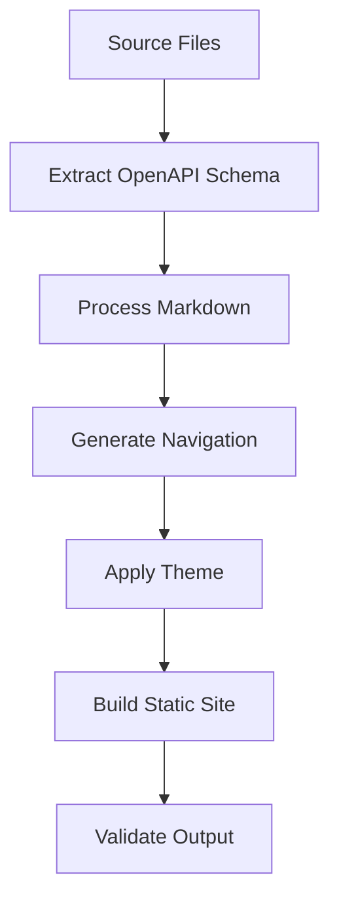

# Documentation Maintenance Guide

This guide provides comprehensive instructions for maintaining the PlexiChat documentation system, including updating content, managing the automated build pipeline, and ensuring documentation quality.

## Table of Contents

- [Overview](#overview)
- [Documentation Architecture](#documentation-architecture)
- [Getting Started](#getting-started)
- [Common Maintenance Tasks](#common-maintenance-tasks)
- [Documentation Standards](#documentation-standards)
- [Writing Guidelines](#writing-guidelines)
- [Cross-Reference Management](#cross-reference-management)
- [API Documentation](#api-documentation)
- [Build System](#build-system)
- [Troubleshooting](#troubleshooting)
- [Review Process](#review-process)
- [Automation Workflows](#automation-workflows)
- [Quality Assurance](#quality-assurance)
- [Advanced Topics](#advanced-topics)

## Overview

PlexiChat uses an automated documentation system built on MkDocs with Material theme, featuring:

- **Automated API documentation** generation from OpenAPI schema
- **Static site generation** for fast, searchable documentation
- **Continuous integration** with GitHub Actions
- **Quality checks** and linting
- **Cross-reference validation**
- **Multi-format output** (HTML, PDF)

### Key Components

| Component | Purpose | Location |
|-----------|---------|----------|
| MkDocs | Static site generator | `mkdocs.yml` |
| Build Script | Orchestrates documentation build | `scripts/build_docs.sh` |
| Makefile | Convenient build targets | `Makefile` |
| OpenAPI Extractor | Generates API docs | `scripts/dump_openapi.py` |
| GitHub Actions | CI/CD pipeline | `.github/workflows/docs.yml` |

## Documentation Architecture

### Directory Structure

```
docs/
├── README.md                    # Main documentation index
├── GETTING_STARTED.md          # Quick start guide
├── ARCHITECTURE.md             # System architecture
├── SECURITY.md                 # Security documentation
├── WAF_RULES.md               # WAF configuration
├── INCIDENT_RESPONSE.md       # Incident response procedures
├── API.md                     # API overview
├── DEPLOYMENT.md              # Deployment guide
├── BACKUP_SYSTEM.md           # Backup procedures
├── PLUGIN_DEVELOPMENT.md      # Plugin development guide
├── MAINTAINING_DOCUMENTATION.md # This file
├── requirements.txt           # Documentation dependencies
├── _generated/               # Auto-generated content
│   ├── openapi.json         # OpenAPI schema
│   └── .gitignore           # Ignore generated files
├── stylesheets/             # Custom CSS
├── javascripts/             # Custom JavaScript
└── includes/                # Reusable content snippets
```

### Navigation Structure

The documentation is organized into logical sections defined in `mkdocs.yml`:

1. **Getting Started** - Installation and quick start
2. **Architecture** - System design and components
3. **Security** - Security policies and procedures
4. **API Reference** - Auto-generated API documentation
5. **Deployment** - Installation and configuration
6. **Backup System** - Data protection procedures
7. **Plugin Development** - Extension development
8. **Maintenance** - System and documentation maintenance

## Getting Started

### Prerequisites

Before maintaining documentation, ensure you have:

- Python 3.8+ installed
- Virtual environment (recommended)
- Git access to the repository
- Text editor with Markdown support

### Initial Setup

1. **Clone the repository:**
   ```bash
   git clone https://github.com/plexichat/plexichat.git
   cd plexichat
   ```

2. **Set up virtual environment:**
   ```bash
   python3 -m venv venv
   source venv/bin/activate  # On Windows: venv\Scripts\activate
   ```

3. **Install documentation dependencies:**
   ```bash
   make docs-install
   # Or manually:
   pip install -r docs/requirements.txt
   ```

4. **Verify setup:**
   ```bash
   make docs-check
   ```

### Quick Start

To start working with documentation:

1. **Start development server:**
   ```bash
   make docs-serve
   # Documentation available at http://localhost:8000
   ```

2. **Make changes** to any `.md` file in the `docs/` directory

3. **Preview changes** in your browser (auto-reloads)

4. **Build production version:**
   ```bash
   make docs
   ```

## Common Maintenance Tasks

### Adding a New Documentation Page

1. **Create the Markdown file:**
   ```bash
   touch docs/new-feature.md
   ```

2. **Add content with proper front matter:**
   ```markdown
   # New Feature Documentation
   
   Brief description of the feature.
   
   ## Overview
   
   Detailed content here...
   ```

3. **Update navigation in `mkdocs.yml`:**
   ```yaml
   nav:
     - Home: README.md
     - New Feature: new-feature.md
     # ... other sections
   ```

4. **Add cross-references** from related pages:
   ```markdown
   For more information, see [New Feature](new-feature.md).
   ```

5. **Test the build:**
   ```bash
   make docs-check
   make docs-serve
   ```

### Updating Existing Documentation

1. **Edit the relevant `.md` file** using your preferred editor

2. **Follow writing guidelines** (see [Writing Guidelines](#writing-guidelines))

3. **Update cross-references** if the content structure changes

4. **Test changes locally:**
   ```bash
   make docs-serve
   ```

5. **Run quality checks:**
   ```bash
   make docs-lint
   ```

### Removing Documentation

1. **Delete the file:**
   ```bash
   rm docs/obsolete-feature.md
   ```

2. **Remove from navigation** in `mkdocs.yml`

3. **Update cross-references** in other files:
   ```bash
   # Find references to the removed file
   grep -r "obsolete-feature.md" docs/
   ```

4. **Test for broken links:**
   ```bash
   make docs-lint
   ```

### Reorganizing Documentation

1. **Plan the new structure** and create a migration map

2. **Move files** to new locations:
   ```bash
   mkdir -p docs/new-section
   mv docs/old-file.md docs/new-section/new-file.md
   ```

3. **Update `mkdocs.yml` navigation:**
   ```yaml
   nav:
     - New Section:
       - New File: new-section/new-file.md
   ```

4. **Update all cross-references:**
   ```bash
   # Find and replace references
   find docs/ -name "*.md" -exec sed -i 's/old-file.md/new-section\/new-file.md/g' {} +
   ```

5. **Test thoroughly:**
   ```bash
   make docs-validate
   ```

## Documentation Standards

### File Naming Conventions

- Use **UPPERCASE** for main documentation files: `README.md`, `SECURITY.md`
- Use **lowercase with hyphens** for subsections: `getting-started.md`
- Use **descriptive names**: `plugin-development.md` not `plugins.md`
- Avoid spaces and special characters

### Content Structure

Every documentation page should follow this structure:

```markdown
# Page Title

Brief description of the page content (1-2 sentences).

## Table of Contents (for long pages)

- [Section 1](#section-1)
- [Section 2](#section-2)

## Overview

High-level overview of the topic.

## Main Content Sections

### Subsection 1

Detailed content...

### Subsection 2

More content...

## Examples

Practical examples and code snippets.

## Troubleshooting

Common issues and solutions.

## Related Documentation

- [Related Page 1](related-page-1.md)
- [Related Page 2](related-page-2.md)
```

### Markdown Standards

- Use **ATX-style headers** (`#`, `##`, `###`)
- Include **table of contents** for pages longer than 3 sections
- Use **code fences** with language specification:
  ```python
  def example_function():
      return "Hello, World!"
  ```
- Use **admonitions** for important information:
  ```markdown
  !!! warning "Important"
      This is critical information.
  
  !!! note "Note"
      This is additional information.
  
  !!! tip "Tip"
      This is helpful advice.
  ```

## Writing Guidelines

### Voice and Tone

- Use **active voice** whenever possible
- Write in **second person** ("you") for instructions
- Be **concise and clear**
- Use **present tense** for current functionality
- Maintain a **professional but friendly** tone

### Content Guidelines

1. **Start with the user's goal** - What are they trying to accomplish?

2. **Provide context** - Why is this information important?

3. **Use clear headings** - Make content scannable

4. **Include examples** - Show, don't just tell

5. **Test instructions** - Verify all steps work as written

6. **Keep it current** - Remove outdated information promptly

### Code Examples

- **Test all code examples** before publishing
- **Include expected output** when relevant
- **Use realistic examples** that users might actually encounter
- **Explain complex code** with comments or prose

Example:
```bash
# Preferred: use the repository helper which safely exports the OpenAPI schema
# By default the script will import the application; set PLEXICHAT_DOCS_MINIMAL=1
# to use a minimal docs-only app that avoids heavy side-effects during import.
PLEXICHAT_DOCS_MINIMAL=1 python scripts/dump_openapi.py

# The script writes: docs/_generated/openapi.json
```

### Screenshots and Diagrams

- Use **high-quality screenshots** with consistent styling
- **Annotate images** to highlight important elements
- Keep **file sizes reasonable** (< 500KB per image)
- Use **alt text** for accessibility
- Store images in `docs/images/` directory

## Cross-Reference Management

### Internal Links

Use relative paths for internal documentation links:

```markdown
# Good
[Security Guide](SECURITY.md)
[Plugin Development](PLUGIN_DEVELOPMENT.md)
[Getting Started](GETTING_STARTED.md)

# Bad
[Security Guide](/docs/SECURITY.md)
[Plugin Development](https://plexichat.github.io/docs/PLUGIN_DEVELOPMENT/)
```

### Link Validation

The build system automatically checks for broken links:

```bash
# Check for broken internal links
make docs-lint

# Validate all documentation
make docs-validate
```

### Cross-Reference Patterns

Use consistent patterns for different types of references:

```markdown
# Reference to another main section
For deployment information, see [Deployment Guide](DEPLOYMENT.md).

# Reference to subsection
See [Database Configuration](DEPLOYMENT.md#database-configuration).

# Reference to API documentation
Refer to the [Authentication API](api/authentication.md) for details.

# Reference to external resources
See the [FastAPI documentation](https://fastapi.tiangolo.com/) for more information.
```

### Maintaining References

When moving or renaming files:

1. **Create a checklist** of all files that reference the changed file
2. **Update references systematically**
3. **Use search and replace** carefully:
   ```bash
   # Find all references to a file
   grep -r "old-filename.md" docs/
   
   # Replace references (be careful with this!)
   find docs/ -name "*.md" -exec sed -i 's/old-filename.md/new-filename.md/g' {} +
   ```
4. **Test thoroughly** after changes

## API Documentation

### Automated Generation

API documentation is automatically generated from the FastAPI OpenAPI schema:

1. **OpenAPI schema extraction** (`scripts/dump_openapi.py`):
   ```python
   # Extracts schema from FastAPI app
   schema = app.openapi()
   ```

2. **Schema processing** during build:
   ```bash
   # Run extraction script
   python scripts/dump_openapi.py
   
   # Build documentation with API docs
   mkdocs build
   ```

3. **Integration with MkDocs** via plugins in `mkdocs.yml`

### Manual API Documentation

For endpoints requiring additional context:

1. **Create dedicated API pages** in `docs/api/` directory
2. **Follow consistent structure:**
   ```markdown
   # Endpoint Name API
   
   ## Overview
   Brief description of the endpoint's purpose.
   
   ## Authentication
   Required authentication method.
   
   ## Request Format
   ### Parameters
   | Parameter | Type | Required | Description |
   |-----------|------|----------|-------------|
   | param1    | string | Yes    | Description |
   
   ### Example Request
   ```json
   {
     "param1": "value1"
   }
   ```
   
   ## Response Format
   ### Success Response
   ```json
   {
     "status": "success",
     "data": {}
   }
   ```
   
   ### Error Responses
   Common error scenarios and responses.
   
   ## Examples
   Practical usage examples.
   ```

### Keeping API Docs Current

1. **Automated updates** happen on every build
2. **Manual review** required for:
   - New endpoint descriptions
   - Usage examples
   - Error handling documentation
   - Authentication changes

3. **Testing API documentation:**
   ```bash
   # Rebuild API docs
   make docs-clean
   make docs
   
   # Verify API endpoints are documented
   grep -r "openapi" site/
   ```

## Build System

### Build Process Overview

The documentation build process consists of several stages:



### Build Commands

| Command | Purpose | Usage |
|---------|---------|-------|
| `make docs-install` | Install dependencies | First-time setup |
| `make docs-serve` | Development server | Local development |
| `make docs` | Production build | Release preparation |
| `make docs-clean` | Clean generated files | Troubleshooting |
| `make docs-lint` | Check documentation quality | Quality assurance |
| `make docs-check` | Validate setup | Troubleshooting |

### Build Script Details

The main build script (`scripts/build_docs.sh`) performs these steps:

1. **Prerequisites check** - Verify Python, pip, required files
2. **Dependency installation** - Install MkDocs and plugins
3. **OpenAPI extraction** - Generate API schema
4. **Documentation build** - Run MkDocs
5. **Validation** - Check output quality

### Configuration Files

#### `mkdocs.yml`
Main configuration file controlling:
- Site metadata
- Theme configuration
- Plugin settings
- Navigation structure
- Markdown extensions

#### `docs/requirements.txt`
Python dependencies for documentation:
```
mkdocs>=1.5.0
mkdocs-material>=9.0.0
mkdocs-openapi-generator-plugin>=1.0.0
markdown-lint-cli>=0.32.0
```

#### `Makefile`
Convenient targets for common operations with proper error handling and logging.

### Customization

#### Theme Customization

Modify `mkdocs.yml` to customize appearance:

```yaml
theme:
  name: material
  palette:
    primary: blue
    accent: blue
  features:
    - navigation.tabs
    - search.highlight
```

#### Custom CSS/JavaScript

Add custom styling in:
- `docs/stylesheets/extra.css`
- `docs/javascripts/extra.js`

Reference in `mkdocs.yml`:
```yaml
extra_css:
  - stylesheets/extra.css
extra_javascript:
  - javascripts/extra.js
```

## Troubleshooting

### Common Issues

#### Build Failures

**Problem:** MkDocs build fails with import errors
```
ModuleNotFoundError: No module named 'src.plexichat'
```

**Solution:**
1. Ensure you're in the project root directory
2. Check Python path configuration
3. Verify virtual environment is activated
4. Install missing dependencies:
   ```bash
   make docs-install
   ```

**Problem:** OpenAPI schema extraction fails
```
Failed to extract OpenAPI schema
```

**Solution:**
1. Check if the FastAPI application starts correctly
2. Verify import paths in `scripts/dump_openapi.py`
3. Check for syntax errors in the main application
4. Run the extraction script manually:
   ```bash
   python scripts/dump_openapi.py
   ```

#### Broken Links

**Problem:** Documentation contains broken internal links

**Solution:**
1. Run link validation:
   ```bash
   make docs-lint
   ```
2. Check for moved or renamed files
3. Update references systematically
4. Verify file paths are correct

#### Missing Dependencies

**Problem:** MkDocs plugins not found

**Solution:**
1. Reinstall documentation dependencies:
   ```bash
   make docs-install
   ```
2. Check `docs/requirements.txt` for version conflicts
3. Update pip if necessary:
   ```bash
   pip install --upgrade pip
   ```

### Debugging Steps

1. **Check prerequisites:**
   ```bash
   make docs-check
   ```

2. **Verify file structure:**
   ```bash
   ls -la docs/
   ls -la scripts/
   ```

3. **Test individual components:**
   ```bash
   # Test OpenAPI extraction
   python scripts/dump_openapi.py
   
   # Test MkDocs configuration
   mkdocs build --strict
   ```

4. **Enable verbose output:**
   ```bash
   make docs VERBOSE=true
   ```

5. **Check logs:**
   ```bash
   # Build with full output
   ./scripts/build_docs.sh --prod --verbose
   ```

### Performance Issues

**Problem:** Documentation build is slow

**Solutions:**
1. **Clean generated files:**
   ```bash
   make docs-clean
   ```

2. **Disable unnecessary plugins** temporarily in `mkdocs.yml`

3. **Use development mode** for faster iteration:
   ```bash
   make docs-serve
   ```

4. **Check for large files** in the documentation directory:
   ```bash
   find docs/ -size +1M -type f
   ```

## Review Process

### Documentation Review Workflow

1. **Author creates/updates documentation**
2. **Self-review checklist:**
   - [ ] Content is accurate and current
   - [ ] Links work correctly
   - [ ] Code examples are tested
   - [ ] Writing follows guidelines
   - [ ] Build passes locally

3. **Peer review:**
   - [ ] Technical accuracy
   - [ ] Clarity and completeness
   - [ ] Consistency with existing docs
   - [ ] Proper cross-references

4. **Final validation:**
   - [ ] Automated tests pass
   - [ ] Documentation builds successfully
   - [ ] No broken links
   - [ ] Proper formatting

### Review Checklist

#### Content Review
- [ ] **Accuracy** - Information is correct and current
- [ ] **Completeness** - All necessary information is included
- [ ] **Clarity** - Content is easy to understand
- [ ] **Relevance** - Information is useful to the target audience
- [ ] **Examples** - Code examples work and are helpful

#### Technical Review
- [ ] **Links** - All internal and external links work
- [ ] **Code** - All code examples are tested and functional
- [ ] **Structure** - Proper heading hierarchy and organization
- [ ] **Cross-references** - Related documentation is properly linked
- [ ] **Formatting** - Consistent markdown formatting

#### Quality Review
- [ ] **Grammar** - Proper grammar and spelling
- [ ] **Style** - Consistent with writing guidelines
- [ ] **Tone** - Appropriate voice and tone
- [ ] **Accessibility** - Alt text for images, clear language
- [ ] **SEO** - Proper headings and meta information

### Review Tools

#### Automated Checks
```bash
# Run all quality checks
make docs-validate

# Individual checks
make docs-lint      # Markdown linting
make docs-check     # Setup validation
make docs          # Build validation
```

#### Manual Review Tools
- **Grammarly** or similar for grammar checking
- **Browser developer tools** for testing responsive design
- **Screen readers** for accessibility testing
- **Print preview** for PDF output testing

## Automation Workflows

### GitHub Actions Integration

The documentation system includes automated workflows in `.github/workflows/docs.yml`:

#### Workflow Triggers
- **Push to main branch** - Builds and deploys documentation
- **Pull request** - Builds documentation for review
- **Manual trigger** - Allows manual documentation builds

#### Workflow Steps
1. **Checkout code**
2. **Setup Python environment**
3. **Install dependencies**
4. **Run quality checks**
5. **Build documentation**
6. **Deploy to GitHub Pages** (on main branch)

#### Configuration Example
```yaml
name: Documentation

on:
  push:
    branches: [main]
    paths: ['docs/**', 'src/**', 'mkdocs.yml']
  pull_request:
    paths: ['docs/**', 'src/**', 'mkdocs.yml']

jobs:
  build:
    runs-on: ubuntu-latest
    steps:
      - uses: actions/checkout@v3
      - name: Setup Python
        uses: actions/setup-python@v4
        with:
          python-version: '3.9'
      - name: Install dependencies
        run: make docs-install
      - name: Build documentation
        run: make docs
      - name: Deploy to GitHub Pages
        if: github.ref == 'refs/heads/main'
        uses: peaceiris/actions-gh-pages@v3
        with:
          github_token: ${{ secrets.GITHUB_TOKEN }}
          publish_dir: ./site
```

### Local Automation

#### Git Hooks

Set up pre-commit hooks to ensure documentation quality:

```bash
# .git/hooks/pre-commit
#!/bin/bash
echo "Running documentation checks..."

# Check if documentation files were modified
if git diff --cached --name-only | grep -q "docs/"; then
    echo "Documentation changes detected, running validation..."
    
    # Run documentation checks
    make docs-lint
    if [ $? -ne 0 ]; then
        echo "Documentation linting failed. Please fix issues before committing."
        exit 1
    fi
    
    # Test build
    make docs-quick
    if [ $? -ne 0 ]; then
        echo "Documentation build failed. Please fix issues before committing."
        exit 1
    fi
    
    echo "Documentation validation passed."
fi
```

#### Watch Scripts

For continuous development, use file watching:

```bash
# Watch for changes and rebuild
make watch-docs

# Or manually with entr
find docs/ -name "*.md" | entr -r make docs-quick
```

### Scheduled Maintenance

#### Weekly Tasks
- **Link validation** - Check for broken external links
- **Dependency updates** - Update MkDocs and plugins
- **Content review** - Review and update time-sensitive content

#### Monthly Tasks
- **Performance review** - Check build times and optimize
- **Analytics review** - Review documentation usage patterns
- **Content audit** - Identify outdated or missing content

#### Quarterly Tasks
- **Major updates** - Update theme and major dependencies
- **Structure review** - Evaluate and improve organization
- **User feedback** - Collect and address user feedback

## Quality Assurance

### Automated Quality Checks

#### Markdown Linting
```bash
# Run markdownlint
markdownlint docs/**/*.md --config docs/.markdownlint.json

# Fix common issues automatically
markdownlint docs/**/*.md --fix
```

#### Link Validation
```bash
# Check internal links
make docs-lint

# Check external links (requires additional tools)
markdown-link-check docs/**/*.md
```

#### Build Validation
```bash
# Strict build (fails on warnings)
mkdocs build --strict

# Validate generated output
make docs-validate
```

### Quality Metrics

#### Content Quality
- **Readability score** - Target 8th grade reading level
- **Content freshness** - Review dates and update frequency
- **Completeness** - Coverage of all features and APIs
- **Accuracy** - Technical correctness verification

#### Technical Quality
- **Build time** - Target under 30 seconds for full build
- **Link health** - Zero broken internal links
- **Accessibility** - WCAG 2.1 AA compliance
- **Performance** - Page load times under 3 seconds

### Quality Tools

#### Linting Configuration
Create `.markdownlint.json` in the docs directory:
```json
{
  "default": true,
  "MD013": {
    "line_length": 100,
    "code_blocks": false,
    "tables": false
  },
  "MD033": {
    "allowed_elements": ["details", "summary", "div", "span"]
  }
}
```

#### Accessibility Testing
- **Alt text** for all images
- **Proper heading hierarchy** (no skipped levels)
- **Color contrast** meeting WCAG standards
- **Keyboard navigation** support

## Advanced Topics

### Custom Plugins

Create custom MkDocs plugins for specialized functionality:

```python
# docs/plugins/custom_plugin.py
from mkdocs.plugins import BasePlugin

class CustomPlugin(BasePlugin):
    def on_page_markdown(self, markdown, page, config, files):
        # Process markdown content
        return markdown
```

Register in `mkdocs.yml`:
```yaml
plugins:
  - custom_plugin:
      option: value
```

### Multi-language Support

Configure multiple language versions:

```yaml
# mkdocs.yml
plugins:
  - i18n:
      default_language: en
      languages:
        en: English
        es: Español
        fr: Français
```

### Advanced Theming

#### Custom Theme Development
```yaml
# mkdocs.yml
theme:
  name: null
  custom_dir: docs/theme/
```

#### Theme Inheritance
```yaml
theme:
  name: material
  custom_dir: docs/theme_overrides/
```

### Integration with External Systems

#### API Documentation Sync
```python
# scripts/sync_api_docs.py
import requests
import json

# Fetch API documentation from external source
response = requests.get('https://api.example.com/docs')
api_docs = response.json()

# Process and save to documentation
with open('docs/_generated/external_api.json', 'w') as f:
    json.dump(api_docs, f, indent=2)
```

#### Content Management Integration
```python
# scripts/sync_content.py
# Sync content from CMS or other sources
```

### Performance Optimization

#### Build Optimization
- **Parallel processing** for large documentation sets
- **Incremental builds** for faster development
- **Caching strategies** for external resources
- **Asset optimization** for images and media

#### Deployment Optimization
- **CDN integration** for global distribution
- **Compression** for faster loading
- **Caching headers** for better performance
- **Progressive loading** for large pages

### Monitoring and Analytics

#### Build Monitoring
```bash
# Monitor build performance
time make docs

# Track build metrics
echo "$(date): Build completed in ${duration}s" >> build_metrics.log
```

#### Usage Analytics
- **Google Analytics** integration
- **User behavior tracking**
- **Search query analysis**
- **Popular content identification**

#### Health Monitoring
```bash
# Check documentation health
curl -f https://docs.plexichat.com/health || echo "Documentation site down"

# Monitor link health
markdown-link-check docs/**/*.md --config link-check-config.json
```

---

## Conclusion

This maintenance guide provides a comprehensive framework for managing PlexiChat's documentation system. Regular maintenance ensures that documentation remains accurate, accessible, and valuable to users and developers.

### Key Takeaways

1. **Consistency is crucial** - Follow established patterns and standards
2. **Automation reduces errors** - Use tools and scripts for repetitive tasks
3. **Quality checks prevent issues** - Regular validation catches problems early
4. **User feedback drives improvement** - Listen to documentation users
5. **Documentation is code** - Apply software development best practices

### Getting Help

- **Documentation issues** - Create GitHub issues with the `documentation` label
- **Build problems** - Check the troubleshooting section or ask in development chat
- **Content questions** - Reach out to the documentation team
- **Technical support** - Contact the development team for system-level issues

### Contributing

We welcome contributions to improve this documentation system. Please:

1. **Follow the guidelines** outlined in this document
2. **Test your changes** thoroughly before submitting
3. **Update this guide** if you make process improvements
4. **Share knowledge** with the team about useful tools or techniques

For more information about contributing, see [CONTRIBUTING.md](CONTRIBUTING.md).