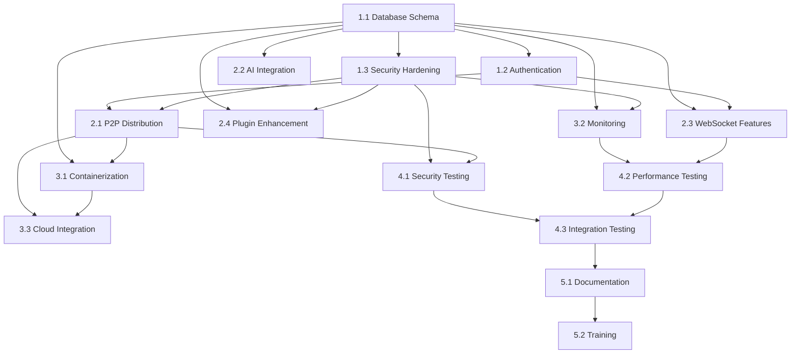

# PlexiChat Task Graph and Implementation Plan

## Overview

This document outlines the dependency-ordered task graph for completing the PlexiChat repository. Tasks are organized by priority and dependency relationships, with assigned specialist roles, acceptance criteria, and rollback plans.

## Task Categories and Owners

### Specialist Roles
- **Backend Engineer**: Core system development and API implementation
- **Security Engineer**: Security features and hardening
- **DevOps Engineer**: Infrastructure, deployment, and monitoring
- **Database Engineer**: Database design and optimization
- **Frontend Engineer**: Web interface and user experience
- **QA Engineer**: Testing and quality assurance
- **AI/ML Engineer**: AI features and integrations
- **System Architect**: Overall system design and coordination

## Phase 1: Foundation and Core Completion (High Priority)

### 1.1 Database Schema Alignment
**Owner**: Database Engineer
**Dependencies**: None
**Estimated Effort**: 2 weeks

**Tasks**:
1. Migrate from SQLite schema to PostgreSQL-compatible models
2. Implement SQLModel classes for all entities
3. Create proper database migrations for PostgreSQL
4. Update connection management for PostgreSQL
5. Implement database connection pooling

**Acceptance Criteria**:
- All models use SQLModel with PostgreSQL compatibility
- Successful migration from existing SQLite data
- Connection pooling working with PostgreSQL
- All existing tests pass with new schema

**Rollback Plan**:
- Revert to SQLite schema
- Restore database backups
- Update configuration to use SQLite

### 1.2 Authentication System Completion
**Owner**: Backend Engineer
**Dependencies**: 1.1
**Estimated Effort**: 1.5 weeks

**Tasks**:
1. Complete MFA email/SMS integration
2. Implement rate limiting for auth endpoints
3. Enhance password policy enforcement
4. Complete session management features
5. Add account recovery mechanisms

**Acceptance Criteria**:
- MFA working for all supported methods
- Rate limiting prevents brute force attacks
- Password policies enforced consistently
- Session management handles edge cases

**Rollback Plan**:
- Disable new MFA features
- Revert to basic authentication
- Restore previous session handling

### 1.3 Security Hardening
**Owner**: Security Engineer
**Dependencies**: 1.1, 1.2
**Estimated Effort**: 2 weeks

**Tasks**:
1. Complete WAF rule implementation
2. Implement comprehensive audit logging
3. Enhance encryption for sensitive data
4. Complete security monitoring
5. Implement emergency lockdown procedures

**Acceptance Criteria**:
- WAF blocks common attack vectors
- All security events logged
- Sensitive data properly encrypted
- Security dashboard functional

**Rollback Plan**:
- Disable WAF features
- Revert to basic logging
- Restore previous encryption methods

## Phase 2: Feature Completion (Medium Priority)

### 2.1 P2P Shard Distribution System
**Owner**: Backend Engineer
**Dependencies**: 1.1, 1.3
**Estimated Effort**: 3 weeks

**Tasks**:
1. Complete peer discovery mechanism
2. Implement distributed shard storage
3. Enhance P2P communication protocols
4. Add distributed consensus for integrity
5. Complete end-to-end encryption for P2P

**Acceptance Criteria**:
- Peers can discover and connect
- Shards distributed across peers
- Data integrity maintained in P2P network
- Encryption working for P2P transfers

**Rollback Plan**:
- Disable P2P features
- Revert to centralized backup
- Restore local shard storage

### 2.2 AI Integration Enhancement
**Owner**: AI/ML Engineer
**Dependencies**: 1.1
**Estimated Effort**: 2.5 weeks

**Tasks**:
1. Complete AI provider integrations
2. Implement content moderation system
3. Add AI-powered features (summarization, etc.)
4. Enhance AI monitoring and logging
5. Implement AI failover mechanisms

**Acceptance Criteria**:
- Multiple AI providers integrated
- Content moderation working
- AI features functional in UI
- Proper error handling and fallbacks

**Rollback Plan**:
- Disable AI features
- Revert to basic text processing
- Remove AI provider dependencies

### 2.3 WebSocket and Real-time Features
**Owner**: Backend Engineer
**Dependencies**: 1.1, 1.2
**Estimated Effort**: 2 weeks

**Tasks**:
1. Complete WebSocket load balancing
2. Implement message persistence
3. Add connection recovery mechanisms
4. Enhance real-time performance
5. Complete WebSocket security features

**Acceptance Criteria**:
- Load balancing working across instances
- Messages persisted reliably
- Connection recovery seamless
- Performance meets requirements

**Rollback Plan**:
- Disable advanced WebSocket features
- Revert to basic messaging
- Restore simple connection handling

### 2.4 Plugin System Enhancement
**Owner**: Backend Engineer
**Dependencies**: 1.1, 1.3
**Estimated Effort**: 2 weeks

**Tasks**:
1. Complete plugin security sandboxing
2. Enhance plugin marketplace
3. Implement plugin dependency management
4. Add plugin performance monitoring
5. Complete plugin API documentation

**Acceptance Criteria**:
- Plugins run in secure sandbox
- Marketplace functional
- Dependencies resolved correctly
- Plugin performance monitored

**Rollback Plan**:
- Disable plugin marketplace
- Revert to basic plugin loading
- Restore previous security model

## Phase 3: Infrastructure and DevOps (Medium Priority)

### 3.1 Containerization and Deployment
**Owner**: DevOps Engineer
**Dependencies**: 1.1, 2.1
**Estimated Effort**: 2 weeks

**Tasks**:
1. Create Docker images for all components
2. Implement Docker Compose orchestration
3. Add Kubernetes manifests
4. Implement CI/CD pipelines
5. Complete deployment automation

**Acceptance Criteria**:
- Docker images build successfully
- Compose deployment working
- Kubernetes deployment functional
- CI/CD pipeline automated

**Rollback Plan**:
- Use existing deployment methods
- Disable container features
- Restore manual deployment

### 3.2 Monitoring and Observability
**Owner**: DevOps Engineer
**Dependencies**: 1.1, 1.3
**Estimated Effort**: 2 weeks

**Tasks**:
1. Implement comprehensive metrics collection
2. Add alerting system
3. Complete log aggregation
4. Implement performance monitoring
5. Add health check endpoints

**Acceptance Criteria**:
- All key metrics collected
- Alerting working for critical issues
- Logs centralized and searchable
- Health checks comprehensive

**Rollback Plan**:
- Disable advanced monitoring
- Revert to basic logging
- Restore simple health checks

### 3.3 Cloud Integration
**Owner**: DevOps Engineer
**Dependencies**: 2.1, 3.1
**Estimated Effort**: 2 weeks

**Tasks**:
1. Complete AWS S3 integration
2. Implement Azure Blob Storage
3. Add Google Cloud Storage
4. Implement cloud database support
5. Add CDN integration

**Acceptance Criteria**:
- All major cloud providers supported
- Storage operations working
- Database integration functional
- CDN improving performance

**Rollback Plan**:
- Disable cloud features
- Revert to local storage
- Restore local database

## Phase 4: Testing and Quality Assurance (High Priority)

### 4.1 Security Testing
**Owner**: QA Engineer
**Dependencies**: 1.3, 2.1
**Estimated Effort**: 2 weeks

**Tasks**:
1. Complete penetration testing
2. Implement security regression tests
3. Add vulnerability scanning
4. Complete security audit
5. Implement security monitoring tests

**Acceptance Criteria**:
- No critical security vulnerabilities
- Security tests automated
- Vulnerability scanning integrated
- Security audit passed

**Rollback Plan**:
- Disable vulnerable features
- Implement security patches
- Restore secure configurations

### 4.2 Performance Testing
**Owner**: QA Engineer
**Dependencies**: 3.2, 2.3
**Estimated Effort**: 1.5 weeks

**Tasks**:
1. Implement load testing
2. Add performance regression tests
3. Complete scalability testing
4. Implement performance monitoring
5. Add performance benchmarks

**Acceptance Criteria**:
- Performance meets requirements
- Load testing successful
- Scalability verified
- Performance benchmarks established

**Rollback Plan**:
- Revert performance optimizations
- Restore previous configurations
- Disable high-load features

### 4.3 Integration Testing
**Owner**: QA Engineer
**Dependencies**: All previous phases
**Estimated Effort**: 2 weeks

**Tasks**:
1. Complete end-to-end testing
2. Implement API integration tests
3. Add database integration tests
4. Complete third-party integration tests
5. Implement chaos engineering tests

**Acceptance Criteria**:
- All integrations tested
- E2E scenarios working
- Database operations verified
- Third-party services integrated

**Rollback Plan**:
- Disable failing integrations
- Revert to working versions
- Restore stable configurations

## Phase 5: Documentation and Training (Low Priority)

### 5.1 Documentation Completion
**Owner**: System Architect
**Dependencies**: All previous phases
**Estimated Effort**: 1 week

**Tasks**:
1. Complete API documentation
2. Add deployment guides
3. Implement user documentation
4. Create troubleshooting guides
5. Add performance tuning guides

**Acceptance Criteria**:
- All APIs documented
- Deployment guides complete
- User documentation comprehensive
- Troubleshooting effective

**Rollback Plan**:
- Use existing documentation
- Update with corrections
- Restore previous versions

### 5.2 Training and Knowledge Transfer
**Owner**: System Architect
**Dependencies**: 5.1
**Estimated Effort**: 0.5 weeks

**Tasks**:
1. Create developer onboarding guides
2. Implement knowledge base
3. Add code review guidelines
4. Create operational runbooks
5. Implement training materials

**Acceptance Criteria**:
- New developers can onboard
- Knowledge base searchable
- Code review standards defined
- Operations documented

**Rollback Plan**:
- Use existing training materials
- Update with corrections
- Restore previous guides

## Task Dependencies Graph

## Risk Assessment and Mitigation

### High Risk Items
1. **Database Migration**: Risk of data loss
   - Mitigation: Comprehensive backups, staged migration
2. **Security Features**: Risk of introducing vulnerabilities
   - Mitigation: Security review, penetration testing
3. **P2P Distribution**: Risk of data integrity issues
   - Mitigation: Extensive testing, gradual rollout

### Medium Risk Items
1. **AI Integration**: Risk of API dependency issues
   - Mitigation: Fallback mechanisms, provider redundancy
2. **Cloud Integration**: Risk of vendor lock-in
   - Mitigation: Multi-cloud support, abstraction layers
3. **Plugin System**: Risk of security vulnerabilities
   - Mitigation: Sandboxing, permission systems

### Low Risk Items
1. **Documentation**: Risk of outdated information
   - Mitigation: Automated documentation updates
2. **Monitoring**: Risk of alert fatigue
   - Mitigation: Alert tuning, noise reduction

## Success Metrics

### Technical Metrics
- **Code Coverage**: >90%
- **Performance**: <100ms response time for 95th percentile
- **Uptime**: >99.9% availability
- **Security**: Zero critical vulnerabilities

### Business Metrics
- **User Adoption**: Successful user onboarding
- **Feature Usage**: >80% feature adoption rate
- **Support Tickets**: <5% increase from baseline
- **Time to Deploy**: <30 minutes for standard deployments

## Conclusion

This task graph provides a comprehensive roadmap for completing the PlexiChat repository. The dependency-ordered approach ensures that foundational work is completed before advanced features, minimizing risks and ensuring system stability. Regular checkpoints and rollback plans provide safety nets for the implementation process.