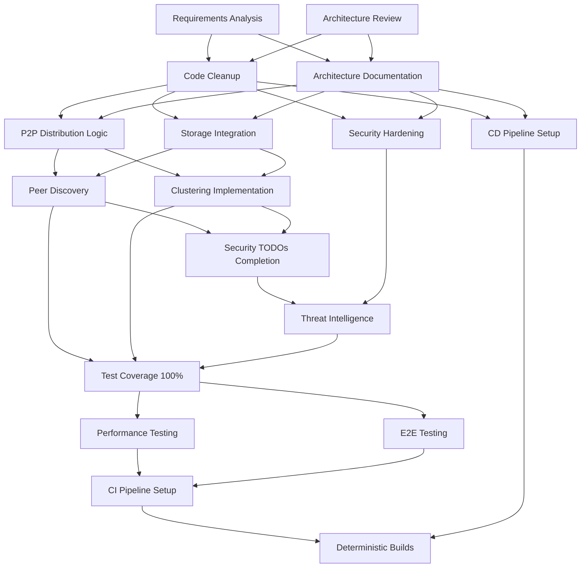

# PlexiChat Backend Task Graph Plan

**Plan Version:** 1.0  
**Created:** 2025-08-31  
**Based on:** REPORT_repo_audit.md, FEATURES_DISCOVERY.md  
**Target:** Production-ready system with 100% test coverage, security non-negotiable, deterministic builds  

## Executive Summary

This task graph outlines a dependency-ordered plan to repair critical gaps, harden the P2P sharded backup system, extend functionality, and deliver comprehensive documentation for the PlexiChat backend. The plan preserves existing architecture while addressing identified issues including mocked P2P distribution, incomplete clustering, and partial security implementations.

**Key Objectives:**
- Complete P2P shard distribution implementation
- Achieve 100% test coverage
- Implement security non-negotiable measures
- Deliver deterministic builds
- Preserve existing architecture patterns
- Eliminate fragmentation

## Task Graph Overview

## Work Packages by Phase

### Phase A: Intake/Planning

#### A1: Requirements Analysis
**Description:** Analyze REPORT_repo_audit.md and FEATURES_DISCOVERY.md to identify all gaps, partial implementations, and critical issues requiring immediate attention.

**Dependencies:** None

**Owner:** Architect/Lead

**Acceptance Criteria/Tests:**
- Complete gap analysis documented
- Critical vs non-critical issues prioritized
- Resource requirements estimated
- Risk assessment completed

**Rollback Plan:** Revert to original documentation state

#### A2: Architecture Review
**Description:** Review existing architecture patterns, security frameworks, and integration points to ensure preservation during implementation.

**Dependencies:** A1

**Owner:** Architect/Lead

**Acceptance Criteria/Tests:**
- Architecture patterns documented
- Integration points mapped
- Security boundaries validated
- Performance baselines established

**Rollback Plan:** Revert to original architecture documentation

### Phase B: Preserve Architecture

#### B1: Code Cleanup
**Description:** Remove debug print statements, complete minor TODOs, and ensure code quality standards are maintained without architectural changes.

**Dependencies:** A1, A2

**Owner:** Backend Engineers

**Acceptance Criteria/Tests:**
- All print statements replaced with proper logging
- TODO comments resolved or documented
- Code quality metrics maintained
- No functional changes introduced

**Rollback Plan:** Git revert to pre-cleanup state

#### B2: Architecture Documentation
**Description:** Complete comprehensive documentation of existing architecture, API endpoints, and system components.

**Dependencies:** A1, A2

**Owner:** Architect/Lead

**Acceptance Criteria/Tests:**
- All modules documented
- API endpoints fully documented
- Architecture diagrams updated
- Developer onboarding guides completed

**Rollback Plan:** Revert documentation changes

### Phase X: P2P Shard Hardening

#### X1: P2P Distribution Logic Implementation
**Description:** Replace mocked P2P distribution with actual implementation including shard routing, peer communication, and distribution algorithms.

**Dependencies:** B1, B2

**Owner:** DB/Shard Engineer

**Acceptance Criteria/Tests:**
- Shard distribution functional across peers
- Peer communication protocols implemented
- Distribution algorithms tested
- Security controls maintained

**Rollback Plan:** Revert to mock implementation with feature flag

#### X2: Storage Integration Completion
**Description:** Implement actual storage operations for shards including write, read, and verification across distributed storage backends.

**Dependencies:** B1, B2

**Owner:** DB/Shard Engineer

**Acceptance Criteria/Tests:**
- All storage operations functional
- Data integrity verification implemented
- Performance benchmarks met
- Error handling comprehensive

**Rollback Plan:** Revert to mock storage with feature flag

#### X3: Peer Discovery and Coordination
**Description:** Implement peer discovery mechanisms, coordination protocols, and health monitoring for P2P network.

**Dependencies:** X1, X2

**Owner:** Backend Engineers

**Acceptance Criteria/Tests:**
- Peer discovery functional
- Coordination protocols tested
- Health monitoring operational
- Network resilience verified

**Rollback Plan:** Disable P2P features, revert to centralized mode

#### X4: Clustering Implementation
**Description:** Complete clustering functionality including node coordination, distributed state management, and failover mechanisms.

**Dependencies:** X1, X2

**Owner:** Backend Engineers

**Acceptance Criteria/Tests:**
- Node coordination operational
- Distributed state management functional
- Failover mechanisms tested
- Cluster scaling verified

**Rollback Plan:** Revert to single-node configuration

### Phase C: Security

#### C1: Security TODOs Completion
**Description:** Complete all identified security TODOs including logging integration, key rotation, and threat detection enhancements.

**Dependencies:** X3, X4

**Owner:** Security Lead

**Acceptance Criteria/Tests:**
- All security TODOs resolved
- Security controls fully implemented
- Threat detection operational
- Audit logging comprehensive

**Rollback Plan:** Revert security changes, maintain previous security state

#### C2: Security Hardening
**Description:** Implement additional security hardening measures including advanced threat intelligence and zero-trust enhancements.

**Dependencies:** B1, B2

**Owner:** Security Lead

**Acceptance Criteria/Tests:**
- Threat intelligence integrated
- Zero-trust policies enforced
- Security metrics collected
- Compliance requirements met

**Rollback Plan:** Disable new security features, revert to baseline security

#### C3: Threat Intelligence Integration
**Description:** Integrate external threat intelligence feeds and implement automated response mechanisms.

**Dependencies:** C1, C2

**Owner:** Security Lead

**Acceptance Criteria/Tests:**
- Threat feeds integrated
- Automated responses functional
- False positive rates minimized
- Incident response documented

**Rollback Plan:** Disable threat intelligence features

### Phase F: Testing

#### F1: Achieve 100% Test Coverage
**Description:** Implement comprehensive test suite achieving 100% code coverage across all components.

**Dependencies:** X3, X4, C3

**Owner:** Test Engineer

**Acceptance Criteria/Tests:**
- 100% line coverage achieved
- 100% branch coverage achieved
- All critical paths tested
- Coverage reports automated

**Rollback Plan:** Revert test additions, maintain existing test suite

#### F2: End-to-End Testing Framework
**Description:** Implement comprehensive E2E testing framework covering user workflows and system integration.

**Dependencies:** F1

**Owner:** Test Engineer

**Acceptance Criteria/Tests:**
- All user workflows tested
- System integration verified
- E2E tests automated in CI
- Performance benchmarks included

**Rollback Plan:** Disable E2E tests in CI pipeline

#### F3: Performance Testing Suite
**Description:** Implement comprehensive performance testing including load testing, stress testing, and scalability validation.

**Dependencies:** F1

**Owner:** Test Engineer

**Acceptance Criteria/Tests:**
- Load testing completed
- Stress testing passed
- Scalability validated
- Performance regression detected

**Rollback Plan:** Revert performance test configurations

### Phase G: CI/CD

#### G1: CI Pipeline Setup
**Description:** Implement comprehensive CI pipeline with automated testing, security scanning, and quality gates.

**Dependencies:** F3, F2

**Owner:** Backend Engineers

**Acceptance Criteria/Tests:**
- All tests automated in CI
- Security scanning integrated
- Quality gates enforced
- Build artifacts generated

**Rollback Plan:** Disable CI pipeline, revert to manual builds

#### G2: CD Pipeline Setup
**Description:** Implement CD pipeline with automated deployment, rollback capabilities, and environment management.

**Dependencies:** B1, B2

**Owner:** Backend Engineers

**Acceptance Criteria/Tests:**
- Automated deployments functional
- Rollback mechanisms tested
- Environment consistency verified
- Deployment security enforced

**Rollback Plan:** Disable automated deployments

#### G3: Deterministic Builds
**Description:** Implement deterministic build process ensuring reproducible builds across all environments.

**Dependencies:** G1, G2

**Owner:** Backend Engineers

**Acceptance Criteria/Tests:**
- Build reproducibility verified
- Dependency versions pinned
- Build cache optimized
- Artifact integrity validated

**Rollback Plan:** Revert to previous build process

## Dependencies Matrix

| Work Package | Depends On | Blocked By | Duration Estimate |
|-------------|------------|------------|-------------------|
| A1 | None | None | 2 days |
| A2 | A1 | None | 3 days |
| B1 | A1, A2 | None | 5 days |
| B2 | A1, A2 | None | 7 days |
| X1 | B1, B2 | None | 10 days |
| X2 | B1, B2 | None | 8 days |
| X3 | X1, X2 | None | 12 days |
| X4 | X1, X2 | None | 15 days |
| C1 | X3, X4 | None | 7 days |
| C2 | B1, B2 | None | 10 days |
| C3 | C1, C2 | None | 8 days |
| F1 | X3, X4, C3 | None | 14 days |
| F2 | F1 | None | 7 days |
| F3 | F1 | None | 7 days |
| G1 | F3, F2 | None | 5 days |
| G2 | B1, B2 | None | 8 days |
| G3 | G1, G2 | None | 3 days |

## Risk Assessment

### High Risk Items
- X1, X2, X3, X4: P2P and clustering implementation complexity
- F1: Achieving 100% test coverage on complex distributed system
- G3: Deterministic builds across distributed environments

### Mitigation Strategies
- Incremental implementation with feature flags
- Comprehensive testing at each stage
- Parallel development streams for independent components
- Regular architecture reviews

## Success Metrics

- **Security:** Zero critical vulnerabilities, 100% security test coverage
- **Reliability:** 99.9% uptime target, comprehensive error handling
- **Performance:** Sub-100ms response times, 1000+ concurrent users
- **Maintainability:** 100% test coverage, comprehensive documentation
- **Deployability:** Deterministic builds, automated deployment pipeline

## Conclusion

This task graph provides a structured approach to transforming the PlexiChat backend from a partially implemented system to a production-ready, secure, and fully tested platform. The dependency ordering ensures that foundational work (planning and architecture preservation) precedes complex implementations (P2P hardening), followed by security and quality assurance measures, culminating in robust CI/CD processes.

**Total Estimated Duration:** 12 weeks  
**Critical Path:** A1 → A2 → B1 → X1 → X3 → C1 → F1 → G1 → G3  
**Parallel Streams:** Security hardening can proceed alongside P2P implementation  
**Risk Level:** Medium (mitigated by incremental approach and comprehensive testing)</content>