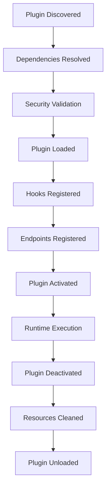

# Plugin API Reference

**Version:** 2.0.0
**Date:** 2025-08-31
**Phase:** H (Plugin Ecosystem Expansion)

## Overview

This document provides comprehensive API reference for developing plugins in the PlexiChat ecosystem. The Plugin API enables developers to extend PlexiChat functionality through secure, sandboxed plugin execution with comprehensive hooks, endpoints, and integration capabilities.

## Core Concepts

### Plugin Architecture

```python
from plexichat_plugin_sdk import Plugin, PluginContext
from typing import Dict, Any, Optional

class MyPlugin(Plugin):
    """
    Base plugin class providing core functionality
    """
    
    def __init__(self):
        super().__init__()
        self.name = "my_plugin"
        self.version = "1.0.0"
        self.description = "My custom plugin"
        
        # Plugin metadata
        self.metadata = {
            'author': 'Developer Name',
            'license': 'MIT',
            'homepage': 'https://example.com',
            'tags': ['utility', 'integration']
        }
    
    def on_load(self, context: PluginContext) -> None:
        """Called when plugin is loaded"""
        self.context = context
        self.logger = context.logger
        self.config = context.config
        
    def on_unload(self) -> None:
        """Called when plugin is unloaded"""
        # Cleanup resources
        pass
```

### Plugin Lifecycle



## Hook System

### Core Hooks

#### User Lifecycle Hooks

```python
from plexichat_plugin_sdk import hook
from typing import Dict, Any

class UserPlugin(Plugin):
    
    @hook('user_registered')
    def on_user_registered(self, user_data: Dict[str, Any]) -> None:
        """
        Triggered when a new user registers
        
        Args:
            user_data: User registration data
                - user_id: str - Unique user identifier
                - email: str - User email address
                - username: str - Username
                - registration_date: str - ISO 8601 timestamp
                - metadata: dict - Additional registration data
        """
        self.logger.info(f"New user registered: {user_data['username']}")
        # Custom registration logic
    
    @hook('user_login')
    def on_user_login(self, login_data: Dict[str, Any]) -> None:
        """
        Triggered when a user logs in
        
        Args:
            login_data: Login event data
                - user_id: str - User identifier
                - login_time: str - ISO 8601 timestamp
                - ip_address: str - Client IP address
                - user_agent: str - Client user agent
                - device_info: dict - Device information
        """
        # Track login analytics
        pass
    
    @hook('user_logout')
    def on_user_logout(self, logout_data: Dict[str, Any]) -> None:
        """
        Triggered when a user logs out
        
        Args:
            logout_data: Logout event data
                - user_id: str - User identifier
                - logout_time: str - ISO 8601 timestamp
                - session_duration: int - Session duration in seconds
        """
        # Clean up user session data
        pass
    
    @hook('user_profile_updated')
    def on_user_profile_updated(self, update_data: Dict[str, Any]) -> None:
        """
        Triggered when user profile is updated
        
        Args:
            update_data: Profile update data
                - user_id: str - User identifier
                - updated_fields: list - List of updated fields
                - old_values: dict - Previous field values
                - new_values: dict - New field values
                - update_time: str - ISO 8601 timestamp
        """
        # Validate profile changes
        pass
```

#### Message Hooks

```python
class MessagePlugin(Plugin):
    
    @hook('message_sent')
    def on_message_sent(self, message_data: Dict[str, Any]) -> Optional[Dict[str, Any]]:
        """
        Triggered when a message is sent
        
        Args:
            message_data: Message data
                - message_id: str - Unique message identifier
                - user_id: str - Sender user ID
                - channel_id: str - Channel identifier
                - content: str - Message content
                - timestamp: str - ISO 8601 timestamp
                - message_type: str - Type of message (text, file, etc.)
                - metadata: dict - Additional message metadata
        
        Returns:
            Optional modified message data or None to allow message
        """
        # Content moderation
        if self._contains_prohibited_content(message_data['content']):
            return None  # Block message
        
        # Add custom processing
        message_data['processed'] = True
        return message_data
    
    @hook('message_received')
    def on_message_received(self, message_data: Dict[str, Any]) -> None:
        """
        Triggered when a message is received by a user
        
        Args:
            message_data: Received message data (same as message_sent)
        """
        # Analytics tracking
        self._track_message_analytics(message_data)
    
    @hook('message_deleted')
    def on_message_deleted(self, delete_data: Dict[str, Any]) -> None:
        """
        Triggered when a message is deleted
        
        Args:
            delete_data: Message deletion data
                - message_id: str - Deleted message ID
                - user_id: str - User who deleted the message
                - channel_id: str - Channel identifier
                - deletion_time: str - ISO 8601 timestamp
                - reason: str - Deletion reason (optional)
        """
        # Log deletion for compliance
        pass
    
    @hook('message_edited')
    def on_message_edited(self, edit_data: Dict[str, Any]) -> None:
        """
        Triggered when a message is edited
        
        Args:
            edit_data: Message edit data
                - message_id: str - Edited message ID
                - user_id: str - User who edited the message
                - old_content: str - Original message content
                - new_content: str - New message content
                - edit_time: str - ISO 8601 timestamp
        """
        # Track content changes
        pass
```

#### Channel Hooks

```python
class ChannelPlugin(Plugin):
    
    @hook('channel_created')
    def on_channel_created(self, channel_data: Dict[str, Any]) -> None:
        """
        Triggered when a channel is created
        
        Args:
            channel_data: Channel creation data
                - channel_id: str - Unique channel identifier
                - name: str - Channel name
                - creator_id: str - User who created the channel
                - channel_type: str - Type (public, private, direct)
                - creation_time: str - ISO 8601 timestamp
                - members: list - Initial member user IDs
        """
        # Initialize channel settings
        pass
    
    @hook('channel_member_joined')
    def on_channel_member_joined(self, join_data: Dict[str, Any]) -> None:
        """
        Triggered when a user joins a channel
        
        Args:
            join_data: Channel join data
                - channel_id: str - Channel identifier
                - user_id: str - User who joined
                - join_time: str - ISO 8601 timestamp
                - invited_by: str - User who invited (optional)
        """
        # Send welcome message
        pass
    
    @hook('channel_member_left')
    def on_channel_member_left(self, leave_data: Dict[str, Any]) -> None:
        """
        Triggered when a user leaves a channel
        
        Args:
            leave_data: Channel leave data
                - channel_id: str - Channel identifier
                - user_id: str - User who left
                - leave_time: str - ISO 8601 timestamp
                - reason: str - Leave reason (optional)
        """
        # Clean up user data
        pass
```

### Custom Hooks

```python
from plexichat_plugin_sdk import emit_hook

class CustomPlugin(Plugin):
    
    def custom_business_logic(self):
        """Custom plugin functionality"""
        # Emit custom hook for other plugins
        emit_hook('custom_event_occurred', {
            'event_type': 'business_logic_executed',
            'timestamp': '2025-08-31T12:00:00Z',
            'data': {'key': 'value'}
        })
    
    @hook('custom_event_occurred')
    def on_custom_event(self, event_data: Dict[str, Any]) -> None:
        """
        Handle custom events from other plugins
        
        Args:
            event_data: Custom event data
        """
        self.logger.info(f"Custom event received: {event_data}")
```

## Endpoint System

### REST API Endpoints

```python
from plexichat_plugin_sdk import endpoint
from plexichat_plugin_sdk.security import require_permission
from typing import Dict, Any

class APIPlugin(Plugin):
    
    @endpoint('/api/v1/myplugin/data', methods=['GET'])
    @require_permission('myplugin.read')
    def get_data(self, request) -> Dict[str, Any]:
        """
        GET endpoint to retrieve plugin data
        
        Args:
            request: HTTP request object
                - user_id: str - Authenticated user ID
                - params: dict - Query parameters
                - headers: dict - HTTP headers
        
        Returns:
            JSON response data
        """
        user_id = request.user_id
        limit = int(request.params.get('limit', 10))
        
        data = self._get_user_data(user_id, limit)
        
        return {
            'status': 'success',
            'data': data,
            'count': len(data)
        }
    
    @endpoint('/api/v1/myplugin/data', methods=['POST'])
    @require_permission('myplugin.write')
    def create_data(self, request) -> Dict[str, Any]:
        """
        POST endpoint to create new data
        
        Args:
            request: HTTP request object
                - user_id: str - Authenticated user ID
                - body: dict - Request body data
                - files: dict - Uploaded files (if any)
        
        Returns:
            JSON response with created resource
        """
        user_id = request.user_id
        data = request.body
        
        # Validate input
        if not self._validate_data(data):
            return {
                'status': 'error',
                'message': 'Invalid data provided'
            }, 400
        
        # Create resource
        resource_id = self._create_resource(user_id, data)
        
        return {
            'status': 'success',
            'resource_id': resource_id,
            'created': True
        }, 201
    
    @endpoint('/api/v1/myplugin/data/{resource_id}', methods=['PUT'])
    @require_permission('myplugin.write')
    def update_data(self, request) -> Dict[str, Any]:
        """
        PUT endpoint to update existing data
        
        Args:
            request: HTTP request object
                - user_id: str - Authenticated user ID
                - path_params: dict - URL path parameters
                - body: dict - Updated data
        
        Returns:
            JSON response with update confirmation
        """
        user_id = request.user_id
        resource_id = request.path_params['resource_id']
        data = request.body
        
        # Check ownership
        if not self._user_owns_resource(user_id, resource_id):
            return {
                'status': 'error',
                'message': 'Access denied'
            }, 403
        
        # Update resource
        success = self._update_resource(resource_id, data)
        
        if success:
            return {
                'status': 'success',
                'resource_id': resource_id,
                'updated': True
            }
        else:
            return {
                'status': 'error',
                'message': 'Update failed'
            }, 500
    
    @endpoint('/api/v1/myplugin/data/{resource_id}', methods=['DELETE'])
    @require_permission('myplugin.delete')
    def delete_data(self, request) -> Dict[str, Any]:
        """
        DELETE endpoint to remove data
        
        Args:
            request: HTTP request object
                - user_id: str - Authenticated user ID
                - path_params: dict - URL path parameters
        
        Returns:
            JSON response with deletion confirmation
        """
        user_id = request.user_id
        resource_id = request.path_params['resource_id']
        
        # Check ownership
        if not self._user_owns_resource(user_id, resource_id):
            return {
                'status': 'error',
                'message': 'Access denied'
            }, 403
        
        # Delete resource
        success = self._delete_resource(resource_id)
        
        if success:
            return {
                'status': 'success',
                'resource_id': resource_id,
                'deleted': True
            }
        else:
            return {
                'status': 'error',
                'message': 'Deletion failed'
            }, 500
```

### WebSocket Endpoints

```python
from plexichat_plugin_sdk import websocket_endpoint
from typing import Dict, Any

class WebSocketPlugin(Plugin):
    
    def __init__(self):
        super().__init__()
        self.active_connections = {}
    
    @websocket_endpoint('/ws/myplugin/events')
    def handle_websocket(self, websocket) -> None:
        """
        WebSocket endpoint for real-time events
        
        Args:
            websocket: WebSocket connection object
                - user_id: str - Authenticated user ID
                - send_json(data): Send JSON data to client
                - receive_json(): Receive JSON data from client
                - close(): Close connection
        """
        user_id = websocket.user_id
        self.active_connections[user_id] = websocket
        
        try:
            # Send welcome message
            websocket.send_json({
                'type': 'welcome',
                'message': 'Connected to plugin events',
                'timestamp': '2025-08-31T12:00:00Z'
            })
            
            while True:
                # Receive message from client
                message = websocket.receive_json()
                
                if message['type'] == 'subscribe':
                    # Handle subscription request
                    self._handle_subscription(user_id, message['channels'])
                    
                elif message['type'] == 'unsubscribe':
                    # Handle unsubscription request
                    self._handle_unsubscription(user_id, message['channels'])
                    
                else:
                    # Handle custom message
                    response = self._process_message(user_id, message)
                    websocket.send_json(response)
                    
        except Exception as e:
            self.logger.error(f"WebSocket error for user {user_id}: {e}")
        finally:
            # Clean up connection
            if user_id in self.active_connections:
                del self.active_connections[user_id]
    
    def broadcast_event(self, event_data: Dict[str, Any]) -> None:
        """
        Broadcast event to all connected clients
        
        Args:
            event_data: Event data to broadcast
        """
        for user_id, websocket in self.active_connections.items():
            try:
                websocket.send_json({
                    'type': 'event',
                    'data': event_data,
                    'timestamp': '2025-08-31T12:00:00Z'
                })
            except Exception as e:
                self.logger.error(f"Failed to send event to user {user_id}: {e}")
```

## Data Access API

### Database Access

```python
from plexichat_plugin_sdk.database import get_db_connection
from typing import List, Dict, Any, Optional

class DatabasePlugin(Plugin):
    
    def get_user_preferences(self, user_id: str) -> Optional[Dict[str, Any]]:
        """
        Retrieve user preferences from database
        
        Args:
            user_id: User identifier
        
        Returns:
            User preferences or None if not found
        """
        with get_db_connection() as conn:
            cursor = conn.cursor()
            
            cursor.execute("""
                SELECT preferences FROM user_preferences 
                WHERE user_id = %s
            """, (user_id,))
            
            result = cursor.fetchone()
            
            if result:
                return json.loads(result[0])
            return None
    
    def save_user_preferences(self, user_id: str, preferences: Dict[str, Any]) -> bool:
        """
        Save user preferences to database
        
        Args:
            user_id: User identifier
            preferences: User preferences data
        
        Returns:
            True if successful, False otherwise
        """
        with get_db_connection() as conn:
            cursor = conn.cursor()
            
            try:
                cursor.execute("""
                    INSERT INTO user_preferences (user_id, preferences, updated_at)
                    VALUES (%s, %s, NOW())
                    ON CONFLICT (user_id) 
                    DO UPDATE SET preferences = EXCLUDED.preferences, 
                                  updated_at = NOW()
                """, (user_id, json.dumps(preferences)))
                
                conn.commit()
                return True
                
            except Exception as e:
                self.logger.error(f"Failed to save preferences for user {user_id}: {e}")
                conn.rollback()
                return False
    
    def get_recent_messages(self, user_id: str, limit: int = 50) -> List[Dict[str, Any]]:
        """
        Get recent messages for a user
        
        Args:
            user_id: User identifier
            limit: Maximum number of messages to retrieve
        
        Returns:
            List of recent messages
        """
        with get_db_connection() as conn:
            cursor = conn.cursor()
            
            cursor.execute("""
                SELECT m.message_id, m.content, m.timestamp, m.channel_id,
                       u.username as sender_name
                FROM messages m
                JOIN users u ON m.user_id = u.user_id
                WHERE m.user_id = %s OR m.channel_id IN (
                    SELECT channel_id FROM channel_members 
                    WHERE user_id = %s
                )
                ORDER BY m.timestamp DESC
                LIMIT %s
            """, (user_id, user_id, limit))
            
            messages = []
            for row in cursor.fetchall():
                messages.append({
                    'message_id': row[0],
                    'content': row[1],
                    'timestamp': row[2],
                    'channel_id': row[3],
                    'sender_name': row[4]
                })
            
            return messages
```

### Cache Access

```python
from plexichat_plugin_sdk.cache import get_cache_client
from typing import Any, Optional

class CachePlugin(Plugin):
    
    def get_cached_data(self, key: str) -> Optional[Any]:
        """
        Retrieve data from cache
        
        Args:
            key: Cache key
        
        Returns:
            Cached data or None if not found
        """
        cache = get_cache_client()
        
        try:
            data = cache.get(key)
            if data:
                self.logger.debug(f"Cache hit for key: {key}")
                return json.loads(data)
            else:
                self.logger.debug(f"Cache miss for key: {key}")
                return None
        except Exception as e:
            self.logger.error(f"Cache retrieval error for key {key}: {e}")
            return None
    
    def set_cached_data(self, key: str, data: Any, ttl: int = 3600) -> bool:
        """
        Store data in cache
        
        Args:
            key: Cache key
            data: Data to cache
            ttl: Time to live in seconds
        
        Returns:
            True if successful, False otherwise
        """
        cache = get_cache_client()
        
        try:
            cache.set(key, json.dumps(data), ex=ttl)
            self.logger.debug(f"Cached data for key: {key} with TTL: {ttl}")
            return True
        except Exception as e:
            self.logger.error(f"Cache storage error for key {key}: {e}")
            return False
    
    def invalidate_cache(self, pattern: str) -> int:
        """
        Invalidate cache keys matching pattern
        
        Args:
            pattern: Key pattern to match
        
        Returns:
            Number of keys invalidated
        """
        cache = get_cache_client()
        
        try:
            # Get all keys matching pattern
            keys = cache.keys(pattern)
            
            if keys:
                cache.delete(*keys)
                self.logger.info(f"Invalidated {len(keys)} cache keys matching {pattern}")
                return len(keys)
            else:
                self.logger.debug(f"No cache keys found matching {pattern}")
                return 0
                
        except Exception as e:
            self.logger.error(f"Cache invalidation error for pattern {pattern}: {e}")
            return 0
```

## Security API

### Permission System

```python
from plexichat_plugin_sdk.security import (
    require_permission, 
    check_permission,
    get_user_permissions
)
from typing import List

class SecurityPlugin(Plugin):
    
    @endpoint('/api/v1/myplugin/secure-data')
    @require_permission('myplugin.admin')
    def get_secure_data(self, request):
        """Endpoint requiring admin permission"""
        # This will automatically check permissions
        return {'secure': 'data'}
    
    def check_user_access(self, user_id: str, resource: str, action: str) -> bool:
        """
        Check if user has permission for specific action
        
        Args:
            user_id: User identifier
            resource: Resource name
            action: Action to check (read, write, delete, etc.)
        
        Returns:
            True if user has permission, False otherwise
        """
        permission = f"{resource}.{action}"
        return check_permission(user_id, permission)
    
    def get_user_permissions_list(self, user_id: str) -> List[str]:
        """
        Get all permissions for a user
        
        Args:
            user_id: User identifier
        
        Returns:
            List of permission strings
        """
        return get_user_permissions(user_id)
    
    def require_custom_permission(self, user_id: str, permission: str) -> None:
        """
        Custom permission check that raises exception if not authorized
        
        Args:
            user_id: User identifier
            permission: Required permission
        
        Raises:
            PermissionError: If user doesn't have required permission
        """
        if not check_permission(user_id, permission):
            raise PermissionError(f"User {user_id} lacks permission: {permission}")
```

### Data Encryption

```python
from plexichat_plugin_sdk.security import encrypt_data, decrypt_data
from typing import Dict, Any

class EncryptionPlugin(Plugin):
    
    def store_sensitive_data(self, user_id: str, data: Dict[str, Any]) -> bool:
        """
        Store sensitive data with encryption
        
        Args:
            user_id: User identifier
            data: Sensitive data to store
        
        Returns:
            True if successful, False otherwise
        """
        try:
            # Encrypt the data
            encrypted_data = encrypt_data(json.dumps(data))
            
            # Store encrypted data
            with get_db_connection() as conn:
                cursor = conn.cursor()
                cursor.execute("""
                    INSERT INTO sensitive_data (user_id, data, created_at)
                    VALUES (%s, %s, NOW())
                """, (user_id, encrypted_data))
                
                conn.commit()
            
            return True
            
        except Exception as e:
            self.logger.error(f"Failed to store sensitive data for user {user_id}: {e}")
            return False
    
    def retrieve_sensitive_data(self, user_id: str) -> Optional[Dict[str, Any]]:
        """
        Retrieve and decrypt sensitive data
        
        Args:
            user_id: User identifier
        
        Returns:
            Decrypted data or None if not found
        """
        try:
            with get_db_connection() as conn:
                cursor = conn.cursor()
                cursor.execute("""
                    SELECT data FROM sensitive_data 
                    WHERE user_id = %s 
                    ORDER BY created_at DESC 
                    LIMIT 1
                """, (user_id,))
                
                result = cursor.fetchone()
                
                if result:
                    # Decrypt the data
                    decrypted_data = decrypt_data(result[0])
                    return json.loads(decrypted_data)
                
                return None
                
        except Exception as e:
            self.logger.error(f"Failed to retrieve sensitive data for user {user_id}: {e}")
            return None
```

## Configuration API

### Plugin Configuration

```python
from plexichat_plugin_sdk.config import get_config, update_config
from typing import Dict, Any

class ConfigurablePlugin(Plugin):
    
    def __init__(self):
        super().__init__()
        # Default configuration
        self.default_config = {
            'max_connections': 100,
            'timeout': 30,
            'debug_mode': False,
            'allowed_domains': ['example.com'],
            'rate_limit': {
                'requests_per_minute': 60,
                'burst_limit': 10
            }
        }
    
    def on_load(self, context):
        """Load configuration on plugin startup"""
        super().on_load(context)
        
        # Load configuration
        self.config = get_config(self.name, self.default_config)
        
        # Validate configuration
        self._validate_config()
    
    def _validate_config(self):
        """Validate configuration values"""
        if self.config['max_connections'] < 1:
            raise ValueError("max_connections must be positive")
        
        if self.config['timeout'] < 1:
            raise ValueError("timeout must be positive")
        
        if not isinstance(self.config['allowed_domains'], list):
            raise ValueError("allowed_domains must be a list")
    
    def update_configuration(self, new_config: Dict[str, Any]) -> bool:
        """
        Update plugin configuration
        
        Args:
            new_config: New configuration values
        
        Returns:
            True if successful, False otherwise
        """
        try:
            # Validate new configuration
            temp_config = self.config.copy()
            temp_config.update(new_config)
            self._validate_config_values(temp_config)
            
            # Update configuration
            update_config(self.name, new_config)
            
            # Reload configuration
            self.config = get_config(self.name, self.default_config)
            
            self.logger.info("Configuration updated successfully")
            return True
            
        except Exception as e:
            self.logger.error(f"Configuration update failed: {e}")
            return False
    
    def _validate_config_values(self, config: Dict[str, Any]):
        """Validate individual configuration values"""
        # Add custom validation logic
        pass
    
    @endpoint('/api/v1/myplugin/config')
    @require_permission('myplugin.admin')
    def get_configuration(self, request):
        """Get current plugin configuration"""
        return {
            'status': 'success',
            'config': self.config
        }
    
    @endpoint('/api/v1/myplugin/config', methods=['PUT'])
    @require_permission('myplugin.admin')
    def update_configuration_endpoint(self, request):
        """Update plugin configuration via API"""
        new_config = request.body
        
        if self.update_configuration(new_config):
            return {
                'status': 'success',
                'message': 'Configuration updated'
            }
        else:
            return {
                'status': 'error',
                'message': 'Configuration update failed'
            }, 500
```

## Logging API

### Plugin Logging

```python
from plexichat_plugin_sdk.logging import get_logger
from typing import Dict, Any

class LoggingPlugin(Plugin):
    
    def on_load(self, context):
        """Initialize logging on plugin load"""
        super().on_load(context)
        
        # Get plugin-specific logger
        self.logger = get_logger(self.name)
        
        # Set log level based on configuration
        log_level = self.config.get('log_level', 'INFO')
        self.logger.setLevel(log_level)
    
    def log_user_action(self, user_id: str, action: str, details: Dict[str, Any]):
        """
        Log user actions with structured data
        
        Args:
            user_id: User identifier
            action: Action performed
            details: Additional action details
        """
        self.logger.info("User action performed", extra={
            'user_id': user_id,
            'action': action,
            'details': details,
            'timestamp': '2025-08-31T12:00:00Z',
            'plugin': self.name
        })
    
    def log_error(self, error: Exception, context: Dict[str, Any]):
        """
        Log errors with context information
        
        Args:
            error: Exception that occurred
            context: Context information
        """
        self.logger.error("Plugin error occurred", extra={
            'error_type': type(error).__name__,
            'error_message': str(error),
            'context': context,
            'plugin': self.name,
            'timestamp': '2025-08-31T12:00:00Z'
        }, exc_info=True)
    
    def log_performance_metric(self, operation: str, duration: float, metadata: Dict[str, Any]):
        """
        Log performance metrics
        
        Args:
            operation: Operation name
            duration: Operation duration in seconds
            metadata: Additional metadata
        """
        self.logger.info("Performance metric", extra={
            'operation': operation,
            'duration': duration,
            'duration_unit': 'seconds',
            'metadata': metadata,
            'plugin': self.name,
            'timestamp': '2025-08-31T12:00:00Z'
        })
```

## Error Handling

### Exception Handling

```python
from plexichat_plugin_sdk.exceptions import PluginError, ValidationError
from typing import Dict, Any

class ErrorHandlingPlugin(Plugin):
    
    def safe_operation(self, operation_func, *args, **kwargs) -> Any:
        """
        Execute operation with comprehensive error handling
        
        Args:
            operation_func: Function to execute
            *args: Positional arguments for function
            **kwargs: Keyword arguments for function
        
        Returns:
            Function result or None on error
        """
        try:
            return operation_func(*args, **kwargs)
            
        except ValidationError as e:
            self.logger.warning(f"Validation error: {e}")
            self._handle_validation_error(e)
            return None
            
        except PermissionError as e:
            self.logger.warning(f"Permission error: {e}")
            self._handle_permission_error(e)
            return None
            
        except Exception as e:
            self.logger.error(f"Unexpected error: {e}", exc_info=True)
            self._handle_unexpected_error(e)
            return None
    
    def _handle_validation_error(self, error: ValidationError):
        """Handle validation errors"""
        # Custom validation error handling
        pass
    
    def _handle_permission_error(self, error: PermissionError):
        """Handle permission errors"""
        # Custom permission error handling
        pass
    
    def _handle_unexpected_error(self, error: Exception):
        """Handle unexpected errors"""
        # Custom unexpected error handling
        pass
    
    @hook('plugin_error')
    def on_plugin_error(self, error_data: Dict[str, Any]):
        """
        Handle plugin errors from other plugins
        
        Args:
            error_data: Error information
        """
        self.logger.error("Plugin error received", extra=error_data)
        
        # Attempt recovery if possible
        if self._can_recover(error_data):
            self._attempt_recovery(error_data)
    
    def _can_recover(self, error_data: Dict[str, Any]) -> bool:
        """Determine if error can be recovered from"""
        # Recovery logic
        return False
    
    def _attempt_recovery(self, error_data: Dict[str, Any]):
        """Attempt to recover from error"""
        # Recovery implementation
        pass
```

## Testing API

### Plugin Testing Framework

```python
from plexichat_plugin_sdk.testing import PluginTestCase, MockContext
import unittest

class TestMyPlugin(PluginTestCase):
    
    def setUp(self):
        """Set up test environment"""
        self.plugin = MyPlugin()
        self.mock_context = MockContext()
        self.plugin.on_load(self.mock_context)
    
    def test_plugin_initialization(self):
        """Test plugin initializes correctly"""
        self.assertEqual(self.plugin.name, "my_plugin")
        self.assertEqual(self.plugin.version, "1.0.0")
    
    def test_hook_registration(self):
        """Test hooks are registered correctly"""
        hooks = self.mock_context.get_registered_hooks()
        self.assertIn('user_registered', hooks)
        self.assertIn('message_sent', hooks)
    
    def test_endpoint_registration(self):
        """Test endpoints are registered correctly"""
        endpoints = self.mock_context.get_registered_endpoints()
        self.assertIn('/api/v1/myplugin/data', endpoints)
    
    def test_user_registration_hook(self):
        """Test user registration hook"""
        user_data = {
            'user_id': 'test_user',
            'username': 'testuser',
            'email': 'test@example.com'
        }
        
        # Trigger hook
        self.plugin.on_user_registered(user_data)
        
        # Verify behavior
        # Add assertions based on expected behavior
    
    def test_api_endpoint(self):
        """Test API endpoint functionality"""
        request = Mock()
        request.user_id = 'test_user'
        request.params = {'limit': '10'}
        
        response = self.plugin.get_data(request)
        
        self.assertEqual(response['status'], 'success')
        self.assertIn('data', response)
    
    def test_error_handling(self):
        """Test error handling"""
        # Test with invalid input
        with self.assertRaises(ValueError):
            self.plugin.process_invalid_input()
    
    def test_performance(self):
        """Test performance requirements"""
        import time
        
        start_time = time.time()
        
        # Perform operation multiple times
        for i in range(1000):
            self.plugin.lightweight_operation()
        
        end_time = time.time()
        duration = end_time - start_time
        
        # Should complete within reasonable time
        self.assertLess(duration, 1.0)  # Less than 1 second

if __name__ == '__main__':
    unittest.main()
```

## Plugin Metadata

### Plugin Manifest

```yaml
# plugin.yaml
plugin:
  name: "advanced_analytics"
  version: "1.0.0"
  author: "PlexiChat Team"
  description: "Advanced user behavior analytics and insights"
  
metadata:
  category: "analytics"
  tags: ["analytics", "insights", "behavior"]
  license: "MIT"
  homepage: "https://github.com/plexichat/advanced-analytics"
  
dependencies:
  core: ">=2.0.0"
  python: ">=3.8"
  packages:
    - pandas>=1.3.0
    - scikit-learn>=1.0.0
    - numpy>=1.21.0
  
permissions:
  required:
    - user_data_read
    - analytics_write
  optional:
    - admin_access
    
resources:
  limits:
    cpu: "500m"
    memory: "1Gi"
  requests:
    cpu: "100m"
    memory: "256Mi"
    
hooks:
  - user_login
  - user_logout
  - message_sent
  - channel_join
  - channel_leave
  
endpoints:
  - /api/v1/analytics/dashboard
  - /api/v1/analytics/report
  - /api/v1/analytics/export
  
settings:
  enable_real_time: true
  retention_days: 90
  batch_size: 1000
```

## Best Practices

### Security Best Practices
1. Always validate input data
2. Use parameterized queries for database access
3. Implement proper error handling without information leakage
4. Follow principle of least privilege
5. Encrypt sensitive data at rest and in transit
6. Regularly update dependencies
7. Implement rate limiting for API endpoints

### Performance Best Practices
1. Use caching for frequently accessed data
2. Implement connection pooling for database access
3. Optimize database queries with proper indexing
4. Use asynchronous processing for heavy operations
5. Implement resource limits and monitoring
6. Profile code regularly for bottlenecks

### Code Quality Best Practices
1. Follow PEP 8 style guidelines
2. Write comprehensive unit tests
3. Use type hints for better code documentation
4. Implement proper logging throughout the code
5. Handle exceptions gracefully
6. Document all public methods and classes
7. Use meaningful variable and function names

### Maintenance Best Practices
1. Keep dependencies updated
2. Monitor plugin performance and errors
3. Regularly review and update security measures
4. Implement proper versioning strategy
5. Document changes and updates
6. Plan for backward compatibility
7. Test upgrades thoroughly before deployment

This API reference provides the foundation for developing robust, secure, and maintainable plugins for the PlexiChat ecosystem. Always refer to the latest documentation and follow security best practices when developing plugins.