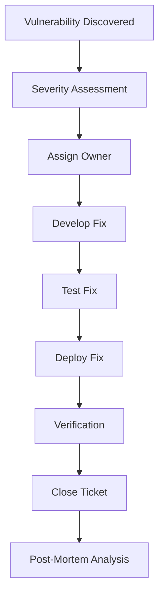

# Security Audit Procedures - Phase H

**Document Date:** 2025-08-31
**Security Officer:** Kilo Code
**Phase:** H (Feature Expansion)
**Classification:** Internal - Security

## Executive Summary

This document outlines the comprehensive security audit procedures for PlexiChat Phase H implementation. It covers audit planning, execution, reporting, and remediation processes to ensure continuous security compliance and risk mitigation.

## Audit Framework

### Audit Types

#### 1. Continuous Security Audits
- **Frequency:** Daily automated scans
- **Scope:** Code changes, configuration updates, dependency changes
- **Tools:** SAST, DAST, dependency scanning, container scanning
- **Reporting:** Automated alerts to security team

#### 2. Weekly Security Reviews
- **Frequency:** Every Monday
- **Scope:** Security logs, incident reports, vulnerability assessments
- **Participants:** Security team, DevOps, development leads
- **Duration:** 1 hour

#### 3. Monthly Comprehensive Audits
- **Frequency:** First Monday of each month
- **Scope:** Full system security assessment
- **Participants:** Security team, external auditors (quarterly)
- **Duration:** 4 hours

#### 4. Quarterly Penetration Testing
- **Frequency:** End of each quarter
- **Scope:** External and internal penetration testing
- **Participants:** Certified penetration testers
- **Duration:** 2 weeks

#### 5. Annual Compliance Audits
- **Frequency:** Annual
- **Scope:** SOC 2, ISO 27001, GDPR compliance
- **Participants:** External audit firms
- **Duration:** 1 month

## Audit Planning

### Pre-Audit Preparation

#### Define Audit Scope
```yaml
audit_scope:
  components:
    - web_application
    - api_endpoints
    - database_system
    - authentication_system
    - file_storage
    - network_infrastructure
    - plugin_system
  environments:
    - development
    - staging
    - production
  compliance_frameworks:
    - SOC_2_Type_II
    - ISO_27001
    - GDPR
    - PCI_DSS
```

#### Assemble Audit Team
- **Lead Auditor:** Certified security professional
- **Technical Auditors:** Security engineers
- **Subject Matter Experts:** Development team representatives
- **Compliance Officer:** For regulatory requirements

#### Prepare Audit Tools
- Vulnerability scanners (Nessus, OpenVAS)
- Web application scanners (OWASP ZAP, Burp Suite)
- Code analysis tools (SonarQube, Checkmarx)
- Network scanners (Nmap, Wireshark)
- Database scanners (sqlmap)

### Risk Assessment

#### Critical Assets Identification
```
High Risk:
├── Customer PII data
├── Financial transaction data
├── Authentication credentials
└── Intellectual property

Medium Risk:
├── User-generated content
├── System configuration
├── Audit logs
└── Backup data

Low Risk:
├── Public documentation
├── Static assets
└── Development environments
```

## Audit Execution

### Phase 1: Reconnaissance

#### External Assessment
```bash
# Network reconnaissance
nmap -sV -O -p- target_ip
# DNS enumeration
dig @dns_server domain.com ANY
# Web server fingerprinting
whatweb https://target.com
# SSL/TLS assessment
sslscan target.com
```

#### Internal Assessment
```bash
# Host discovery
nmap -sn 192.168.1.0/24
# Service enumeration
nmap -sV -p 1-65535 internal_hosts
# Vulnerability scanning
openvas-start
```

### Phase 2: Vulnerability Assessment

#### Automated Scanning
- **SAST (Static Application Security Testing)**
  - Code review for security vulnerabilities
  - Dependency vulnerability scanning
  - Configuration file analysis

- **DAST (Dynamic Application Security Testing)**
  - Runtime vulnerability detection
  - API endpoint testing
  - Authentication bypass attempts

- **Container Security Scanning**
  - Image vulnerability assessment
  - Runtime security monitoring
  - Compliance checking

#### Manual Testing
- **Authentication Testing**
  - Password policy enforcement
  - Session management
  - MFA implementation

- **Authorization Testing**
  - Role-based access control
  - Privilege escalation attempts
  - API authorization

- **Input Validation Testing**
  - SQL injection attempts
  - XSS vulnerability testing
  - Command injection testing

### Phase 3: Penetration Testing

#### Web Application Testing
```bash
# SQL injection testing
sqlmap -u "https://api.example.com/users?id=1" --dbs
# XSS testing
xsstrike -u "https://app.example.com/search?q=test"
# CSRF testing
csrfpoc -u "https://app.example.com/transfer"
```

#### API Testing
```bash
# API fuzzing
ffuf -w wordlist.txt -u https://api.example.com/FUZZ
# Authentication bypass
hydra -l admin -P passwords.txt api.example.com http-post-form "/login:username=^USER^&password=^PASS^"
# Rate limiting bypass
bombardier -c 1000 -n 10000 https://api.example.com/endpoint
```

#### Network Testing
```bash
# Port scanning
masscan -p1-65535 192.168.1.0/24
# Service exploitation
metasploit
# Wireless testing (if applicable)
aircrack-ng
```

### Phase 4: Compliance Verification

#### GDPR Compliance
- Data processing inventory
- Consent management verification
- Data subject rights implementation
- Breach notification procedures

#### SOC 2 Controls
- Security principle assessment
- Availability monitoring
- Processing integrity verification
- Confidentiality controls
- Privacy protection measures

#### ISO 27001 Alignment
- Information security management system review
- Risk treatment plan verification
- Statement of applicability validation
- Internal audit procedures

## Audit Reporting

### Executive Summary
- Overall security posture assessment
- Critical findings summary
- Risk level determination
- Compliance status overview

### Technical Findings
```markdown
## Vulnerability Classification

### Critical (CVSS 9.0-10.0)
| ID | Description | Impact | Status |
|----|-------------|--------|--------|
| SEC-001 | Remote Code Execution | System compromise | Open |
| SEC-002 | Authentication Bypass | Unauthorized access | Fixed |

### High (CVSS 7.0-8.9)
| ID | Description | Impact | Status |
|----|-------------|--------|--------|
| SEC-003 | SQL Injection | Data breach | Mitigated |
| SEC-004 | XSS Vulnerability | Session hijacking | Open |

### Medium (CVSS 4.0-6.9)
| ID | Description | Impact | Status |
|----|-------------|--------|--------|
| SEC-005 | Weak Password Policy | Credential compromise | Planned |
| SEC-006 | Missing Security Headers | Information disclosure | Fixed |
```

### Risk Assessment Matrix
```
Impact →     Low         Medium      High
Severity ↓
Critical      2           3           5
High          1           2           4
Medium        0           1           3
Low           0           0           1
```

### Compliance Gap Analysis
- **Implemented Controls:** 85%
- **Partially Implemented:** 10%
- **Not Implemented:** 5%
- **Recommended Actions:** Detailed remediation plans

## Remediation Process

### Vulnerability Management Workflow


### Remediation Timeline
- **Critical:** 24 hours
- **High:** 1 week
- **Medium:** 1 month
- **Low:** Next release cycle

### Verification Procedures
- **Code Review:** Security-focused code review
- **Penetration Testing:** Retest specific vulnerabilities
- **Automated Testing:** Regression testing for security fixes
- **Compliance Verification:** Re-assessment against frameworks

## Continuous Monitoring

### Security Information and Event Management (SIEM)
```yaml
siem_rules:
  - name: "Failed Login Attempts"
    condition: "auth.failure > 5"
    action: "alert_security_team"
    severity: "medium"

  - name: "Suspicious File Upload"
    condition: "file.upload.size > 100MB"
    action: "quarantine_file"
    severity: "high"

  - name: "API Rate Limit Exceeded"
    condition: "api.requests_per_minute > 1000"
    action: "temporary_block"
    severity: "low"
```

### Key Performance Indicators (KPIs)
- **Mean Time to Detect (MTTD):** < 1 hour
- **Mean Time to Respond (MTTR):** < 4 hours for critical issues
- **Vulnerability Closure Rate:** > 95%
- **False Positive Rate:** < 5%

### Automated Alerting
- **Real-time Alerts:** Immediate notification for critical issues
- **Daily Digests:** Summary of security events
- **Weekly Reports:** Trend analysis and recommendations
- **Monthly Reviews:** Comprehensive security posture updates

## Incident Response Integration

### Security Incident Classification
```
Level 1 (Low):
├── Port scans
├── Failed login attempts
└── Minor policy violations

Level 2 (Medium):
├── Successful unauthorized access
├── Data exfiltration attempts
└── Malware detection

Level 3 (High):
├── Data breaches
├── System compromises
└── Service disruptions

Level 4 (Critical):
├── Widespread compromise
├── Regulatory violations
└── Business-critical system failure
```

### Escalation Procedures
- **Level 1:** Security team notification within 1 hour
- **Level 2:** Incident response team activation within 30 minutes
- **Level 3:** Executive notification within 15 minutes
- **Level 4:** Immediate emergency response protocol

## Audit Documentation

### Required Documentation
- **Audit Plans:** Detailed scope and methodology
- **Audit Logs:** All testing activities and findings
- **Evidence Collection:** Screenshots, logs, and test results
- **Remediation Records:** Fix implementation and verification
- **Compliance Reports:** Framework-specific assessments

### Retention Policy
- **Audit Reports:** 7 years
- **Security Logs:** 2 years
- **Incident Reports:** 7 years
- **Compliance Documentation:** 7 years

## Training and Awareness

### Security Training Requirements
- **Annual Security Awareness:** All employees
- **Role-specific Training:** Developers, administrators
- **Incident Response Drills:** Quarterly simulations
- **Compliance Training:** Framework-specific requirements

### Certification Requirements
- **Security Team:** CISSP, CISM, or equivalent
- **Developers:** Secure coding certifications
- **Auditors:** Internal audit certifications
- **Compliance Officers:** Domain-specific certifications

## Conclusion

The security audit procedures outlined in this document provide a comprehensive framework for maintaining the security posture of PlexiChat Phase H. Regular audits, continuous monitoring, and structured remediation processes ensure that security remains a core component of the system's operation.

**Key Success Factors:**
1. Regular audit execution and follow-through
2. Automated monitoring and alerting
3. Structured remediation processes
4. Continuous training and awareness
5. Compliance with regulatory requirements

**Audit Schedule Summary:**
- Daily: Automated security scans
- Weekly: Security review meetings
- Monthly: Comprehensive security audits
- Quarterly: Penetration testing
- Annually: Compliance audits

This framework ensures that PlexiChat maintains a robust security posture while supporting the rapid development cycles required for Phase H feature expansion.