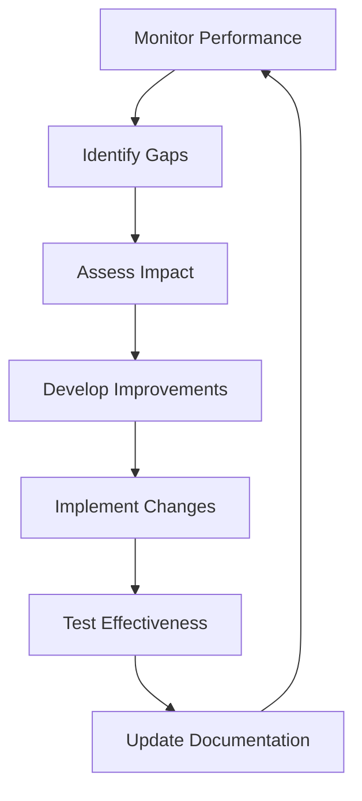

# Security Compliance Framework - Phase H

**Document Date:** 2025-08-31
**Compliance Officer:** Kilo Code
**Phase:** H (Feature Expansion)
**Classification:** Internal - Compliance

## Executive Summary

This document outlines the comprehensive security compliance framework for PlexiChat Phase H implementation. It covers regulatory requirements, compliance controls, audit procedures, and remediation processes to ensure adherence to industry standards and legal obligations.

## Compliance Frameworks

### Primary Frameworks

#### SOC 2 Type II
**Scope:** Security, Availability, Processing Integrity, Confidentiality, Privacy
**Audit Frequency:** Annual with quarterly reviews
**Evidence Requirements:** Control testing, monitoring reports, incident response logs

#### ISO 27001
**Scope:** Information Security Management System (ISMS)
**Certification:** ISO 27001:2022
**Implementation:** Risk-based approach with Statement of Applicability

#### GDPR
**Scope:** Personal data processing within EU
**Requirements:** Data protection principles, data subject rights, breach notification
**Implementation:** Privacy by design and default

#### PCI DSS (if applicable)
**Scope:** Payment card data processing
**Level:** Determined by transaction volume
**Requirements:** Secure cardholder environment, encryption, access control

### Secondary Frameworks

#### NIST Cybersecurity Framework
**Core Functions:** Identify, Protect, Detect, Respond, Recover
**Implementation:** Mapped to existing controls
**Assessment:** Annual gap analysis

#### CIS Controls
**Version:** CIS Controls v8
**Implementation:** Basic, Foundational, Organizational
**Assessment:** Continuous monitoring

## Compliance Program Structure

### Governance Structure
```
ComplianceOrganization
├── Chief Compliance Officer
│   ├── Compliance Manager
│   ├── Security Compliance Specialist
│   └── Privacy Officer
├── Compliance Committee
│   ├── Executive Sponsor
│   ├── Department Heads
│   └── External Advisors
└── Compliance Working Groups
    ├── SOC 2 Working Group
    ├── GDPR Working Group
    └── ISO 27001 Working Group
```

### Compliance Responsibilities

#### Executive Leadership
- Establish compliance culture
- Approve compliance budget
- Review compliance reports
- Ensure regulatory adherence

#### Compliance Team
- Develop compliance policies
- Conduct risk assessments
- Monitor regulatory changes
- Coordinate audit activities

#### Business Units
- Implement compliance controls
- Report compliance incidents
- Participate in training
- Support audit activities

## Risk Assessment

### Compliance Risk Identification
```yaml
risk_categories:
  regulatory:
    - GDPR violations
    - SOC 2 non-compliance
    - ISO 27001 certification lapse
  operational:
    - Security incidents
    - Data breaches
    - System outages
  financial:
    - Fines and penalties
    - Legal costs
    - Reputation damage
  strategic:
    - Business disruption
    - Customer loss
    - Competitive disadvantage
```

### Risk Assessment Methodology
```
Risk Score = (Likelihood × Impact) × Velocity
Where:
- Likelihood: 1 (Rare) to 5 (Certain)
- Impact: 1 (Minimal) to 5 (Catastrophic)
- Velocity: 1 (Slow) to 5 (Immediate)
```

### Risk Treatment Strategies
- **Avoid:** Eliminate the risk source
- **Mitigate:** Reduce likelihood or impact
- **Transfer:** Insurance or third-party management
- **Accept:** Documented acceptance with monitoring

## Control Framework

### Preventive Controls
```yaml
preventive_controls:
  access_control:
    - Multi-factor authentication
    - Role-based access control
    - Least privilege principle
    - Segregation of duties
  data_protection:
    - Encryption at rest
    - Encryption in transit
    - Data classification
    - Data loss prevention
  system_hardening:
    - Secure configuration
    - Patch management
    - Vulnerability scanning
    - Change management
```

### Detective Controls
```yaml
detective_controls:
  monitoring:
    - Security information and event management
    - Intrusion detection systems
    - Log analysis and correlation
    - Performance monitoring
  auditing:
    - Access logging
    - Change auditing
    - Security event logging
    - Compliance reporting
  testing:
    - Vulnerability assessments
    - Penetration testing
    - Security control validation
    - Compliance testing
```

### Corrective Controls
```yaml
corrective_controls:
  incident_response:
    - Incident response plan
    - Breach notification procedures
    - Recovery procedures
    - Lessons learned process
  remediation:
    - Vulnerability management
    - Patch deployment
    - Configuration correction
    - Process improvement
```

## GDPR Compliance

### Data Protection Principles
1. **Lawfulness, Fairness, and Transparency**
   - Legal basis documentation
   - Privacy notice publication
   - Transparent processing practices

2. **Purpose Limitation**
   - Defined processing purposes
   - Purpose compatibility assessment
   - Data minimization practices

3. **Data Minimization**
   - Necessary data collection only
   - Data retention schedules
   - Automated data cleanup

4. **Accuracy**
   - Data validation procedures
   - Data correction mechanisms
   - Accuracy monitoring

5. **Storage Limitation**
   - Retention policy implementation
   - Automated data deletion
   - Archival procedures

6. **Integrity and Confidentiality**
   - Encryption implementation
   - Access control measures
   - Security monitoring

7. **Accountability**
   - Data protection officer
   - Record of processing activities
   - Compliance documentation

### Data Subject Rights
```yaml
data_subject_rights:
  access:
    - Data access requests
    - Processing information
    - Response time: 30 days
  rectification:
    - Data correction procedures
    - Accuracy verification
    - Update notifications
  erasure:
    - Right to be forgotten
    - Data deletion procedures
    - Third-party notifications
  restriction:
    - Processing limitation
    - Temporary restrictions
    - Automated enforcement
  portability:
    - Data export formats
    - Structured data delivery
    - Direct transfer capabilities
  objection:
    - Direct marketing opt-out
    - Legitimate interest assessment
    - Processing cessation
```

### Breach Notification
- **Detection:** Within 72 hours
- **Assessment:** Breach impact evaluation
- **Notification:** Supervisory authority within 72 hours
- **Communication:** Data subjects without undue delay
- **Documentation:** Breach response records

## SOC 2 Compliance

### Trust Services Criteria

#### Security
```
Security Criteria:
├── Restricts logical and physical access
├── Protects against unauthorized access
├── Provides secure authentication
├── Protects sensitive data
├── Manages vulnerabilities
├── Implements change management
└── Monitors security events
```

#### Availability
```
Availability Criteria:
├── Operates with due care
├── Prevents unauthorized access
├── Monitors availability
├── Prepares for disruptions
├── Responds to incidents
└── Communicates availability
```

#### Processing Integrity
```
Processing Integrity Criteria:
├── Processes data completely and accurately
├── Authorizes data processing
├── Processes data timely and authorized
├── Maintains quality of system processing
├── Protects data from unauthorized access
└── Maintains data processing records
```

#### Confidentiality
```
Confidentiality Criteria:
├── Restricts access to confidential information
├── Protects confidential information
├── Manages confidential information
├── Disposes of confidential information
└── Communicates confidentiality requirements
```

#### Privacy
```
Privacy Criteria:
├── Notices and communications
├── Choice and consent
├── Collection
├── Use, retention, and disposal
├── Access
├── Disclosure and notification
├── Quality
├── Monitoring and enforcement
└── Accountability and assurance
```

## ISO 27001 Compliance

### Information Security Management System (ISMS)

#### Context of the Organization
- Internal/external issues identification
- Interested parties identification
- ISMS scope definition

#### Leadership and Commitment
- Information security policy
- Organizational roles and responsibilities
- Information security objectives

#### Planning
- Risk assessment and treatment
- Statement of applicability
- Risk treatment plan

#### Support
- Resources, roles, and responsibilities
- Competence and awareness
- Communication and consultation
- Documented information

#### Operation
- Operational planning and control
- Information security risk assessment
- Information security risk treatment

#### Performance Evaluation
- Monitoring, measurement, analysis, and evaluation
- Internal audit
- Management review

#### Improvement
- Nonconformity and corrective action
- Continual improvement

## Compliance Monitoring

### Key Performance Indicators (KPIs)
```yaml
compliance_kpis:
  - name: "Policy Compliance Rate"
    target: "> 95%"
    frequency: "Monthly"
  - name: "Training Completion Rate"
    target: "> 98%"
    frequency: "Quarterly"
  - name: "Audit Finding Closure Rate"
    target: "> 90%"
    frequency: "Monthly"
  - name: "Incident Response Time"
    target: "< 4 hours"
    frequency: "Per incident"
  - name: "Control Effectiveness Score"
    target: "> 85%"
    frequency: "Quarterly"
```

### Compliance Dashboard
```
Compliance Dashboard Components:
├── Overall Compliance Score
├── Framework-specific Scores
├── Control Status Matrix
├── Risk Heat Map
├── Audit Findings Tracker
├── Training Status
├── Incident Summary
└── Regulatory Deadline Tracker
```

### Automated Monitoring
- **Policy Compliance:** Automated policy checking
- **Control Validation:** Continuous control testing
- **Risk Monitoring:** Real-time risk assessment
- **Audit Preparation:** Automated evidence collection

## Audit and Assessment

### Internal Audits
- **Frequency:** Quarterly for each framework
- **Scope:** Full compliance assessment
- **Methodology:** Risk-based sampling
- **Reporting:** Executive summary and detailed findings

### External Audits
- **SOC 2:** Annual Type II audit
- **ISO 27001:** Triennial recertification
- **GDPR:** Annual data protection audit
- **PCI DSS:** Annual assessment (if applicable)

### Self-Assessment
- **Frequency:** Monthly
- **Scope:** Key controls and processes
- **Methodology:** Checklist-based assessment
- **Reporting:** Compliance committee review

## Training and Awareness

### Compliance Training Program
```yaml
training_program:
  general_awareness:
    - Annual security awareness training
    - Code of conduct review
    - Data protection basics
  role_specific:
    - Developer security training
    - Administrator compliance training
    - Manager leadership training
  specialized:
    - GDPR data protection training
    - SOC 2 controls training
    - ISO 27001 ISMS training
```

### Training Effectiveness
- **Pre/Post Assessments:** Knowledge verification
- **Practical Exercises:** Scenario-based training
- **Certification Tracking:** Training completion records
- **Refresher Training:** Annual updates

## Incident Management

### Compliance Incident Classification
```
Level 1 (Minor):
├── Policy violations
├── Training non-completion
└── Minor control failures

Level 2 (Moderate):
├── Repeated violations
├── Control failures
└── Regulatory inquiries

Level 3 (Major):
├── Material control failures
├── Regulatory violations
└── Significant incidents

Level 4 (Critical):
├── Data breaches
├── Regulatory enforcement
└── Legal proceedings
```

### Incident Response Process
1. **Detection and Assessment**
   - Incident identification
   - Impact assessment
   - Regulatory notification requirements

2. **Containment and Recovery**
   - Immediate containment
   - Evidence preservation
   - Recovery procedures

3. **Investigation and Analysis**
   - Root cause analysis
   - Compliance impact assessment
   - Lessons learned

4. **Reporting and Notification**
   - Internal reporting
   - Regulatory notifications
   - Stakeholder communication

5. **Remediation and Prevention**
   - Corrective actions
   - Preventive measures
   - Process improvements

## Documentation and Records

### Required Documentation
- **Compliance Policies:** Framework-specific policies
- **Procedures:** Operational procedures and controls
- **Records:** Audit reports, training records, incident reports
- **Evidence:** Control testing results, monitoring reports

### Retention Requirements
- **Audit Reports:** 7 years
- **Training Records:** 5 years
- **Incident Reports:** 7 years
- **Compliance Documentation:** 7 years

## Continuous Improvement

### Compliance Improvement Process


### Benchmarking
- **Industry Benchmarks:** Comparison with peers
- **Best Practices:** Adoption of industry standards
- **Regulatory Updates:** Incorporation of new requirements
- **Technology Advances:** Implementation of new security technologies

## Conclusion

The compliance framework outlined in this document provides a comprehensive approach to maintaining regulatory compliance for PlexiChat Phase H. Through structured governance, continuous monitoring, and proactive risk management, the organization can achieve and maintain compliance with multiple regulatory frameworks.

**Key Success Factors:**
1. Strong leadership commitment
2. Comprehensive risk assessment
3. Effective control implementation
4. Continuous monitoring and auditing
5. Regular training and awareness
6. Proactive incident management

**Compliance Roadmap:**
- **Q1:** SOC 2 Type II readiness assessment
- **Q2:** ISO 27001 certification preparation
- **Q3:** GDPR compliance enhancement
- **Q4:** Continuous monitoring optimization

This framework ensures that PlexiChat maintains robust compliance posture while supporting business objectives and regulatory requirements.