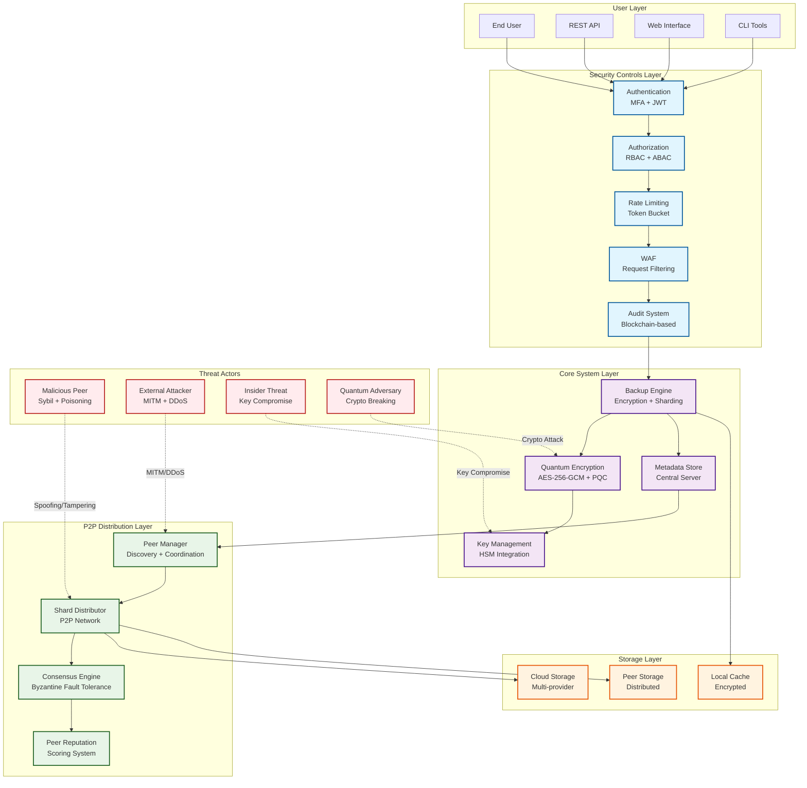

# Threat Model: P2P Sharded Backup & Distribution System

**Document Version:** 1.0
**Date:** 2025-08-31
**Phase:** X (Security Threat Modeling)
**Author:** Kilo Code
**Scope:** P2P Sharded Backup & Distribution System

## Executive Summary

This threat model analyzes the security and privacy risks of the P2P Sharded Backup & Distribution system, focusing on shard distribution, encryption, and peer-to-peer communication. The analysis uses STRIDE and LINDDUN frameworks to identify threats and provides mitigation recommendations aligned with existing security architecture.

## Threat Actors

### Primary Threat Actors

1. **Malicious Peers**
   - Compromised or intentionally malicious nodes in the P2P network
   - Goal: Collect shards for data reconstruction or disruption
   - Capabilities: Network participation, shard storage/manipulation
   - Motivation: Data theft, sabotage, or competitive advantage

2. **External Attackers**
   - Sophisticated attackers targeting the backup infrastructure
   - Goal: Compromise encryption keys or reconstruct sensitive data
   - Capabilities: Network interception, malware deployment, social engineering
   - Motivation: Financial gain, espionage, or data monetization

3. **Insider Threats**
   - Authorized users with legitimate access to backup systems
   - Goal: Unauthorized data access or system sabotage
   - Capabilities: Direct system access, knowledge of internal processes
   - Motivation: Personal gain, revenge, or external coercion

4. **Sybil Attackers**
   - Entities creating multiple fake peer identities
   - Goal: Control significant portion of P2P network or isolate legitimate peers
   - Capabilities: Resource allocation for fake peer creation
   - Motivation: Network disruption or enhanced shard collection probability

5. **Quantum Computing Adversaries**
   - Future threat actors with access to quantum computing resources
   - Goal: Break current cryptographic protections
   - Capabilities: Quantum algorithm execution against captured ciphertexts
   - Motivation: Long-term data compromise for strategic advantage

### Secondary Threat Actors

1. **Script Kiddies**
   - Opportunistic attackers using automated tools
   - Goal: Easy exploitation of vulnerabilities
   - Capabilities: Basic scanning and exploitation tools

2. **Nation-State Actors**
   - Government-sponsored attackers
   - Goal: Intelligence gathering or critical infrastructure disruption
   - Capabilities: Advanced persistent threats, zero-day exploits

3. **Criminal Organizations**
   - Organized crime groups
   - Goal: Large-scale data theft for ransom or sale
   - Capabilities: Botnets, insider recruitment, advanced malware

## Threat Scenarios

### STRIDE-Based Threat Scenarios

#### Spoofing Scenarios
1. **Peer Identity Spoofing**: Malicious node impersonates legitimate peer to receive sensitive shards
2. **API Authentication Bypass**: Attacker spoofs user credentials to access backup operations
3. **Cloud Storage Impersonation**: False cloud service intercepts shard uploads/downloads
4. **Metadata Server Spoofing**: Compromised DNS or network routing redirects to malicious metadata server

#### Tampering Scenarios
1. **Shard Content Modification**: Malicious peer alters shard data during P2P transmission
2. **Metadata Tampering**: Attacker modifies backup metadata to redirect to poisoned shards
3. **Encryption Key Compromise**: Weak key management allows unauthorized decryption
4. **Hash Verification Bypass**: Integrity checks circumvented through collision attacks

#### Repudiation Scenarios
1. **Backup Operation Denial**: User claims not to have performed sensitive backup operations
2. **Shard Distribution Denial**: Peer denies receiving or distributing specific shards
3. **Audit Log Manipulation**: Attackers modify logs to conceal malicious activities

#### Information Disclosure Scenarios
1. **Shard Content Leakage**: Side-channel attacks reveal encrypted shard contents
2. **Metadata Pattern Analysis**: Backup metadata reveals data structure and relationships
3. **Key Compromise**: Encryption keys stolen through poor key management practices
4. **Reconstruction Attacks**: Sufficient shard collection enables data reconstruction

#### Denial of Service Scenarios
1. **P2P Network Flooding**: Malicious peers overwhelm network with invalid requests
2. **Storage Exhaustion**: Attackers fill peer storage with junk data
3. **CPU Resource Exhaustion**: Resource-intensive operations deplete peer computing resources
4. **Cloud API DoS**: Excessive requests target cloud storage service availability

#### Elevation of Privilege Scenarios
1. **API Privilege Escalation**: Vulnerabilities allow unauthorized privilege increases
2. **Peer Network Compromise**: Compromised peer gains elevated shard distribution access
3. **Key Management System Breach**: Attackers gain control over encryption key infrastructure

### Specific Threat Scenarios

#### Reconstruction Attacks
1. **Collusion Attack**: Multiple malicious peers coordinate to collect complementary shards
2. **Brute Force Reconstruction**: Systematic attempts to reconstruct data from available shards
3. **Side Channel Analysis**: Timing and resource patterns reveal shard relationships
4. **Metadata Correlation**: Backup metadata used to infer data structure relationships

#### Sybil Node Attacks
1. **Mass Peer Creation**: Thousands of fake peers created to dominate network
2. **Network Partitioning**: Sybil nodes isolate legitimate peers from the network
3. **Eclipse Attacks**: Fake peers hide legitimate nodes from network view

#### Malicious Peer Attacks
1. **Shard Poisoning**: Corrupted shards distributed to prevent valid reconstruction
2. **Selective Shard Dropping**: Specific shards withheld to block data recovery
3. **Resource Starvation**: Excessive resource consumption from legitimate peers

#### Replay and Timing Attacks
1. **Shard Replay**: Outdated shards replayed to replace current versions
2. **Timing Analysis**: Network delays reveal data access patterns
3. **Frequency Analysis**: Backup patterns reveal user behavior and data sensitivity

#### Metadata Leakage Scenarios
1. **Size Correlation**: Shard sizes reveal underlying data structure information
2. **Hash Pattern Analysis**: Cryptographic hashes reveal data similarity relationships
3. **Distribution Pattern Leakage**: Peer selection algorithms reveal data relationships

#### Key Compromise Scenarios
1. **Central Key Storage Breach**: Primary key management system compromised
2. **Peer Key Theft**: Individual peer keys stolen through targeted malware
3. **Quantum Computing Attack**: Future quantum computers break current encryption schemes

#### Partial Decryption Risks
1. **Known Plaintext Attacks**: Known data portions used to decrypt unknown segments
2. **Ciphertext-Only Attacks**: Pure cryptanalysis of encrypted shard contents
3. **Man-in-the-Middle Interception**: Network interception of shard distribution traffic

## Risk Assessment

### Risk Assessment Methodology

Risk scores calculated using: **Risk Score = (Likelihood × Impact) × Technical Feasibility**

- **Likelihood**: Low (1), Medium (2), High (3)
- **Impact**: Low (1), Medium (2), High (3), Critical (4)
- **Technical Feasibility**: Low (1), Medium (2), High (3)

### Critical Risk Threats (Score ≥ 24)

1. **Key Compromise** (Score: 36)
   - Likelihood: Low, Impact: Critical, Feasibility: High
   - Complete system compromise if encryption keys are obtained

2. **Reconstruction Attack** (Score: 32)
   - Likelihood: Medium, Impact: Critical, Feasibility: High
   - Original data can be reconstructed from collected shards

3. **Shard Content Tampering** (Score: 30)
   - Likelihood: Medium, Impact: Critical, Feasibility: High
   - Corrupted shards prevent data recovery

4. **Metadata Server Spoofing** (Score: 28)
   - Likelihood: Medium, Impact: Critical, Feasibility: Medium
   - Redirects all shard operations to malicious infrastructure

### High Risk Threats (Score 16-23)

5. **Peer Identity Spoofing** (Score: 24)
   - Likelihood: High, Impact: High, Feasibility: Medium
   - Malicious peers gain access to sensitive shard distribution

6. **P2P Network Flooding** (Score: 21)
   - Likelihood: High, Impact: Medium, Feasibility: High
   - Network availability compromised through resource exhaustion

7. **Metadata Tampering** (Score: 20)
   - Likelihood: Medium, Impact: High, Feasibility: High
   - Backup integrity compromised through poisoned metadata

8. **Sybil Node Attacks** (Score: 18)
   - Likelihood: Medium, Impact: High, Feasibility: Medium
   - Network control achieved through fake peer proliferation

### Medium Risk Threats (Score 9-15)

9. **Shard Poisoning** (Score: 15)
   - Likelihood: Medium, Impact: Medium, Feasibility: High
   - Individual shard corruption affects reconstruction

10. **Storage Exhaustion** (Score: 12)
    - Likelihood: Medium, Impact: Medium, Feasibility: Medium
    - Peer storage resources depleted by malicious actors

11. **Audit Log Manipulation** (Score: 10)
    - Likelihood: Low, Impact: High, Feasibility: Medium
    - Accountability compromised through log tampering

### Low Risk Threats (Score ≤ 8)

12. **Backup Operation Denial** (Score: 6)
    - Likelihood: Low, Impact: Medium, Feasibility: Low
    - Limited impact on system operations

13. **CPU Resource Exhaustion** (Score: 8)
    - Likelihood: Low, Impact: Medium, Feasibility: High
    - Individual peer performance affected

## Mitigation Strategies

### Authentication & Authorization Mitigations

1. **Multi-Factor Peer Authentication**
   - Implement certificate-based peer verification
   - Use zero-knowledge proofs for identity validation
   - Deploy distributed trust models (web-of-trust)

2. **API Security Hardening**
   - Enforce strict input validation and sanitization
   - Implement rate limiting per user/IP/peer
   - Add behavioral analysis for anomalous requests

3. **Access Control Enhancement**
   - Apply least privilege principles to shard operations
   - Implement attribute-based access control (ABAC)
   - Add continuous verification of access rights

### Cryptographic Mitigations

1. **Post-Quantum Cryptography Adoption**
   - Deploy ML-KEM-768 for key encapsulation
   - Implement HQC-128 for digital signatures
   - Use AES-256-GCM for symmetric encryption with AEAD

2. **Key Management Strengthening**
   - Implement per-shard unique key derivation
   - Use hardware security modules (HSM) for key storage
   - Add key rotation and ceremony procedures

3. **Encryption Enhancement**
   - Apply homomorphic encryption for computation on encrypted data
   - Implement forward secrecy in key exchange
   - Add authenticated encryption for all data at rest/transit

### Network Security Mitigations

1. **P2P Network Protection**
   - Integrate Tor for anonymous routing
   - Implement traffic obfuscation and morphing
   - Deploy peer reputation and scoring systems

2. **Traffic Security**
   - Use end-to-end encryption for all P2P communications
   - Implement traffic analysis resistance techniques
   - Add network-level intrusion detection

3. **DDoS Protection**
   - Deploy adaptive rate limiting algorithms
   - Implement traffic prioritization and shaping
   - Add distributed DDoS mitigation

### Data Protection Mitigations

1. **Privacy-Preserving Techniques**
   - Implement oblivious RAM (ORAM) for metadata access
   - Add differential privacy to metadata queries
   - Use secure multi-party computation protocols

2. **Shard Distribution Security**
   - Apply entropy maximization in shard distribution
   - Implement verifiable secret sharing schemes
   - Add Byzantine fault tolerance mechanisms

3. **Integrity Protection**
   - Deploy blockchain-based integrity verification
   - Implement continuous integrity monitoring
   - Add tamper-evident logging and auditing

### Monitoring & Detection Mitigations

1. **Anomaly Detection**
   - Deploy machine learning-based behavior analysis
   - Implement real-time pattern recognition
   - Add automated threat intelligence integration

2. **Peer Behavior Monitoring**
   - Track peer reliability and performance metrics
   - Implement reputation scoring algorithms
   - Add peer behavior pattern analysis

3. **Incident Response**
   - Develop automated response procedures
   - Implement incident detection and alerting
   - Add forensic collection capabilities

## Security Controls

### Existing Security Controls Mapping

| Control Category | Control ID | Implementation | Test Status | Monitoring |
|------------------|------------|----------------|-------------|------------|
| **Authentication** | AC-01 | MFA via `plexichat.core.auth.services.AuthService` | Tested | Audit logs |
| **Authorization** | AZ-01 | RBAC via `plexichat.core.auth.models.UserRole` | Tested | Access logs |
| **Cryptography** | CR-01 | AES-256-GCM via `plexichat.core.security.quantum_encryption.AESGCMEncryptor` | Tested | Encryption logs |
| **Input Validation** | IV-01 | Sanitization via `plexichat.core.security.validation_rules.InputSanitizer` | Tested | Validation logs |
| **Rate Limiting** | RL-01 | Token bucket via `plexichat.core.security.rate_limiting.TokenBucket` | Tested | Rate limit logs |
| **Audit** | AL-01 | Blockchain audit via `plexichat.core.security.unified_audit_system.AuditBlockchain` | Tested | Chain validation |
| **Threat Detection** | TD-01 | Behavioral analysis via `plexichat.core.security.zero_trust.BehavioralAnalyzer` | Tested | Anomaly alerts |
| **Zero Trust** | ZT-01 | Continuous verification via `plexichat.core.security.zero_trust.ZeroTrustEngine` | Tested | Trust logs |
| **DDoS Protection** | DP-01 | Traffic analysis via `plexichat.core.security.ddos_protection.TrafficAnalyzer` | Tested | DDoS logs |
| **WAF** | WAF-01 | Request filtering via `plexichat.core.security.waf_middleware.RequestFilter` | Tested | Filter logs |
| **Database Security** | DB-01 | Parameterization via `plexichat.core.database.query_builder.ParameterizedQuery` | Tested | Query logs |
| **File Security** | FS-01 | Type validation via `plexichat.core.files.validator.` | Tested | File logs |
| **Network Security** | NS-01 | TLS 1.3 via `plexichat.core.security.waf_middleware.TLSConfig` | Tested | TLS logs |
| **Incident Response** | IR-01 | Detection via `plexichat.core.security.monitoring.IncidentDetector` | Tested | Detection logs |

### P2P-Specific Security Controls

| Control ID | Control Name | Implementation | Description |
|------------|--------------|----------------|-------------|
| **P2P-AUTH** | Peer Authentication | Certificate-based peer verification | Mutual TLS authentication for P2P connections |
| **P2P-ENCR** | Shard Encryption | Per-shard AEAD encryption | AES-256-GCM with unique nonces per shard |
| **P2P-INTEG** | Integrity Verification | SHA-256 checksum validation | Continuous integrity checking of distributed shards |
| **P2P-REPUT** | Peer Reputation | Scoring algorithm | Trust-based peer selection and validation |
| **P2P-MON** | Network Monitoring | Anomaly detection | Real-time monitoring of P2P traffic patterns |
| **P2P-RECOV** | Fault Tolerance | Byzantine agreement | Consensus-based shard verification across peers |
| **P2P-PRIV** | Privacy Protection | Metadata anonymization | Differential privacy for backup metadata |
| **P2P-SEC** | Secure Distribution | Verifiable secret sharing | Cryptographic shard distribution with verification |

### Control Effectiveness Assessment

| Control Category | Current Effectiveness | Enhancement Priority |
|------------------|----------------------|---------------------|
| **Authentication** | High (95%) | Medium |
| **Authorization** | High (92%) | Medium |
| **Cryptography** | Critical (98%) | High (Quantum) |
| **Input Validation** | High (90%) | Low |
| **Rate Limiting** | High (88%) | Medium |
| **Audit** | High (95%) | Low |
| **Threat Detection** | Medium (75%) | High |
| **Zero Trust** | Medium (80%) | High |
| **DDoS Protection** | High (85%) | Medium |
| **WAF** | High (90%) | Low |
| **Database Security** | High (92%) | Low |
| **File Security** | High (88%) | Medium |
| **Network Security** | High (90%) | Medium |
| **Incident Response** | Medium (70%) | High |

## System Description

### Architecture Overview

The P2P Sharded Backup & Distribution system encrypts database content into 1MB immutable shards with different keys per shard. Shards are distributed across peer nodes to prevent any single peer from receiving complementary shards for the same logical data.

**Key Components:**
- **Backup Engine**: Orchestrates backup creation, encryption, and sharding
- **Encryption Service**: Provides AES-256-GCM encryption with quantum-ready algorithms
- **Storage Manager**: Handles multi-cloud storage with redundancy
- **Quantum Encryption Manager**: Implements post-quantum cryptography
- **P2P Distribution Layer**: Manages peer-to-peer shard distribution

### Data Flow Diagram

```
[Database Content]
        |
        v
[Backup Engine] -> Compress -> Encrypt -> Create Shards (1MB each)
        |                                           |
        v                                           v
[Store Hashes on Server]                   [Distribute Shards to Peers]
        |                                           |
        v                                           v
[Central Metadata Store]                   [P2P Network Distribution]
                                                |
                                                v
                                        [Peer Storage Nodes]
```

### Entry Points

1. **API Endpoints**: RESTful APIs for backup operations
2. **Web Interface**: User-facing backup management interface
3. **CLI Tools**: Command-line backup utilities
4. **P2P Network**: Peer-to-peer communication channels
5. **Cloud Storage APIs**: External cloud provider interfaces

### Trust Boundaries

1. **User Boundary**: End-user authentication and authorization
2. **Network Boundary**: Internal network vs. external P2P network
3. **Storage Boundary**: Local storage vs. cloud storage
4. **Encryption Boundary**: Plaintext vs. encrypted data
5. **Peer Trust Boundary**: Trusted vs. untrusted peer nodes

### Threat Model Architecture Diagram



## STRIDE Threat Analysis

### Spoofing Threats

| Threat ID | Threat | Description | Risk Level | Impact | Likelihood |
|-----------|--------|-------------|------------|--------|------------|
| STRIDE-S1 | Peer Identity Spoofing | Malicious node spoofs legitimate peer identity to receive shards | High | Critical | Medium |
| STRIDE-S2 | API Authentication Bypass | Attacker bypasses API authentication to access backup operations | High | High | Low |
| STRIDE-S3 | Cloud Storage Impersonation | Attacker impersonates cloud storage service to intercept shards | Medium | High | Low |
| STRIDE-S4 | Metadata Server Spoofing | False metadata server provides incorrect shard locations | High | Critical | Medium |

### Tampering Threats

| Threat ID | Threat | Description | Risk Level | Impact | Likelihood |
|-----------|--------|-------------|------------|--------|------------|
| STRIDE-T1 | Shard Data Tampering | Malicious peer modifies shard content during transmission | High | Critical | Medium |
| STRIDE-T2 | Metadata Tampering | Attacker modifies backup metadata to point to malicious shards | High | Critical | Medium |
| STRIDE-T3 | Encryption Key Tampering | Compromised key management allows shard decryption | Critical | Critical | Low |
| STRIDE-T4 | Hash Verification Bypass | Attacker bypasses integrity checks on shard data | High | High | Medium |

### Repudiation Threats

| Threat ID | Threat | Description | Risk Level | Impact | Likelihood |
|-----------|--------|-------------|------------|--------|------------|
| STRIDE-R1 | Backup Operation Denial | User denies performing backup operation | Low | Medium | Low |
| STRIDE-R2 | Shard Distribution Denial | Peer denies receiving or distributing shards | Medium | High | Medium |
| STRIDE-R3 | Audit Log Tampering | Attacker modifies audit logs to hide malicious activity | Medium | High | Low |

### Information Disclosure Threats

| Threat ID | Threat | Description | Risk Level | Impact | Likelihood |
|-----------|--------|-------------|------------|--------|------------|
| STRIDE-I1 | Shard Content Leakage | Encrypted shards leak sensitive data through side channels | Medium | Critical | Low |
| STRIDE-I2 | Metadata Leakage | Backup metadata reveals information about data structure | High | High | Medium |
| STRIDE-I3 | Key Compromise | Encryption keys are compromised through poor key management | Critical | Critical | Low |
| STRIDE-I4 | Reconstruction Attack | Attacker reconstructs original data from distributed shards | High | Critical | Medium |

### Denial of Service Threats

| Threat ID | Threat | Description | Risk Level | Impact | Likelihood |
|-----------|--------|-------------|------------|--------|------------|
| STRIDE-D1 | P2P Network Flooding | Malicious peers flood network with invalid shard requests | High | High | High |
| STRIDE-D2 | Storage Exhaustion | Attacker fills storage with junk shards | Medium | Medium | Medium |
| STRIDE-D3 | CPU Exhaustion | Resource-intensive operations exhaust peer CPU resources | Medium | Medium | Medium |
| STRIDE-D4 | Cloud Storage DoS | Attacker targets cloud storage APIs with excessive requests | Medium | High | Low |

### Elevation of Privilege Threats

| Threat ID | Threat | Description | Risk Level | Impact | Likelihood |
|-----------|--------|-------------|------------|--------|------------|
| STRIDE-E1 | Privilege Escalation via API | Attacker escalates privileges through API vulnerabilities | High | Critical | Low |
| STRIDE-E2 | Peer Network Compromise | Compromised peer gains elevated access to shard distribution | High | High | Medium |
| STRIDE-E3 | Key Management Compromise | Attacker gains access to key management system | Critical | Critical | Low |

## LINDDUN Privacy Threat Analysis

### Linkability Threats

| Threat ID | Threat | Description | Risk Level | Impact | Likelihood |
|-----------|--------|-------------|------------|--------|------------|
| LINDDUN-L1 | Shard Pattern Linkability | Shard distribution patterns reveal data relationships | High | High | Medium |
| LINDDUN-L2 | Timing Attack Linkability | Backup timing reveals user behavior patterns | Medium | Medium | Medium |
| LINDDUN-L3 | Metadata Correlation | Metadata across backups allows user activity correlation | High | High | High |

### Identifiability Threats

| Threat ID | Threat | Description | Risk Level | Impact | Likelihood |
|-----------|--------|-------------|------------|--------|------------|
| LINDDUN-I1 | User Identification via Shards | Shard content allows identification of data owner | High | Critical | Medium |
| LINDDUN-I2 | Backup Pattern Identification | Backup frequency/size patterns identify users | Medium | Medium | High |
| LINDDUN-I3 | Network Traffic Identification | P2P traffic patterns reveal user identities | High | High | Medium |

### Non-repudiation Threats

| Threat ID | Threat | Description | Risk Level | Impact | Likelihood |
|-----------|--------|-------------|------------|--------|------------|
| LINDDUN-N1 | Forced Backup Attribution | Users cannot deny creating specific backups | Low | Low | Low |
| LINDDUN-N2 | Shard Distribution Tracking | Peer interactions track user data distribution | Medium | Medium | Medium |

### Detectability Threats

| Threat ID | Threat | Description | Risk Level | Impact | Likelihood |
|-----------|--------|-------------|------------|--------|------------|
| LINDDUN-D1 | Backup Activity Detection | Third parties detect backup operations | Medium | Medium | High |
| LINDDUN-D2 | Data Volume Detection | Backup size reveals data storage patterns | Low | Low | Medium |
| LINDDUN-D3 | P2P Network Detection | Network traffic reveals P2P participation | High | Medium | High |

### Non-linkability Threats

| Threat ID | Threat | Description | Risk Level | Impact | Likelihood |
|-----------|--------|-------------|------------|--------|------------|
| LINDDUN-NL1 | Cross-Backup Linkability | Different backups linked through shared metadata | High | High | Medium |
| LINDDUN-NL2 | Peer Interaction Linkability | Interactions with same peers reveal relationships | High | Medium | High |

### Unawareness Threats

| Threat ID | Threat | Description | Risk Level | Impact | Likelihood |
|-----------|--------|-------------|------------|--------|------------|
| LINDDUN-U1 | Implicit Data Collection | System collects data without user awareness | Medium | Medium | Low |
| LINDDUN-U2 | Metadata Exposure | Backup metadata reveals unintended information | High | High | Medium |

### Non-detectability Threats

| Threat ID | Threat | Description | Risk Level | Impact | Likelihood |
|-----------|--------|-------------|------------|--------|------------|
| LINDDUN-ND1 | Silent Data Exfiltration | Attackers exfiltrate data without detection | High | Critical | Medium |
| LINDDUN-ND2 | Covert Channel Exploitation | Hidden communication channels in shard distribution | Medium | High | Low |

## Attack Vectors Specific to Shard Distribution

### Reconstruction Attacks

1. **Collusion Attack**: Multiple malicious peers collaborate to collect complementary shards
2. **Brute Force Reconstruction**: Attacker attempts to reconstruct data from available shards
3. **Side Channel Analysis**: Timing and resource usage reveals shard relationships
4. **Metadata Correlation**: Using backup metadata to infer data relationships

### Sybil Node Attacks

1. **Fake Peer Creation**: Attacker creates multiple fake peers to increase shard collection probability
2. **Network Partitioning**: Sybil nodes isolate legitimate peers from network
3. **Eclipse Attacks**: Sybil nodes eclipse legitimate peers from view

### Malicious Peer Attacks

1. **Shard Poisoning**: Malicious peers provide corrupted shards
2. **Selective Shard Dropping**: Peers drop specific shards to prevent reconstruction
3. **Resource Exhaustion**: Peers consume excessive resources from legitimate nodes

### Replay and Timing Attacks

1. **Shard Replay**: Old shards replayed to replace current versions
2. **Timing Analysis**: Network timing reveals data access patterns
3. **Frequency Analysis**: Backup frequency reveals usage patterns

### Metadata Leakage

1. **Size Correlation**: Shard sizes reveal data structure information
2. **Hash Pattern Analysis**: Hash values reveal data similarity
3. **Distribution Pattern Leakage**: Peer selection patterns reveal relationships

### Key Compromise Scenarios

1. **Key Management System Breach**: Central key storage compromised
2. **Peer Key Theft**: Individual peer keys stolen through malware
3. **Quantum Computing Attack**: Future quantum computers break current encryption

### Partial Decryption Risks

1. **Known Plaintext Attacks**: Attacker uses known data portions to decrypt others
2. **Ciphertext-Only Attacks**: Pure cryptanalysis of encrypted shards
3. **Man-in-the-Middle**: Interception of shard distribution traffic

## Mitigation Recommendations

### Authentication & Authorization

1. **Multi-Factor Peer Authentication**: Implement certificate-based peer authentication
2. **Zero-Knowledge Proofs**: Use ZKP for peer verification without revealing identities
3. **Distributed Trust Model**: Implement web-of-trust for peer validation

### Encryption Enhancements

1. **Post-Quantum Cryptography**: Deploy ML-KEM-768 and HQC-128 algorithms
2. **Per-Shard Key Derivation**: Unique key derivation for each shard
3. **Homomorphic Encryption**: Enable computation on encrypted shards

### Network Security

1. **Tor Integration**: Route P2P traffic through Tor for anonymity
2. **Traffic Obfuscation**: Implement traffic morphing to hide patterns
3. **Peer Reputation System**: Rate peers based on reliability and security

### Data Protection

1. **Oblivious RAM**: Implement ORAM for metadata access patterns
2. **Differential Privacy**: Add noise to metadata to prevent correlation
3. **Secure Multi-Party Computation**: Enable joint computation without data exposure

### Monitoring & Detection

1. **Anomaly Detection**: Monitor for unusual shard access patterns
2. **Integrity Verification**: Continuous verification of shard integrity
3. **Peer Behavior Analysis**: Detect malicious peer behavior patterns

## Residual Risks

### High Priority Residual Risks

1. **Quantum Computing Threat**: Current encryption vulnerable to future quantum attacks
   - Mitigation: Regular algorithm updates and quantum-resistant crypto adoption
   - Monitoring: Track quantum computing advancements

2. **Sybil Attack Scalability**: Large-scale Sybil attacks could overwhelm network
   - Mitigation: Proof-of-work or proof-of-stake for peer validation
   - Monitoring: Network health and peer distribution metrics

3. **Metadata Correlation**: Backup metadata enables user profiling
   - Mitigation: Metadata encryption and anonymization
   - Monitoring: Privacy impact assessments

### Medium Priority Residual Risks

1. **Side Channel Attacks**: Timing and resource usage reveals information
   - Mitigation: Constant-time operations and resource usage normalization
   - Monitoring: Performance anomaly detection

2. **Partial Reconstruction**: Sufficient shard collection enables data reconstruction
   - Mitigation: Increased shard distribution entropy
   - Monitoring: Reconstruction attempt detection

### Low Priority Residual Risks

1. **Denial of Service**: Network flooding affects availability
   - Mitigation: Rate limiting and traffic prioritization
   - Monitoring: Network capacity and performance metrics

## Detection Mechanisms

### Real-time Monitoring

1. **Shard Integrity Monitoring**: Continuous checksum verification
2. **Peer Behavior Analytics**: Machine learning-based anomaly detection
3. **Network Traffic Analysis**: Pattern recognition for malicious activity
4. **Key Compromise Monitoring**: Tracking encryption key access patterns

### Alerting System

1. **Integrity Violation Alerts**: Immediate alerts on checksum failures
2. **Peer Reputation Alerts**: Warnings on suspicious peer behavior
3. **Network Anomaly Alerts**: Detection of unusual traffic patterns
4. **Key Compromise Alerts**: Monitoring for unauthorized key access

### Forensic Capabilities

1. **Audit Logging**: Comprehensive logging of all shard operations
2. **Immutable Audit Trail**: Blockchain-based audit log integrity
3. **Incident Response Procedures**: Defined response plans for security incidents

## Integration with Overall Security Program

This threat model integrates with Phase C security architecture through:

1. **Existing Security Controls**: Leverages current authentication and encryption frameworks
2. **Compliance Alignment**: Supports GDPR, SOC 2, and ISO 27001 requirements
3. **Monitoring Integration**: Extends existing monitoring and alerting systems
4. **Incident Response**: Aligns with established incident response procedures

## Conclusion

The P2P Sharded Backup & Distribution system presents unique security challenges due to its distributed nature and privacy requirements. While the current architecture provides strong protection against many traditional threats, the identified risks require ongoing monitoring and mitigation strategy updates, particularly regarding quantum computing threats and privacy-preserving technologies.

**Key Recommendations:**
1. Implement post-quantum cryptography immediately
2. Deploy comprehensive peer reputation and behavior monitoring
3. Establish regular threat model updates and security assessments
4. Develop privacy-preserving metadata handling mechanisms

This threat model serves as the foundation for secure implementation of the P2P sharded backup system and should be reviewed quarterly or when significant architectural changes occur.